#### 学习大纲

参考链接：https://baijiahao.baidu.com/s?id=1721040222341192801&wfr=spider&for=pc

### 一、安装

#### 1、kubeadm  官方推荐的命令安装

重启数据比二进制启动慢，容器管理容器

#### 2、二进制安装

### 二、知识图谱

#### 1、基本概念

##### （1）Pod

**1、Pod**是在 K8s 集群中运行部署应用或服务的最小单元，它是可以支持多容器的。Pod 的设计理念是支持多个容器在一个 Pod 中共享网络地址和文件系统，可以通过进程间通信和文件共享这种简单高效的方式组合完成服务。Pod 对多容器的支持是 K8s 最基础的设计理念，如：运行一个操作系统发行版的软件仓库，一个 Nginx 容器用来发布软件，另一个容器专门用来从源仓库做同步，这两个容器的镜像不太可能是一个团队开发的，但是他们一块儿工作才能提供一个微服务；这种情况下，不同的团队各自开发构建自己的容器镜像，在部署的时候组合成一个微服务对外提供服务。

##### （2）Pod控制器

**1、副本集（Replica Set，RS）**RS 是 K8s 集群中保证 Pod 高可用的 API 对象。通过监控运行中的 Pod 来保证集群中运行指定数目的 Pod 副本。指定的数目可以是多个也可以是 1 个；少于指定数目，RS 就会启动运行新的 Pod 副本；多于指定数目，RS 就会杀死多余的 Pod 副本。即使在指定数目为 1 的情况下，通过 RS 运行 Pod 也比直接运行 Pod 更明智，因为 RS 也可以发挥它高可用的能力，保证永远有 1 个 Pod 在运行。

**2、部署（Deployment）**Deployment 表示用户对 K8s 集群的一次更新操作。部署是一个比 RS 应用模式更广的 API 对象，可以是创建一个新的服务，更新一个新的服务，也可以是滚动升级一个服务。滚动升级一个服务，实际是创建一个新的 RS，然后逐渐将新 RS 中副本数增加到理想状态，将旧 RS 中的副本数减小到 0 的复合操作；这样一个复合操作用一个 RS 是不太好描述的，所以用一个更通用的 Deployment 来描述。

**3、后台支撑服务集（DaemonSet）**长期伺服型和批处理型服务的核心在业务应用，可能有些节点运行多个同类业务的 Pod，有些节点上又没有这类 Pod 运行；而后台支撑型服务的核心关注点在 K8s 集群中的节点（物理机或虚拟机），要保证每个节点上都有一个此类 Pod 运行。节点可能是所有集群节点也可能是选定的一些特定节点。典型的后台支撑型服务包括，存储，日志和监控等在每个节点上支持 K8s 集群运行的服务。

**4、任务（Job）和定时任务（Cronjob）**Job 是 K8s 用来控制批处理型任务的 API 对象。批处理业务与长期伺服业务的主要区别是批处理业务的运行有头有尾，而长期伺服业务在用户不停止的情况下永远运行。Job 管理的 Pod 根据用户的设置把任务成功完成就自动退出了。成功完成的标志根据不同的策略而不同：单 Pod 型任务有一个 Pod 成功就标志完成；定数成功型任务保证有 N 个任务全部成功；工作队列型任务根据应用确认的全局成功而标志成功。任务可以设置成定时执行的模式。

##### （3）服务发现

**1、服务（Service）**RS 和 Deployment 只是保证了支撑服务的微服务 Pod 的数量，但是没有解决如何访问这些服务的问题。一个 Pod 只是一个运行服务的实例，随时可能在一个节点上停止，在另一个节点以一个新的 IP 启动一个新的 Pod，因此不能以确定的 IP 和端口号提供服务。要稳定地提供服务需要服务发现和负载均衡能力，服务发现完成的工作，是针对客户端访问的服务，找到对应的的后端服务实例。在 K8s 集群中，客户端需要访问的服务就是 Service 对象。每个 Service 会对应一个集群内部有效的虚拟 IP，集群内部通过虚拟 IP 访问一个服务。在 K8s 集群中微服务的负载均衡是由 Proxy 实现的，Proxy 是 K8s 集群内部的负载均衡器。它是一个分布式代理服务器，在 K8s 的每个节点上都有一个，需要访问服务的节点越多，提供负载均衡能力的 Proxy 就越多，高可用节点也随之增多。

Proxy会watch  apiserver 服务的变化，修改iptables 实现负载均衡

只有四层代理

有状态服务  数据库等

无状态服务  应用服务

dns有缓存  ip更新不及时

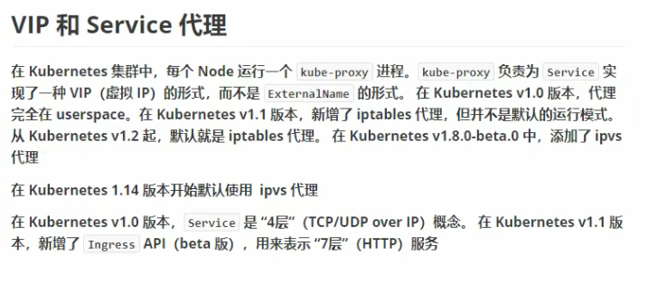

###### v1.0 userspace

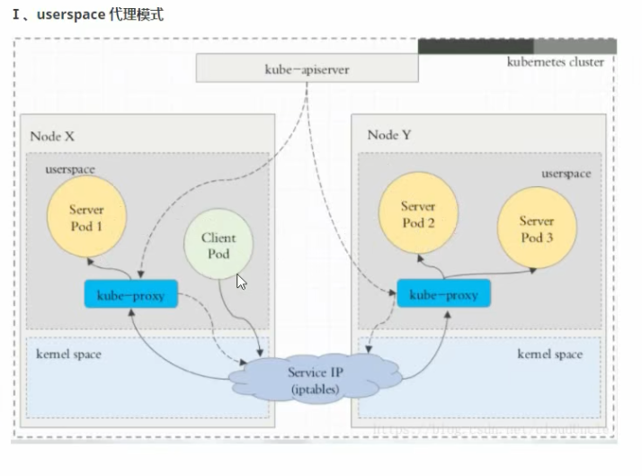

###### v1.1 iptables

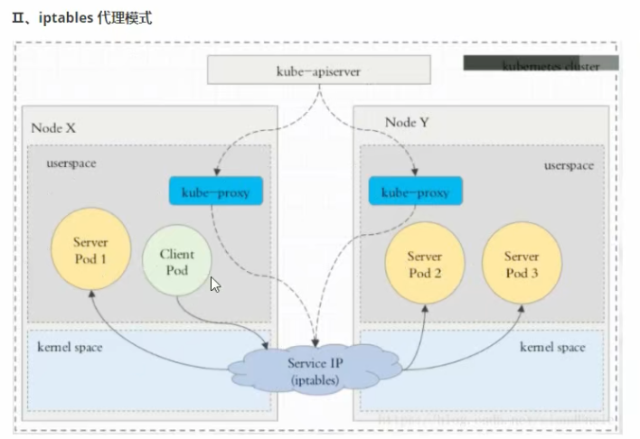

###### v1.14 ipvs

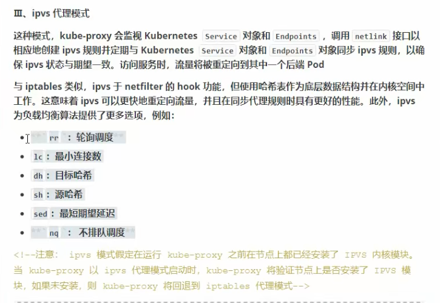

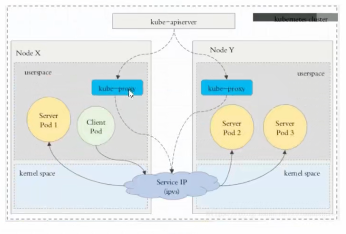

###### service ingress

七层代理

Nginx-ingress

##### （4）存储

**1、存储卷（Volume）**K8s 集群中的存储卷跟 Docker 的存储卷有些类似，只不过 Docker 的存储卷作用范围为一个容器，而 K8s 的存储卷的生命周期和作用范围是一个 Pod。每个 Pod 中声明的存储卷由 Pod 中的所有容器共享。K8s 支持非常多的存储卷类型，特别的，支持多种公有云平台的存储，包括 AWS，Google 和 Azure 云；支持多种分布式存储包括 GlusterFS 和 Ceph；也支持较容易使用的主机本地目录 hostPath 和 NFS 。

**2、持久存储卷（Persistent Volume，PV）和持久存储卷声明（Persistent Volume Claim，PVC）**PV 和 PVC 使得 K8s 集群具备了存储的逻辑抽象能力，使得在配置 Pod 的逻辑里可以忽略对实际后台存储技术的配置，而把这项配置的工作交给 PV 的配置者，即集群的管理者。存储的 PV 和 PVC 的这种关系，跟计算的 Node 和 Pod 的关系是非常类似的；PV 和 Node 是资源的提供者，根据集群的基础设施变化而变化，由 K8s 集群管理员配置；而 PVC 和 Pod 是资源的使用者，根据业务服务的需求变化而变化，有K8s集群的使用者即服务的管理员来配置。

**3、密钥对象（Secret）**Secret 是用来保存和传递密码、密钥、认证凭证这些敏感信息的对象。使用 Secret 的好处是可以避免把敏感信息明文写在配置文件里。在 K8s 集群中配置和使用服务不可避免的要用到各种敏感信息实现登录、认证等功能，例如访问 AWS 存储的用户名密码。为了避免将类似的敏感信息明文写在所有需要使用的配置文件中，可以将这些信息存入一个 Secret 对象，而在配置文件中通过 Secret 对象引用这些敏感信息。这种方式的好处包括：意图明确，避免重复，减少暴漏机会。

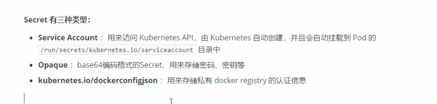

**4、configMap**  配置

##### **（5）资源清单**

###### 1、资源

k8s中所有的内容都抽象为资源。资源实例化后叫做对象

###### 2、资源访问范围

名称空间、集群、元数据

###### 3、资源分类

名称空间级别：

工作负载型资源：Pod、ReplicaSet、Deployment、StatefulSet、DemonSet、Job、CronJob

服务发现资源：Service、Ingress...

配置存储：Volume、CSI、ConfigMap、Secret 

集群级别：Namespace、Node、Role、ClusterRole、RoleBinding、ClusterRoleBinding

元数据级别：HPA、PodTemplate、LimitRange

###### 4、资源定义

kubectl explain pod  可以查看详细属性

yaml文件定义资源

​	（1）必须存在的属性

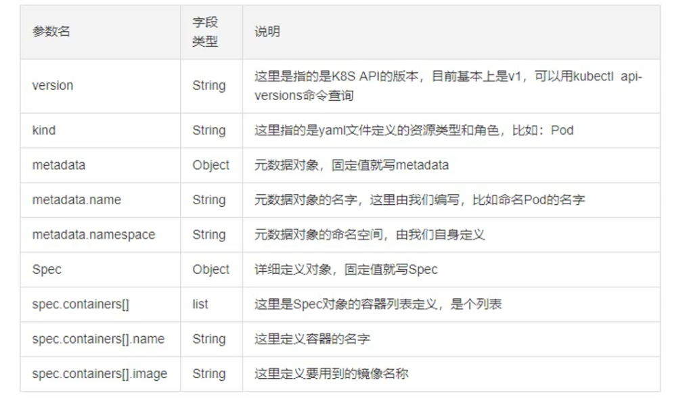

（2）主要对象属性

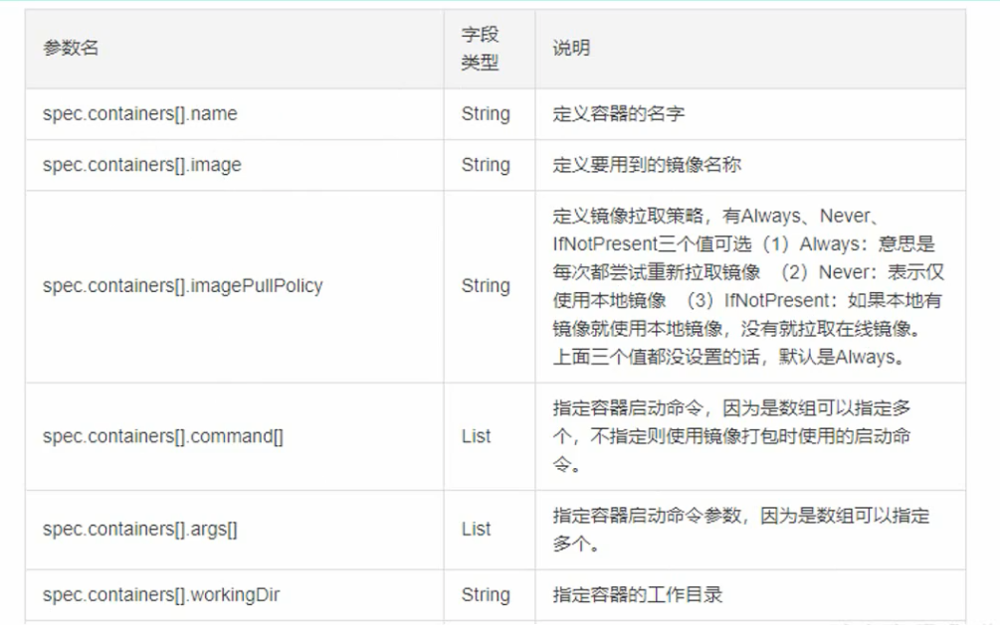

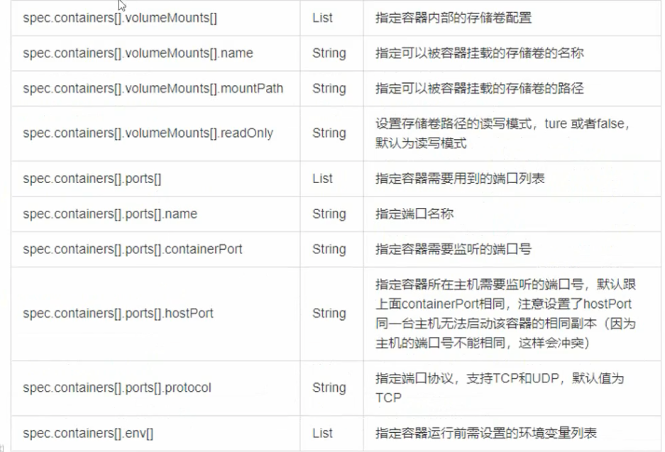

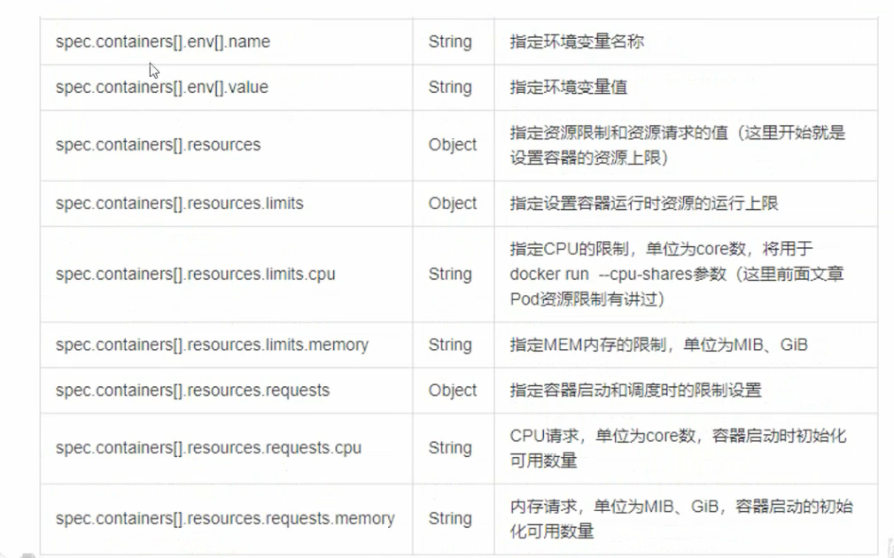

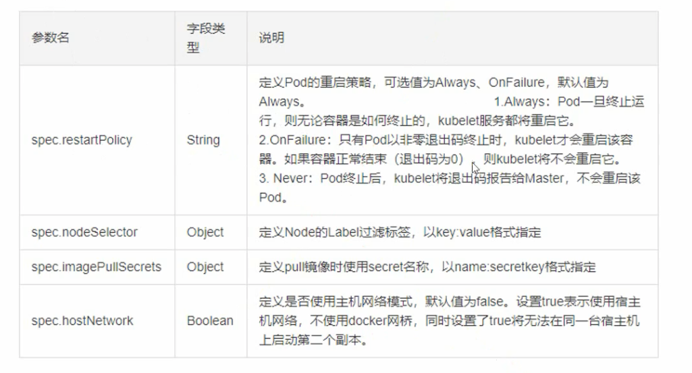

##### （6）调取器

调度算法：

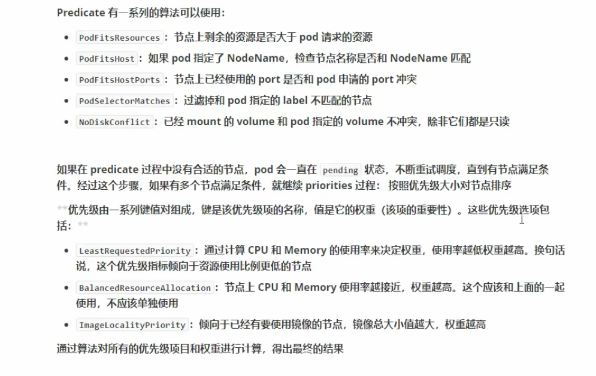

###### 1、亲和性

可以定义 Pod、Node的分布，定义Pod需要分布在什么样的Node上

node 亲和性，指定node运行的主机要求

pod亲和性，指定pod与pod 在同一个拓扑域 或者不同拓扑域

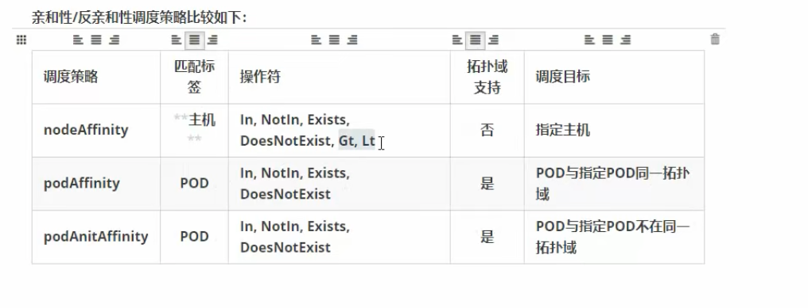

###### 2、污点（Node）、容忍（Pod）

不能容忍污点，就不会调度到有相应污点的node上

容忍，可能调度到有相应污点的node上

污点：taint

kubectl taint nodes node1 key=value:effect

key=value:effect

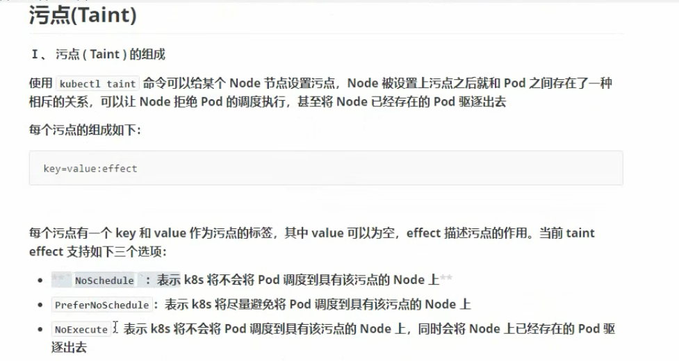

pod容忍

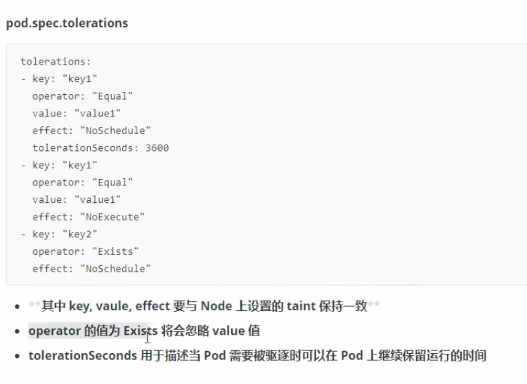

###### 3、固定节点

nodeName 节点名称

nodeSelector 标签选择

##### （7）其他

**1、工作节点（Node）**K8s 集群中的计算能力由 Node 提供，K8s集群中的 Node 是所有 Pod 运行所在的工作主机，可以是物理机也可以是虚拟机。不论是物理机还是虚拟机，工作主机的统一特征是上面要运行 kubelet 管理节点上运行的容器。

**2、用户帐户（User Account）和服务帐户（Service Account）**

用户帐户为人提供账户标识，而服务账户为计算机进程和 K8s 集群中运行的 Pod 提供账户标识。用户帐户和服务帐户的一个区别是作用范围；用户帐户对应的是人的身份，人的身份与服务的名字空间无关，所以用户账户是跨名字空间的；而服务帐户对应的是一个运行中程序的身份，与特定名字空间是相关的。

**3、名字空间（Namespace）**Namespace 为 K8s 集群提供虚拟的隔离作用，K8s 集群初始有两个名字空间，分别是默认名字空间 "default" 和系统名字空间 "kube-system"，除此以外，管理员可以可以创建新的名字空间满足需要。

**4、标签（Label）**Label 附加在资源上，用于关联对象的查询和筛选。

#### 2、K8s 架构和组件

K8s 集群架构

**1、主控节点 / Master 组件：**

**1）API Server**集群统一入口，各组件的协调者，提供认证、授权、访问控制、API注册和发现等机制，以 RESTful API 的方式提供接口服务，所有对象资源的增删改查和监听都由 API Server 处理后提交给 Etcd 存储。

**2）Etcd Cluster**分布式键值存储系统集群，用于保存集群状态数据，如：Pod、Service 等资源对象信息。

**3）Controller Manager**控制器管理程序，负责控制器的管理，控制器和资源一一对应，控制器用于维护集群的状态，如：故障检测、自动扩展、滚动更新等常规后台任务。

**4）Scheduler**调度程序，负责资源的调度，按照预定的调度策略将 Pod 调度到相应的机器上，调度程序根据调度算法为新创建的 Pod 选择一个 Node 节点，可以任意部署，可以部署在同一个节点上，也可以部署在不同的节点上。

**2、工作节点 / Node 组件：**

**1）Kubelet**主控节点代理程序，在 Node 节点上执行 Master 节点安排的任务，它将每个 Pod 转换成一组容器，用于管理本节点运行容器的生命周期，如：创建容器、Pod 挂载数据卷、下载 Secret 、获取容器和节点状态等工作。

**2）Proxy**网络代理程序，在 Node 节点上实现 Pod 网络代理，负责为 Service 提供 Cluster 内部的服务发现、网络规划和负载均衡。

**3）Docker**容器引擎，负责所有具体的映像下载和容器运行。

**3、第三方插件：**

**1）Flannel** 是一个为 K8s 原生集成的三层网络解决方案，主要用于解决容器之间的网络（CNI 网络）通信问题，Flannel 为每个 Node 工作节点分配独立的子网网段，并将所有的网络信息存储在 Etcd 数据库中。脱离 CNI 网络的 K8s 集群是无法工作的，因此在部署 K8s 集群时必须部署 Flannel 插件。

**2）CoreDNS** 是一个为 K8s 原生集成的域名发现解决方案，主要用于将 K8s 服务的动态 IP 地址自动映射成为 **"<service-name>:<service-namespace>"** 规则的 DNS 域名。因 K8s 在创建服务时会分配动态的 IP 地址，因此当在【B 容器 】中使用【A 容器】发布的服务，因为【A 容器】的服务对应的 IP 是动态可变的，所以应当通过该服务对应的 DNS 获取，例如：**"htp(s)://:"**。

**3）Dashboard** 是一个为 K8s 原生集成的用户界面，主要用于 K8s 的可视化管理。使用 Dashboard 可以监控、管理 K8s 集群和集群中的各类资源（如 Deployment，Job，DaemonSet 等等），还可以完成对 Deployment 实现弹性伸缩、发起滚动升级、重启 Pod 或者使用向导创建新应用等管理行为。

**4）Ingress-Nginx** 是一个为 K8s 原生集成的服务网关，主要用于对集群中的服务（通常是 Http 或 Https 服务）的外部访问的 API 对象，以及提供负载平衡、SSL 终端和基于名称的虚拟主机。

#### 3、基于k8s的微服务架构

基于K8s Service做服务发现与负载均衡&基于K8s ConfigMap做配置中心的整体架构

### 三、集群安全机制

#### 1、认证

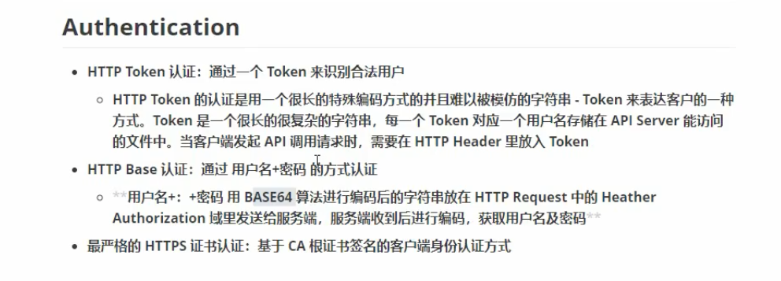

##### （1）http  token认证

##### （2）http base 用户密码认证

##### （3）https证书认证（安全）

