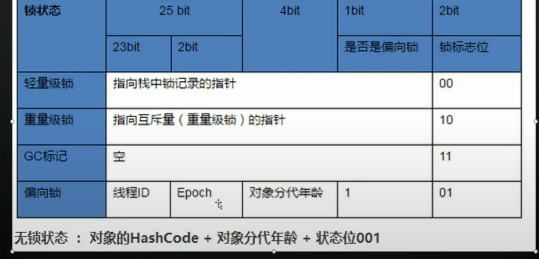
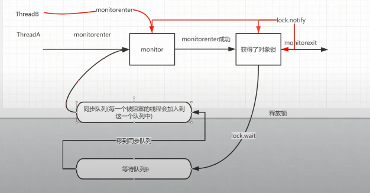
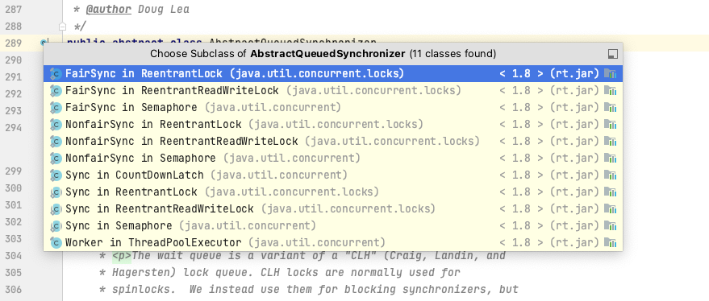

#### 1、java 8 对HashMap的优化

在 JDK 1.7 时 HashMap 是由数组和链表组成的，而 JDK 1.8 则新增了红黑树结构，当链表长度达到 8 并且容器达到 64 时会转换为红黑树存储，以提升元素的操作性能。

同时还介绍了 HashMap 的三个重要方法，查询、添加和扩容，以及 JDK 1.7 resize()  在并发环境下导致死循环的原因(红黑树还是可能会有死循环)
头部插入改成尾部插入

HashMap的数组长度恒定为2的n次方，代码有限制长度 会取与你传入的数最近的一个2的n次方的数

resize 扩容优化    扩容后的位置 为 原始位置  或者 原始位置+数组长度

证明： 以数组长度为16 扩容到 32位例  下标为15和31

15    *0000 0000 0000 1111*

31   *0000 0000 0001 1111*

hash&(n-1)    可以看出与计算结果两者要么相等  要么多出一个数组长度


key可以为null  为null的时候，在第一个位置


#### 2、常用的5中Map

java为数据结构中的映射定义了一个接口java.util.Map，有五个实现类：HashMap、LinkedHashMap、HashTable、TreeMap、ConcurrentHashMap

（1）LinkedHashMap是HashMap的一个子类，但它保持了记录的插入顺序（内部维护了一个双向链表），遍历时会通过链来遍历。

（2）　TreeMap　实现了SortMap接口，能够把保存的记录按照键排序（默认升序），也可以指定排序比较器，遍历时得到的数据是排过序的，底层用红黑树实现

#### 3、ConcurrentHashMap

##### java8 相对于java7 优化  

红黑树、synchronize、volatile+cas

Unsafe.getObjectVolatile()  获取数组的可见性

sizeCtl   与cas结合控制初始化

synchronized 锁节点


key、value 都不能为null   源码不支持，判断key是否存在判断的是value是否为null

从设计的角度  集合内出现null 容易才生bug

ConcurrentHashMap能完全取代HashTable呢？迭代器是强一致性还是弱一致性？


#### 4、java1.8 synchronize优化

synchronized  偏向锁（cas）-》轻量锁（自旋）-》重量级锁（monitor）

##### （1）对象头有四个字节，标记锁的情况

-XX:-UseBiasedLocking //关闭偏向锁（默认打开）



##### （2）重量锁说明

对象头 10标志重量锁  其余信息 指向 monitor   每个对象都存在一个monitor（管程或监视器锁）与之关联

monitor主要包含三部分：正在执行的线程、等待线程队列（线程挂起）、同步线程队列

monitor对象存在于每个Java对象的对象头中(存储的指针的指向)，synchronized锁便是通过这种方式获取锁的，也是为什么Java中任意对象可以作为锁的原因，同时也是notify/notifyAll/wait等方法存在于顶级对象Object中的原因，在使用这3个方法时，必须处于synchronized代码块或者synchronized方法中，否则就会抛出IllegalMonitorStateException异常，这是因为调用这几个方法前必须拿到当前对象的监视器monitor对象，也就是说notify/notifyAll和wait方法依赖于monitor对象，在前面的分析中，我们知道monitor 存在于对象头的Mark Word 中(存储monitor引用指针)，而synchronized关键字可以获取 monitor ，这也就是为什么notify/notifyAll和wait方法必须在synchronized代码块或者synchronized方法调用的原因。




#### 5、List线程安全

##### （1）`Vector`

`Vetor`的实现方式与`ArrayList`大同小异，它的底层也是一个数组，在添加时自增长；

**与`ArrayList`不同的是，它的`add()`方法带有`synchronized`关键字。**

```
public boolean add(E e) {
    ensureCapacityInternal(size + 1); 
    elementData[size++] = e;   //添加元素后   size自增
    return true;
}
```


##### （2）`Collections.synchronizedList(List<T> list)`

**`Collections.synchronizedList()`方法会返回一个`SynchronizedList`类的实例，其中包含了调用该方法时传入的集合，在构造期间，将`SynchronizedCollection`作为互斥锁。**

```
public boolean add(E e) {
    synchronized (mutex) {  //锁住 SynchronizedCollection 集合类
        return c.add(e);
    }
}
```

##### （3）`CopyOnWriteArrayList`

**一个写时复制的`List`，写操作时加锁，过程中创建一个新的数组长度为原来的数组`+1`，并将原有数组元素添加到新数组中，之后添加新元素到末尾。**

**读时不加锁，底层数组被`volatile`修饰，线程可见。**

**他的核心就是：读时不阻塞，大大提升了读的速度。**

##### （4）总结

读多写少的情况使用CopyOnWriteArrayList

写多的情况使用另外两种

#### 6、aqs 源码相关应用

简单分析aqs几个应用场景

主要使用：

1、ReentrantLock  公平锁、非公平锁

2、ReentrantReadWriteLock 公平锁、非公平锁

3、CountDownLatch 

4、Semaphore 公平、非公平

5、ThreadPoolExecutor 线程池




##### （1）ReentrantLock  公平锁、非公平锁

主要方法：

###### 1、加锁

```
public void lock() {
    sync.lock();
}
```

```
abstract void lock();
```

公平锁直接使用aqs的 acquire 方法

```
final void lock() {
    acquire(1);
}
```

非公平锁，先cas判断锁状态没有加锁直接竞争锁，竞争锁失败执行acquire方法

```
final void lock() {
    if (compareAndSetState(0, 1))
        setExclusiveOwnerThread(Thread.currentThread());
    else
        acquire(1);
}
```

aqs acquire详解，代码逻辑上看，先tryAcquire（在子类中实现，具体释放逻辑）尝试获取锁，获取成功往下执行，获取失败则将当前线程加入等待队列,然后再次尝试获取锁   

使用ockSupport.park(this); 阻塞等待

```
public final void acquire(int arg) {
    if (!tryAcquire(arg) &&
        acquireQueued(addWaiter(Node.EXCLUSIVE), arg))
        selfInterrupt();
}
```

公平锁和非公平锁的区别

1、lock的时候，无锁时是否会直接竞争锁

代码区别：

|          | lock               | tryAcquire                         |
| -------- | ------------------ | ---------------------------------- |
| 公平锁   | 无锁进入tryAcquire | 无锁判断是否有前任节点，无才竞争锁 |
| 非公平锁 | 无锁直接竞争锁     | 无锁直接竞争锁                     |

###### 2、释放锁

```
public void unlock() {
    sync.release(1);
}
```

直接调用aqs  release方法

```
public final boolean release(int arg) {
    if (tryRelease(arg)) {
        Node h = head;
        if (h != null && h.waitStatus != 0)
            unparkSuccessor(h);
        return true;
    }
    return false;
}
```

aqs会先调用 tryRelease 在子类中实现，具体释放逻辑

重置state状态，重入锁通过 +1 -1 解决

state 设置为0时，将占有锁的线程置空，结束

```
protected final boolean tryRelease(int releases) {
    int c = getState() - releases;
    if (Thread.currentThread() != getExclusiveOwnerThread())
        throw new IllegalMonitorStateException();
    boolean free = false;
    if (c == 0) {
        free = true;
        setExclusiveOwnerThread(null);
    }
    setState(c);
    return free;
}
```


###### 3、aqs使用总结

state 为重入锁计数

state >1 的时候是加锁，通过cas操作，竞争锁

aqs 获取锁的时候会调用 acquire，通过子类实现tryAcquire方法自定义操作

释放锁的时候回会调用release，通过子类实现tryRelease方法自定义操作


##### （2）ReentrantReadWriteLock 读写锁


读写锁的可重入：state 高16位  读锁  低16位  写锁

###### 1、写锁：

是否重入，设置写锁state位，设置写锁占有线程；获取锁失败入队等待

公平和非公平锁的区别：

公平锁在无锁的情况下会判断等待队列有没有前置节点，有的话先入队等待

非公平锁在无锁的情况下，总是会先竞争一下锁，成功直接获取

公平锁

```
        final boolean writerShouldBlock() {
            return hasQueuedPredecessors();
        }
```

非公平锁

```
final boolean writerShouldBlock() {
    return false; // writers can always barge
}
```


获取锁的时候会调用 acquire，通过子类实现tryAcquire方法自定义操作，unpark之后从队列头部开始获取锁

```
final boolean acquireQueued(final Node node, int arg) {
    boolean failed = true;
    try {
        boolean interrupted = false;
        for (;;) {
            final Node p = node.predecessor();
            if (p == head && tryAcquire(arg)) {
                setHead(node);
                p.next = null; // help GC
                failed = false;
                return interrupted;
            }
            if (shouldParkAfterFailedAcquire(p, node) &&
                parkAndCheckInterrupt())
                interrupted = true;
        }
    } finally {
        if (failed)
            cancelAcquire(node);
    }
}
```

释放锁的时候回会调用release，通过子类实现tryRelease方法自定义操作，state为0时，读写锁释放完成才能 unpark解锁

```
protected final boolean tryRelease(int releases) {
    if (!isHeldExclusively())
        throw new IllegalMonitorStateException();
    int nextc = getState() - releases;
    boolean free = exclusiveCount(nextc) == 0;
    if (free)
        setExclusiveOwnerThread(null);
    setState(nextc);
    return free;
}
```

###### 2、读锁：

是否重入，设置写d读锁state位，设置读锁占有线程；获取锁失败入队等待

公平锁和非公平锁的区别

readerShouldBlock返回false的时候先竞争一次读锁

公平锁：队列有等待线程，并且不是当前线程。

只要队列有节点就先入队等待

```
final boolean readerShouldBlock() {
    return hasQueuedPredecessors();
}
```

非公平锁：队列一个节点是写锁

队列第一个节点不为写锁就先竞争读锁

```
final boolean readerShouldBlock() {
    /* As a heuristic to avoid indefinite writer starvation,
     * block if the thread that momentarily appears to be head
     * of queue, if one exists, is a waiting writer.  This is
     * only a probabilistic effect since a new reader will not
     * block if there is a waiting writer behind other enabled
     * readers that have not yet drained from the queue.
     */
    return apparentlyFirstQueuedIsExclusive();
}
```


获取锁的时候会调用 acquireShared，通过子类实现tryAcquireShared方法自定义操作，unpark之后，从队列头部开始获取锁，获取成功如果下一个节点是读节点继续释放锁doReleaseShared

```
private void doAcquireShared(int arg) {
    final Node node = addWaiter(Node.SHARED);
    boolean failed = true;
    try {
        boolean interrupted = false;
        for (;;) {
            final Node p = node.predecessor();
            if (p == head) {
                int r = tryAcquireShared(arg);
                if (r >= 0) {
                    setHeadAndPropagate(node, r);
                    p.next = null; // help GC
                    if (interrupted)
                        selfInterrupt();
                    failed = false;
                    return;
                }
            }
            if (shouldParkAfterFailedAcquire(p, node) &&
                parkAndCheckInterrupt())
                interrupted = true;
        }
    } finally {
        if (failed)
            cancelAcquire(node);
    }
}
```

释放锁的时候回会调用releaseShared，通过子类实现tryReleaseShared方法自定义操作 state 读状态为 减1   为0的时候 unpark

```
protected final boolean tryReleaseShared(int unused) {
    Thread current = Thread.currentThread();
    if (firstReader == current) {
        // assert firstReaderHoldCount > 0;
        if (firstReaderHoldCount == 1)
            firstReader = null;
        else
            firstReaderHoldCount--;
    } else {
        HoldCounter rh = cachedHoldCounter;
        if (rh == null || rh.tid != getThreadId(current))
            rh = readHolds.get();
        int count = rh.count;
        if (count <= 1) {
            readHolds.remove();
            if (count <= 0)
                throw unmatchedUnlockException();
        }
        --rh.count;
    }
    for (;;) {
        int c = getState();
        int nextc = c - SHARED_UNIT;
        if (compareAndSetState(c, nextc))
            // Releasing the read lock has no effect on readers,
            // but it may allow waiting writers to proceed if
            // both read and write locks are now free.
            return nextc == 0;
    }
}
```

###### 3、aqs使用总结

state 高16位  读锁  低16位  写锁

写锁 

```
获取锁的时候会调用 acquire，通过子类实现tryAcquire方法自定义操作

释放锁的时候回会调用release，通过子类实现tryRelease方法自定义操作
```

读锁

```
获取锁的时候会调用 acquireShared，通过子类实现tryAcquireShared方法自定义操作

释放锁的时候回会调用releaseShared，通过子类实现tryReleaseShared方法自定义操作
```

##### （3）CountDownLatch

主要方法

```
countDown
await
```

state用于等待线程计数，为0的时候

###### 1、countDown  

执行aqs的 releaseShared方法 通过自定义 tryReleaseShared 实现特定逻辑

每次执行 state减1，减到0的时候unpark

```
protected boolean tryReleaseShared(int releases) {
    // Decrement count; signal when transition to zero
    for (;;) {
        int c = getState();
        if (c == 0)
            return false;
        int nextc = c-1;
        if (compareAndSetState(c, nextc))
            return nextc == 0;
    }
}
```

###### 2、await

执行 aqs 的 acquireSharedInterruptibly方法 通过 tryAcquireShared 自定义逻辑，

```
protected int tryAcquireShared(int acquires) {
    return (getState() == 0) ? 1 : -1;
}
```

3、aqs使用总结

state用于等待线程计数

tryReleaseShared 减数

acquireSharedInterruptibly 堵塞等待线程计数为0  unpark

##### （4）Semaphore

主要方法

```
// 初始化信号量数量
new Semaphore(3);
//获取信号量
semaphore.acquire();
//释放信号量
semaphore.release();
```

###### 1、acquire

调用aqs的acquireSharedInterruptibly方法 获取锁

通过实现tryAcquireShared 方式，实现自定义逻辑

公平锁：前置节点先入队等待，没有的话信号量state有可用余量能成功获取锁

```
protected int tryAcquireShared(int acquires) {
    for (;;) {
        if (hasQueuedPredecessors())
            return -1;
        int available = getState();
        int remaining = available - acquires;
        if (remaining < 0 ||
            compareAndSetState(available, remaining))
            return remaining;
    }
}
```

非公平锁：直接尝试获取可用余量，如果没有入队park等待

```
final int nonfairTryAcquireShared(int acquires) {
    for (;;) {
        int available = getState();
        int remaining = available - acquires;
        if (remaining < 0 ||
            compareAndSetState(available, remaining))
            return remaining;
    }
}
```

###### 2、release

调用aqs的releaseShared方法

通过tryReleaseShared实现自定义逻辑，增加可用余量，增加成功unpark 释放一个堵塞

```
protected final boolean tryReleaseShared(int releases) {
    for (;;) {
        int current = getState();
        int next = current + releases;
        if (next < current) // overflow
            throw new Error("Maximum permit count exceeded");
        if (compareAndSetState(current, next))
            return true;
    }
}
```

##### （5）ThreadPoolExecutor 线程池

状态 ctl 高三位状态，低位当前的线程数量

1、低于核心线程 addWorker(command, true) 新建 worker

2、加入队列排队

3、加入队列失败addWorker(command, false)

4、加入队列失败，最大线程数，执行reject策略

Worker 继承 aqs 实现 runnable

在run内，死循环，从队列获取任务执行，

执行是通过 aqs的自定义lock 堵塞和释放 ,是为了不可重入

不通过lock锁的原因是重入问题，主要是防止 执行中的时候 shutdown 停止当前线程

interruptIdleWorkers的时候获取锁成功了在中断线程

```
private void interruptIdleWorkers(boolean onlyOne) {
    final ReentrantLock mainLock = this.mainLock;
    mainLock.lock();
    try {
        for (Worker w : workers) {
            Thread t = w.thread;
            if (!t.isInterrupted() && w.tryLock()) {
                try {
                    t.interrupt();
                } catch (SecurityException ignore) {
                } finally {
                    w.unlock();
                }
            }
            if (onlyOne)
                break;
        }
    } finally {
        mainLock.unlock();
    }
}
```

