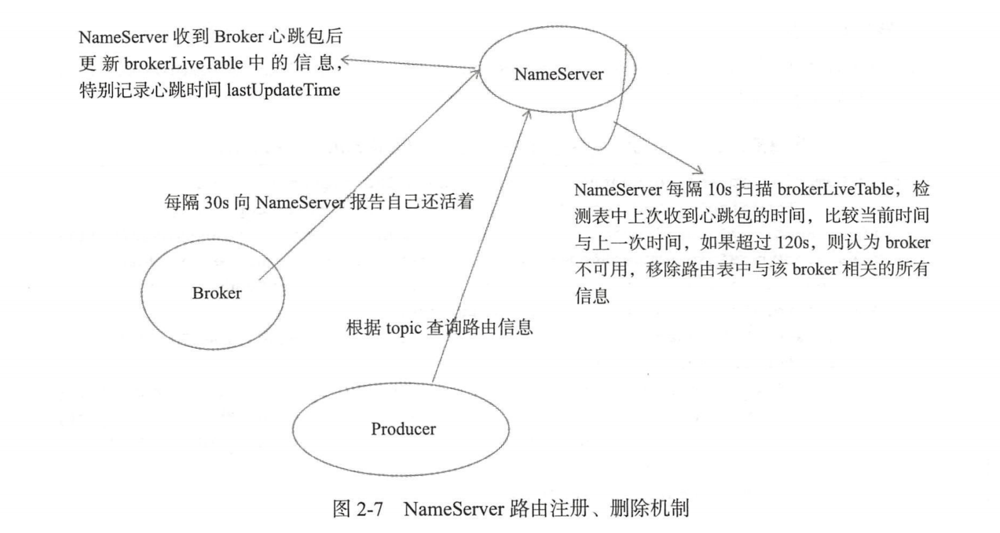

# 一、架构设计

设计优势：事务型消息、延迟消息、消息索引查询

问题点：

1、NameServer  

保存主题、队列、broker的映射关系，10秒扫描一次broker健康状态 120s没有心跳就剔除

高可用：broker每30秒上传心跳，上传当前主题、队列信息。每个nameserver之间没有连接，通过broker上传信息保证路由信息最终一致，消息发送失败，会有重试机制，保证生产者路由信息不及时不会影响使用

2、生产者

发送消息从nameserver获取主题路由信息，每30秒会从nameserver更新路由信息。

发送失败会重试，失败的broker会在短时间内不会往该broker发送消息，因为路由信息会延迟30秒以上，通过一个健康检测的消息成功之后再加入生产服务

3、 Broker 为每一主题默认创建 个读队列 个写队列

# 二、nameserver

> 1、NameServer  
>
> 保存主题、队列、broker的映射关系，10秒扫描一次broker健康状态 120s没有心跳就剔除
>
> 高可用：broker每30秒上传心跳，上传当前主题、队列信息。每个nameserver之间没有连接，通过broker上传信息保证路由信息最终一致，消息发送失败，会有重试机制，保证生产者路由信息不及时不会影响使用

# 三、生产者

> 发送消息从nameserver获取主题路由信息，每30秒会从nameserver更新路由信息。
>
> 发送失败会重试，失败的broker会在短时间内不会往该broker发送消息，因为路由信息会延迟30秒以上，通过一个健康检测的消息成功之后再加入生产服务

# 四、消费者

消费者每20s会rebalance 重新负载消费者，拉取最新的路由信息，判断路由信息有没有变化，有新加入的或者删除的broker，根据策略重新负载消费broker。

消费者启动的时候会想broker注册消费者信息，同步给其他broker，如此每个broker都会有没有主题消费组的信息。重新负载的时候向broker获取当前消费组的信息，向nameserver获取当前队列的信息，根据策略重新负载

 Broker 为每一主题默认创建 个读队列 个写队列，主题的队列分布在不同的broker上

# 五、broker高可用

一个broker 有多个主题，一个主题有多个队列。broker主从复制实现高可用，主从broker的数据一样。多主多从的模式，每个主broker包含每个主题的队列可以提高生产的并发和容灾能力，一个主broker挂了，可以向其它主节点从事。从节点复制保存数据，主节点挂了可以接管服务。

