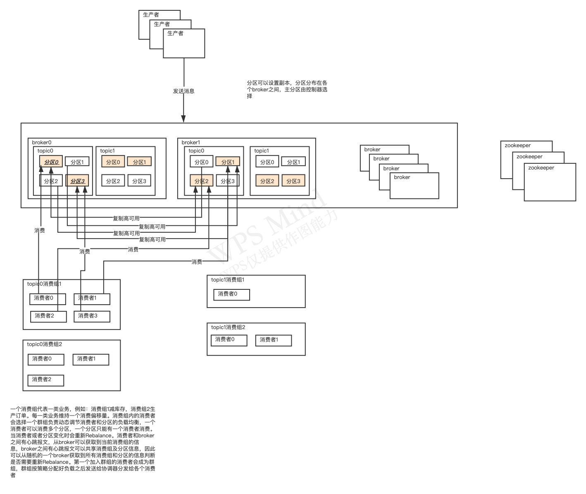
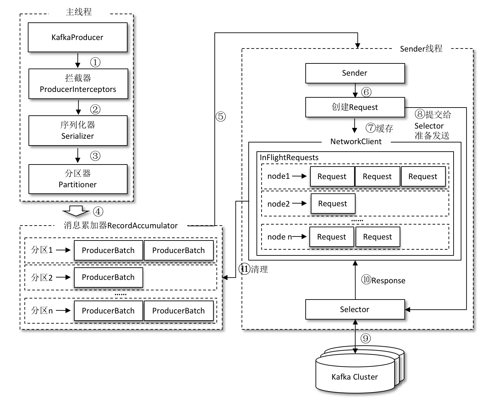
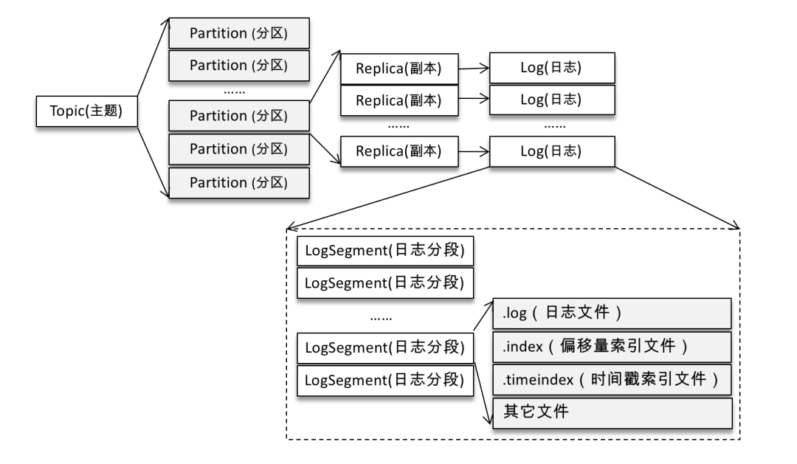

# broker高可用

一个broker有多个主题，一个主题有多个分区（类似队列），主题分布在不同的broker上 。数据高可用，通过分区数据在不同broker上复制保存。

broker控制区选举：在zk内创建临时节点，第一个创建成功的为控制器，负责分区leader的选举。控制器关闭断开连接其他broker通过watch观察到临时节点消失会重新竞争成为控制器。当有新加入的broker分区有变化时控制器会通知其他broker分区信息，从而实现每个broker上都保存了分区分布信息


broker会向zk注册topic和分区信息，消费在创建对应的watch，分区和broker发生变化可以及时rebalance


和RocketMQ的区别：

kafka broker没有主从的区别，通过分区的冗余保证高可用

Rocket 通过broker的主从保证高可用


# 消费者

一个主题有多个分区，一个分区只能被一个消费者消费，一个消费者可以消费多个分区。同一个消息只能被同一个消费组消费一次。

三个分区一个消费者，这个消费者会消费三个分区，新增一个消费者会变成一个消费者消费两个分区，一个消费一个分区。消费组内的消费者变化或者主题分区变化，需要rebalance重新 负载

消费组信息由 消费者和broker的心跳维持，分区的信息

每个消费者会想协调器broker发送心跳信息，第一个加入群组的消费者会成为群主，有此消费者分配好消费负载发送给broker协调器，在发送给各个消费者负载消费


# 注意问题

- Kafka的用途有哪些？使用场景如何？

> 数据同步，削峰，解耦

- Kafka中的ISR、AR又代表什么？ISR的伸缩又指什么

> - AR 分区的所有副本、 ISR与主节点保持同步副本集合。
>
>  分区中的所有副本统称为AR（Assigned Repllicas）。
>
> 所有与leader副本保持一定程度同步的副本（包括Leader）组成ISR（In-Sync Replicas），ISR集合是AR集合中的一个子集。
>
> 与leader副本同步滞后过多的副本（不包括leader）副本，组成OSR(Out-Sync Relipcas),
>
> AR=ISR+OSR。在正常情况下，所有的follower副本都应该与leader副本保持一定程度的同步，即AR=ISR,OSR集合为空。
>
> 副本选主时，只有ISR中的副本才有资格参加选举
>
> - ISR列表维持，会有两个定时任务周期性的监测每个分区副本，有失效的副本就缩减，有完成同步的加入列表。
>
> 分布式消息系统对一个节点是否存活有这样两个条件判断：第一个，节点必须维护和zookeeper的连接，zookeeper通过心跳机制检查每个节点的连接；第二个，如果节点时follower，它必要能及时同步与leader的写操作，不是延时太久。
>
> 延迟时间replica.lag.time.max.ms和延迟条数replica.lag.max.messages两个维度
>
> 每个broker 向zk定期注册信息，保存broker 主题，分区，同步偏移量信息，更新时间，broker控制器定期获取信息对比判断isr中的节点是否需要剔除或者增加。在zk上会保存每个分区当前的主分区及isr信息。zk上会保存一个isr变更信息的数据，其他broker会watch路劲当isr发生变更可以同步到其他节点。如果频繁更变isr写入zk会影响性能
>
> （1）.上一次ISR集合发生变化距离现在已经超过5秒，
>
>  （2）.上一次写入zookeeper的时候距离现在已经超过60秒。
>
>  满足以上两个条件之一者可以将ISR写入集合的变化的目标节点。

- Kafka中的HW、LEO、LSO、LW等分别代表什么？

> LW是Low Watermark的缩写，俗称“低水位”，代表AR集合中最小的logStartOffset值，副本的拉取请求（FetchRequest，它有可能触发新建日志分段而旧的的被清理，进而导致logStartoffset的增加）和删除请求（DeleteRecordRequest）都可能促使LW的增长。
>
> HW是High Watermak的缩写， 俗称高水位，它表示了一个特定消息的偏移量（offset），消费之只能拉取到这个offset之前的消息。 ISR中同步最小的偏移量
>
> LEO是Log End Offset的缩写，它表示了当前日志文件中下一条待写入消息的offset，如上图offset为9的位置即为当前日志文件
>
> 分区ISR集合中的每个副本都会维护自身的LEO，而ISR集合中最小的LEO即为分区的HW，对消费者而言只能消费HW之前的消息。
>
> LSO特指LastStableOffset。它具体与kafka的事物有关。
>
>   消费端参数——isolation.level,这个参数用来配置消费者事务的隔离级别。字符串类型，“read_uncommitted”和“read_committed”，表示消费者所消费到的位置，如果设置为“read_committed"，那么消费这就会忽略事务未提交的消息，既只能消费到LSO(LastStableOffset)的位置，默认情况下，”read_uncommitted",既可以消费到HW（High Watermak）的位置。


- Kafka中是怎么体现消息顺序性的？

> 只能保证分区的顺序性，按业务区分消息，顺序性的消息放入一个分区

- Kafka中的分区器、序列化器、拦截器是否了解？它们之间的处理顺序是什么？

> - 序列化器：生产者需要用序列化器（Serializer）把对象转换成字节数组才能通过网络发送给 Kafka。而在对侧，消费者需要用反序列化器（Deserializer）把从 Kafka 中收到的字节数组转换成相应的对象。
> - 分区器：分区器的作用就是为消息分配分区。如果消息 ProducerRecord 中没有指定 partition 字段，那么就需要依赖分区器，根据 key 这个字段来计算 partition 的值。
> - Kafka 一共有两种拦截器：生产者拦截器和消费者拦截器。 
>   - 生产者拦截器既可以用来在消息发送前做一些准备工作，比如按照某个规则过滤不符合要求的消息、修改消息的内容等，也可以用来在发送回调逻辑前做一些定制化的需求，比如统计类工作。
>   - 消费者拦截器主要在消费到消息或在提交消费位移时进行一些定制化的操作。
>
> 消息在通过 send() 方法发往 broker 的过程中，有可能需要经过拦截器（Interceptor）、序列化器（Serializer）和分区器（Partitioner）的一系列作用之后才能被真正地发往 broker。拦截器（下一章会详细介绍）一般不是必需的，而序列化器是必需的。消息经过序列化之后就需要确定它发往的分区，如果消息 ProducerRecord 中指定了 partition 字段，那么就不需要分区器的作用，因为 partition 代表的就是所要发往的分区号。
>
> 处理顺序 ：拦截器->序列化器->分区器
>
> KafkaProducer 在将消息序列化和计算分区之前会调用生产者拦截器的 onSend() 方法来对消息进行相应的定制化操作。 然后生产者需要用序列化器（Serializer）把对象转换成字节数组才能通过网络发送给 Kafka。 最后可能会被发往分区器为消息分配分区。

- Kafka生产者客户端的整体结构是什么样子的？



- Kafka生产者客户端中使用了几个线程来处理？分别是什么？

> 整个生产者客户端由两个线程协调运行，这两个线程分别为主线程和 Sender 线程（发送线程）。在主线程中由 KafkaProducer 创建消息，然后通过可能的拦截器、序列化器和分区器的作用之后缓存到消息累加器（RecordAccumulator，也称为消息收集器）中。Sender 线程负责从 RecordAccumulator 中获取消息并将其发送到 Kafka 中。

- Kafka的旧版Scala的消费者客户端的设计有什么缺陷？

> 老版本的 Consumer Group 把位移保存在 ZooKeeper 中。Apache ZooKeeper 是一个分布式的协调服务框架，Kafka 重度依赖它实现各种各样的协调管理。将位移保存在 ZooKeeper 外部系统的做法，最显而易见的好处就是减少了 Kafka Broker 端的状态保存开销。
>
> ZooKeeper 这类元框架其实并不适合进行频繁的写更新，而 Consumer Group 的位移更新却是一个非常频繁的操作。这种大吞吐量的写操作会极大地拖慢 ZooKeeper 集群的性能

- “消费组中的消费者个数如果超过topic的分区，那么就会有消费者消费不到数据”这句话是否正确？如果正确，那么有没有什么hack的手段？
- 消费者提交消费位移时提交的是当前消费到的最新消息的offset还是offset+1?

> 在旧消费者客户端中，消费位移是存储在 ZooKeeper 中的。而在新消费者客户端中，消费位移存储在 Kafka 内部的主题__consumer_offsets 中。 当前消费者需要提交的消费位移是offset+1

- 有哪些情形会造成重复消费？

> 1. Rebalance 一个consumer正在消费一个分区的一条消息，还没有消费完，发生了rebalance(加入了一个consumer)，从而导致这条消息没有消费成功，rebalance后，另一个consumer又把这条消息消费一遍。
> 2. 消费者端手动提交 如果先消费消息，再更新offset位置，导致消息重复消费。
> 3. 消费者端自动提交 设置offset为自动提交，关闭kafka时，如果在close之前，调用 consumer.unsubscribe() 则有可能部分offset没提交，下次重启会重复消费。
> 4. 生产者端 生产者因为业务问题导致的宕机，在重启之后可能数据会重发

- 那些情景下会造成消息漏消费？

> 1. 自动提交 设置offset为自动定时提交，当offset被自动定时提交时，数据还在内存中未处理，此时刚好把线程kill掉，那么offset已经提交，但是数据未处理，导致这部分内存中的数据丢失。
> 2. 生产者发送消息 发送消息设置的是fire-and-forget（发后即忘），它只管往 Kafka 中发送消息而并不关心消息是否正确到达。不过在某些时候（比如发生不可重试异常时）会造成消息的丢失。这种发送方式的性能最高，可靠性也最差。
> 3. 消费者端 先提交位移，但是消息还没消费完就宕机了，造成了消息没有被消费。自动位移提交同理
> 4. acks没有设置为all 如果在broker还没把消息同步到其他broker的时候宕机了，那么消息将会丢失

- KafkaConsumer是非线程安全的，那么怎么样实现多线程消费？

> 使用多个分区，一个消费组多个消费组

- 简述消费者与消费组之间的关系

> 一个消费组有一个或多个消费组，消费组内的消费者负载均衡消费主题下面的分区

- 当你使用kafka-topics.sh创建（删除）了一个topic之后，Kafka背后会执行什么逻辑？

> 在 log.dir配置的目录下创建主题和分区
>
> 在zk上创建一个目录记录topic的分区副本和broker保存的关系

- topic的分区数可不可以增加？如果可以怎么增加？如果不可以，那又是为什么？

> 可以增加，新增之后会触发Rebalance
>
> ```javascript
> bin/kafka-topics.sh --bootstrap-server broker_host:port --alter --topic <topic_name> --partitions <新分区数>
> ```

- topic的分区数可不可以减少？如果可以怎么减少？如果不可以，那又是为什么？

> 不能删除，分区的消息不好处理

- 创建topic时如何选择合适的分区数？

> 在 Kafka 中，性能与分区数有着必然的关系，在设定分区数时一般也需要考虑性能的因素。对不同的硬件而言，其对应的性能也会不太一样。 可以使用Kafka 本身提供的用于生产者性能测试的 kafka-producer- perf-test.sh 和用于消费者性能测试的 kafka-consumer-perf-test.sh来进行测试。 增加合适的分区数可以在一定程度上提升整体吞吐量，但超过对应的阈值之后吞吐量不升反降。

- Kafka目前有哪些内部topic，它们都有什么特征？各自的作用又是什么？

> __consumer_offsets：作用是保存 Kafka 消费者的位移信息
> __transaction_state：用来存储事务日志消息

- 优先副本是什么？它有什么特殊的作用？

> 所谓的优先副本是指在AR集合列表中的第一个副本。
> 理想情况下，优先副本就是该分区的leader 副本，所以也可以称之为 preferred leader。Kafka 要确保所有主题的优先副本在 Kafka 集群中均匀分布，这样就保证了所有分区的 leader 均衡分布。以此来促进集群的负载均衡，这一行为也可以称为“分区平衡”。

- Kafka有哪几处地方有分区分配的概念？简述大致的过程及原理。

> 1. 生产者的分区分配是指为每条消息指定其所要发往的分区。可以编写一个具体的类实现org.apache.kafka.clients.producer.Partitioner接口。
> 2. 消费者中的分区分配是指为消费者指定其可以消费消息的分区。Kafka 提供了消费者客户端参数 partition.assignment.strategy 来设置消费者与订阅主题之间的分区分配策略。
> 3. 分区副本的分配是指为集群制定创建主题时的分区副本分配方案，即在哪个 broker 中创建哪些分区的副本。kafka-topics.sh 脚本中提供了一个 replica-assignment 参数来手动指定分区副本的分配方案。

- 简述Kafka的日志目录结构

> broker分布
>
> ```json
> /brokers/ids/[0...N] --> {"jmx_port":...,"timestamp":...,"endpoints":[...],"host":...,"version":...,"port":...} (ephemeral node)
> ```
>
> 主题分布
>
> ```json
> /brokers/topics/[topic]/partitions/[0...N]/state --> {"controller_epoch":...,"leader":...,"version":...,"leader_epoch":...,"isr":[...]} (ephemeral node)
> ```
>
> Kafka 中的消息是以主题为基本单位进行归类的，各个主题在逻辑上相互独立。每个主题又可以分为一个或多个分区。不考虑多副本的情况，一个分区对应一个日志（Log）。为了防止 Log 过大，Kafka 又引入了日志分段（LogSegment）的概念(每段为1GB)，将 Log 切分为多个 LogSegment，相当于一个巨型文件被平均分配为多个相对较小的文件。
>
> Log 和 LogSegment 也不是纯粹物理意义上的概念，Log 在物理上只以文件夹的形式存储，而每个 LogSegment 对应于磁盘上的一个日志文件和两个索引文件，以及可能的其他文件（比如以“.txnindex”为后缀的事务索引文件）
>
> 每个日志分段文件对应了两个索引文件，主要用来提高查找消息的效率。
>
> 偏移量索引文件用来建立消息偏移量（offset）到物理地址之间的映射关系，方便快速定位消息所在的物理文件位置
>
> 时间戳索引文件则根据指定的时间戳（timestamp）来查找对应的偏移量信息。




- Kafka中有那些索引文件？

> 偏移量索引文件用来建立消息偏移量（offset）到物理地址之间的映射关系，方便快速定位消息所在的物理文件位置
>
> 时间戳索引文件则根据指定的时间戳（timestamp）来查找对应的偏移量信息。

- 如果我指定了一个offset，Kafka怎么查找到对应的消息？

> Kafka是通过seek() 方法来指定消费的，在执行seek() 方法之前要去执行一次poll()方法，等到分配到分区之后会去对应的分区的指定位置开始消费，如果指定的位置发生了越界，那么会根据auto.offset.reset 参数设置的情况进行消费。

- 如果我指定了一个timestamp，Kafka怎么查找到对应的消息？

> Kafka提供了一个 offsetsForTimes() 方法，通过 timestamp 来查询与此对应的分区位置。offsetsForTimes() 方法的参数 timestampsToSearch 是一个 Map 类型，key 为待查询的分区，而 value 为待查询的时间戳，该方法会返回时间戳大于等于待查询时间的第一条消息对应的位置和时间戳，对应于 OffsetAndTimestamp 中的 offset 和 timestamp 字段。

- 聊一聊你对Kafka的Log Retention的理解

> 日志删除（Log Retention）：按照一定的保留策略直接删除不符合条件的日志分段。可以通过 broker 端参数 log.cleanup.policy 来设置日志清理策略，此参数的默认值为“delete”，即采用日志删除的清理策略。
>
> **基于时间**：默认情况下只配置了 log.retention.hours 参数，其值为168，故默认情况下日志分段文件的保留时间为7天。
>
> 删除日志分段时，首先会从 Log 对象中所维护日志分段的跳跃表中移除待删除的日志分段，以保证没有线程对这些日志分段进行读取操作。然后将日志分段所对应的所有文件添加上“.deleted”的后缀（当然也包括对应的索引文件）。最后交由一个以“delete-file”命名的延迟任务来删除这些以“.deleted”为后缀的文件，这个任务的延迟执行时间可以通过 file.delete.delay.ms 参数来调配，此参数的默认值为60000，即1分钟。
>
> **基于日志大小** 
>
> **基于日志起始偏移量**

- 聊一聊你对Kafka的Log Compaction的理解

> Kafka中的Log Compaction是指在默认的日志删除（Log Deletion）规则之外提供的一种清理过时数据的方式。如下图所示，Log Compaction对于有相同key的的不同value值，只保留最后一个版本。如果应用只关心key对应的最新value值，可以开启Kafka的日志清理功能，Kafka会定期将相同key的消息进行合并，只保留最新的value值。

- 聊一聊你对Kafka底层存储的理解（页缓存、内核层、块层、设备层）

> https://www.cnblogs.com/luozhiyun/p/11909315.html

- 聊一聊Kafka的延时操作的原理
- 聊一聊Kafka控制器的作用

> 在 Kafka 集群中会有一个或多个 broker，其中有一个 broker 会被选举为控制器（Kafka Controller），它负责管理整个集群中所有分区和副本的状态。当某个分区的 leader 副本出现故障时，由控制器负责为该分区选举新的 leader 副本。当检测到某个分区的 ISR 集合发生变化时，由控制器负责通知所有broker更新其元数据信息。当使用 kafka-topics.sh 脚本为某个 topic 增加分区数量时，同样还是由控制器负责分区的重新分配。

- 消费再均衡的原理是什么？（提示：消费者协调器和消费组协调器）
- Kafka中的幂等是怎么实现的？
- Kafka中的事务是怎么实现的？
- Kafka中有那些地方需要选举？这些地方的选举策略又有哪些？
- 失效副本是指什么？有那些应对措施？
- 多副本下，各个副本中的HW和LEO的演变过程
- 为什么Kafka不支持读写分离？
- Kafka在可靠性方面做了哪些改进？（HW, LeaderEpoch）
- Kafka中怎么实现死信队列和重试队列？
- Kafka中的延迟队列怎么实现
- Kafka中怎么做消息审计？
- Kafka中怎么做消息轨迹？
- Kafka中有那些配置参数比较有意思？聊一聊你的看法
- Kafka中有那些命名比较有意思？聊一聊你的看法
- Kafka有哪些指标需要着重关注？
- 怎么计算Lag？(注意read_uncommitted和read_committed状态下的不同)
- Kafka的那些设计让它有如此高的性能？
- Kafka有什么优缺点？
- 还用过什么同质类的其它产品，与Kafka相比有什么优缺点？
- 为什么选择Kafka?
- 在使用Kafka的过程中遇到过什么困难？怎么解决的？
- 怎么样才能确保Kafka极大程度上的可靠性？
- 聊一聊你对Kafka生态的理解

