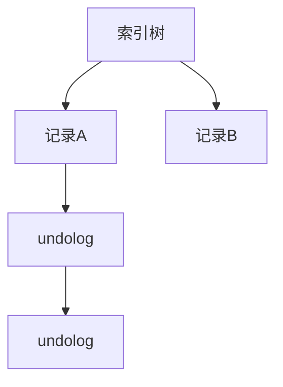
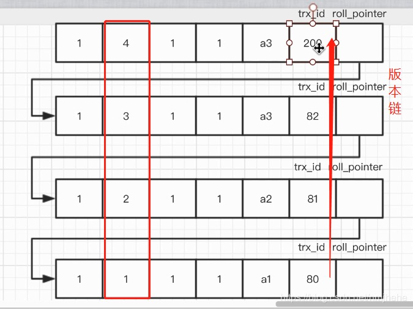
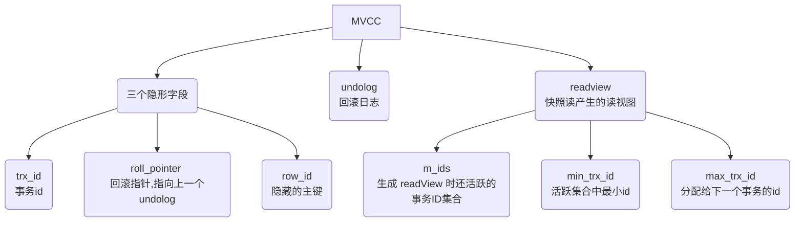
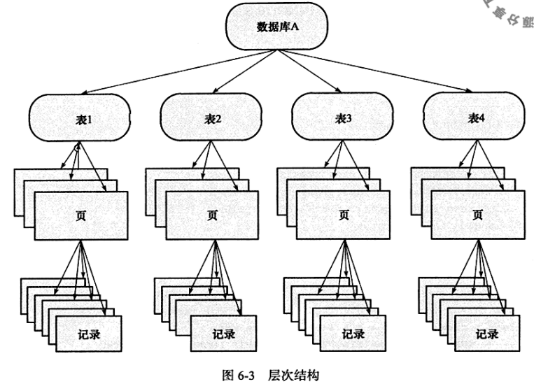
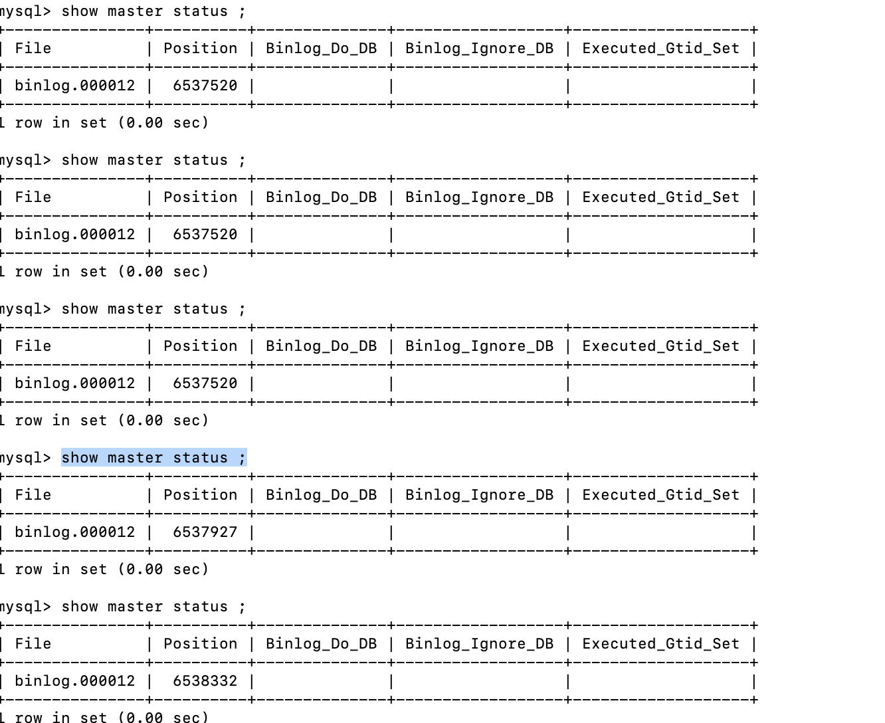
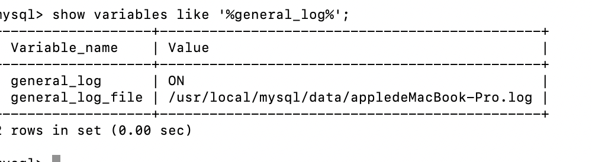

# 一、索引

# 二、事务

> 事务简单的描述，就是为了保障数据的完整性，碰到极端情况宕机之类数据不丢失的一种机制。
>
> 事务未提交宕机，数据库会回滚数据。
>
> 主要几个特性：
>
> - 原子性(Atomicity) ：一个事务中的所有操作要么一起成功，要么一起失败。
>
>   通过 undo log 来实现的
>
> - 一致性(Consistency)：从一个一致性的状态转移到另一个一致性的状态，保证数据的完整一致。
>
>   通过原子性，持久性，隔离性来实现的！
>
> - 隔离性(Isolation)：事务之间的数据读写具有一定的独立性，根据不同的隔离级别不同，能够并发的读写请求。
>
>   通过MVCC+读写锁实现
>
> - 持久性(Durability)：事务一旦提交，其所作做的修改会永久保存到数据库中，此时即使系统崩溃修改的数据也不会丢失。
>
>   通过redo log来实现

## （一）原子性

原子性是通过undo log来实现的，保证事务内的所有操作一起成功或者一起失败。

### 1、undo log

> undo log是回滚日志，提供回滚操作。
>
> 回滚日志，写操作前记录数据的逆向回滚数据。存放在数据库的undo段（undo segment）中会持久化到磁盘。如果事务操作失败可以根据undo log回滚数据到之前的版本，保证所有操作一起成功或者失败。
>
> 事务提交之后并不是立即删除undo log，MVCC也是通过undo log+readview逻辑实现的，待判断没有事物用到该版本的信息时才可以清理相应undo log。

### （1）undo log格式

##### 1.insert undo log 

在insert操作中产生的undo log。因为insert操作的记录只对事务本身可见，对其他事务不可见，故此类log在事务提交后可以直接删除

##### 2.update undo log

delete和update操作时产生的undo log。该log可能需要提供MVCC机制，因此不能事务提交时就删除。提交时放入undo log链表等待purge线程进行最后的删除。判断条件undo log链表中，小于当前最小活跃事务id的集合中保存最大的事务id的undo log集合中其余可以删除，只需要保留undo log中已经提交的需要使用的最新的已提交数据即可。

### （2）steal/no-force策略

> - steal策略，磁盘上可能包含uncommitted的数据，因此系统需要记录undo log。
> - no steal策略，磁盘上不会存在uncommitted数据，因此无需回滚操作，也就无需记录undo log。
> - force策略，表示事务在committed之后必须将所有更新立刻持久化到磁盘
> - no-force表示事务在committed之后可以不立即持久化到磁盘，需要记录redo log，重启时恢复数据

现在DBMS常用的是steal/no-force策略，因此一般都需要记录redo log和undo log。因为redo log中也会持久化未提交的事务，所以undo log也需要持久化，在redo恢复数据的时候，数据在redo中没有提交记录需要根据undo log回滚

### 2、原子性实现过程描述

> 写操作会加排它锁，所有同一条的数据同一时刻肯定一直一个写操作，索引树上保存的是写操作最新的数据。
>
> undo log链条上的数据都是已经提交的数据，如果当前有一个事务正在写操作会加一条当前操作的undo log+已经提交的undo log
>
> 如果事务回滚则取出索引树上最新数据的undo log进行回滚操作，回滚结束log从链条上删除，最新数据恢复成其他版本，排它锁释放。
>
> undo log链条上的数据包含大于当前事务最小活跃id的log，以及小于最小活跃id中最大的一条即可满足MVCC的要求




## （二）一致性

> 通过回滚，以及恢复，和在并发环境下的隔离做到一致性。
>
> 通过原子性、隔离性、持久性保证数据的一致性.

## （三）事务隔离级别

### 1、隔离级别描述

- 读未提交	-》读取到最新版本数据，事务未提交也能读取到，如果该数据事务回滚会导致脏读
- 读已提交    -》数据在事务提交成功之后才能读取到
- 可重复读    -》mysql默认隔离级别，在同一个事务内读取到的数据是相同的，存储引擎为innodb时不会出现幻读
- 可串行化    -》事务串行执行，性能低一般不使用

#### （1）脏读、重复读、幻读

- 脏读：事务未提交的数据被读取到之后回滚了，读取到的数据与实际数据不一致

- 不可重复读：同一个事务中，对于同一数据，执行完全相同的select语句时可能看到不一样的结果。

- 幻读：在一个事务中使用相同的 SQL范围读 两次读取，第二次读取到了其他事务新插入的行。

> 在 MySQL InnoDB 中，Repeatable Read 隔离级别不存在幻读问题，对于快照读，InnoDB 使用 MVCC 解决幻读，对于当前读，InnoDB 通过 gap locks 或 next-key locks 解决幻读。

#### （2）快照读和当前读

- 快照读：读取的是记录的可见版本 (有可能是历史版本)，不用加锁，也称一致性非锁定读。
- 当前读，读取的是记录的最新版本，并且，当前读返回的记录，都会加上锁，保证其他事务不会再并发修改这条记录，也称为一致性锁定读。

- 在一个支持MVCC并发控制的系统中，哪些读操作是快照读？哪些操作又是当前读呢？以MySQL InnoDB为例：

 　**快照读：**简单的select操作，属于快照读，不加锁。(当然，也有例外，下面会分析)　　　　　　

```
select * from table where ?;
```

　　 **当前读：**特殊的读操作，插入/更新/删除操作，属于当前读，需要加锁。　　

```
　　select * from table where ? lock in share mode;
	 select * from table where ? for update;
   insert into table values (…);
   update table set ? where ?;
   delete from table where ?;
```

所有以上的语句，都属于当前读，读取记录的最新版本。并且，读取之后，还需要保证其他并发事务不能修改当前记录，对读取记录加锁。其中，除了第一条语句，对读取记录加**S锁 (共享锁)外**，其他的操作，都加的是**X锁 (排它锁)。**

### 2、事务隔离级别的实现

#### （1）MVCC（多版本并发控制）

##### 1.简介

MVCC全称Multi-Version  Concurrency Control （多版本并发控制），实现了一致性非锁定读。多版本并发控制指的是一条记录有多个版本，每次修改记录都会存储这条数据被修改之前的版本，多版本之前串联起来就形成了一条版本链。这样不同时刻启动的事务可以无锁的获得不同版本的数据（普通读）。此时读操作不会阻塞写操作。无非就是多加了数据版本，历史版本记录可供已经启动的事务读取。

存储结构如下：索引树通过 回滚指针,用于定位undolog中的历史记录,指向该记录的上一版本




##### 2.实现原理

底层原理：实现是通过undo段来完成，而undo用于事务回滚因此快照数据本身没有额外开销。不同的事务隔离级别读取的方式不同，读已提交和重复读会使用到一致性非锁定读，但是读取方式不同。读未提交和可串行化不需要使用一致性非锁定读。




- ###### 隐式字段

```
数据库的每行记录除了记录显示的数据外,还会有一些隐藏字段,mvcc用到了其中三个,如下：
1.trx_id 事务id
2.roll_pointer 回滚指针,用于定位undolog中的历史记录,指向该记录的上一版本
3.row_id 隐藏的主键
```

- ###### undoLog

```
即回滚日志,用于记录每条记录历史版本数据的日志文件,当update，insert，delete等语句执行时记录历史版本数据,方便出错时回滚
当事务提交之后，undo log并不能立马被删除,而是会被放到待清理链表中,待判断没有事物用到该版本的信息时才可以清理相应undolog。
保存了事务发生之前的数据的一个版本，用于回滚，同时可以提供多版本并发控制下的读(MVCC)，也即非锁定读
```

- ###### readview

定义

```
readview是事务进行快照读操作的时候生成的读视图，在该事务执行快照读的那一刻，会生成一个数据系统当前的快照，记录并维护系统当前活跃事务的id，事务的id值是递增的；可用来作可见性判断,当事务对某一记录执行快照读的时候会产生一个readview视图,可把它当做一个条件去判断当前事务能读到该数据的哪个版本，有可能读的是当前最新数据,也有可能读的是undolog中的历史数据
```

读视图可见性判断规则

```
可见性判断的前提需要理解四个个字段的概念:
	creator_trx_id，当前事务ID。
	m_ids，生成 readView 时还活跃的事务ID集合，也就是已经启动但是还未提交的事务ID列表。
	min_trx_id，当前活跃ID之中的最小值。
	max_trx_id，生成 readView 时 InnoDB 将分配给下一个事务的 ID 的值（事务 ID 是递增分配的，越后面申请的事务ID越大）
比较可见性:
	如果当前数据版本的 trx_id ==  creator_trx_id 说明修改这条数据的事务就是当前事务，所以可见。
	如果当前数据版本的 trx_id < min_trx_id，说明修改这条数据的事务在当前事务生成 readView 的时候已提交，所以可见。
	如果当前数据版本的 trx_id 在 m_ids 中，说明修改这条数据的事务此时还未提交，所以不可见。
	如果当前数据版本的 trx_id >= max_trx_id，说明修改这条数据的事务在当前事务生成 readView 的时候还未启动，所以不可见(结合事务ID递增来看)。
```

创建时机

```
在RC隔离级别下，是每个SELECT都会获取最新的read view；
而在RR隔离级别下，则是当事务中的第一个SELECT请求才创建read view。
```

#### （2）事务隔离级别和MVCC的关系

- 读已提交和重复读需要用到MVCC。

- 读未提交的话直接读取最新数据不需要用到MVCC，可串行化事务串行执行也不需要MVCC。

```
实现原理：
读已提交：事务每次读取事务的时候创建readview，根据readview内的事务信息判断可见性读取对应版本数据。
可重复读：事务第一次读取的时候创建readview，根据readview读取对应可见性版本数据。
```

## （四）持久性

> 事务一旦提交，其所作做的修改会永久保存到数据库中，此时即使系统崩溃修改的数据也不会丢失。
>
> 通过redo log达到故障后恢复来实现

### 1、redo log

> **redo log通常是物理日志，记录的是数据页的物理修改，而不是某一行或某几行修改成怎样怎样，它用来恢复提交后的物理数据页(恢复数据页，且只能恢复到最后一次提交的位置)。**
>
> 当数据库对数据做修改的时候，需要把数据页从磁盘读到buffer pool中，然后在buffer pool中进行修改，那么这个时候buffer pool中的数据页就与磁盘上的数据页内容不一致，称buffer pool的数据页为dirty page 脏数据，如果这个时候发生非正常的DB服务重启，那么这些数据还没在内存，并没有同步到磁盘文件中（注意，同步到磁盘文件是个随机IO），也就是会发生数据丢失，如果这个时候，能够在有一个文件，当buffer pool 中的data page变更结束后，把相应修改记录记录到这个文件（注意，记录日志是顺序IO），那么当DB服务发生crash的情况，恢复DB的时候，也可以根据这个文件的记录内容，重新应用到磁盘文件，数据保持一致。
>
>   这个文件就是redo log ，用于记录 数据修改后的记录，顺序记录。它可以带来这些好处：
>
> - 当buffer pool中的dirty page 还没有刷新到磁盘的时候，发生crash，启动服务后，可通过redo log 找到需要重新刷新到磁盘文件的记录；
> - buffer pool中的数据直接flush到disk file，是一个随机IO，效率较差，而把buffer pool中的数据记录到redo log，是一个顺序IO，可以提高事务提交的速度；
>
> 持久性主要由两部分组成：
>
> - redo log buffer 重做日志缓存，容易丢失
> - redo log file 持久化日志
>
> 落盘方式（将 innodb 日志缓冲区的日志刷新到磁盘）
>
> 1. Master Thread 每秒一次执行刷新 Innodb_log_buffer 到重做日志文件 
> 2. 默认每个事务提交时会将重做日志刷新到重做日志文件（innodb_flush_log_trx_commit 默认1，根据该配置不同）
> 3. 当重做日志缓存可用空间少于一半时，重做日志缓存被刷新到重做日志文件
>
> 提交的事务必须持久化redo log，未提交的事务可能持久化redo log，未提交的事务持久化redo log后宕机，需要undo log协助回滚数据

### 2、LSN详解

> LSN称为日志的逻辑序列号(log sequence number)，在innodb存储引擎中，lsn占用8个字节。LSN的值会随着日志的写入而逐渐增大。
>
> 根据LSN，可以获取到几个有用的信息：
>
> 1.数据页的版本信息。
>
> 2.写入的日志总量，通过LSN开始号码和结束号码可以计算出写入的日志量。
>
> 3.可知道检查点的位置。
>
> 实际上还可以获得很多隐式的信息
>
> checkpoint表示已经完整刷到磁盘上data page上的LSN

### 3、实现过程

> 事务写操作流程
>
> 1、记录undo log 缓冲池和持久化
>
> 2、记录redo log缓冲池，按对应持久化策略持久化 prepare状态
>
> 3、事务提交 binlog持久化、redolog  commit状态
>
> 4、按策略刷新redo log到磁盘数据页中记录checkpoint 位置
>
> 如果数据库宕机，
>
> 恢复数据根据checkpoint记录的同步位置，使用redo log重做恢复数据。重做日志是日志可能是提交的事务也可能是未提交的事务，分析redo log中事务状态，已提交直接重做恢复，未提交判断binlog是否完整，完整直接重做，不完整先重做然后根据undo log回滚。

### 4、redolog、 binlog 两阶段提交

 https://mp.weixin.qq.com/s/QLnbpRNKd9TqPHDSsioKwg

> 1. 将语句执行
> 2. 记录redo log，并将记录状态设置为prepare
> 3. 通知Server，已经修改好了，可以提交事务了
> 4. 将更新的内容写入binlog
> 5. commit，提交事务
> 6. 将redo log里这个事务相关的记录状态设置为commited
>
> **prepare：** redolog写入log buffer，并fsync持久化到磁盘，在redolog事务中记录2PC的XID，在redolog事务打上prepare标识
>
> **commit：** binlog写入log buffer，并fsync持久化到磁盘，在binlog事务中记录2PC的XID，同时在redolog事务打上commit标识 其中，prepare和commit阶段所提到的“事务”，都是指内部XA事务，即2PC

恢复步骤

> redolog中的事务如果经历了二阶段提交中的prepare阶段，则会打上prepare标识，如果经历commit阶段，则会打上commit标识（此时redolog和binlog均已落盘）。
>
> 1. 按顺序扫描redolog，如果redolog中的事务既有prepare标识，又有commit标识，就直接提交（复制redolog disk中的数据页到磁盘数据页）
>
> 2. 如果redolog事务只有prepare标识，没有commit标识，则说明当前事务在commit阶段crash了，binlog中当前事务是否完整未可知，此时拿着redolog中当前事务的XID（redolog和binlog中事务落盘的标识），去查看binlog中是否存在此XID
>
> 3. 1. 如果binlog中有当前事务的XID，则提交事务（复制redolog disk中的数据页到磁盘数据页）
>    2. 如果binlog中没有当前事务的XID，则回滚事务（使用undolog来删除redolog中的对应事务）

# 三、锁

## （一）锁的类型

### 1、共享锁、排它锁

#### （1）共享锁（S LOCK）

允许事务读数据，也可简单称为读锁。

加锁方式：select…lock in share mode

#### （2）排它锁（X LOCK）

允许事务删除或更新数据，也可称为写锁。

加锁方式：select…for update 、**update、insert、delete** 当前读

#### （3）兼容性

如果一行数据加了共享锁，其他事务可以继续加共享锁，简言之读读不互斥。但是要加排它锁需要等待共享锁释放之后才能获取，读写互斥。如果数据加了排它锁，则获取共享锁和排它锁都需要等待上一个事务提交释放锁才能继续获取锁。写数据的时候，当前读和写操作都需要等待。兼容性如下表：

|      |   X    |   S    |
| :--: | :----: | :----: |
|  X   | 不兼容 | 不兼容 |
|  S   | 不兼容 |  兼容  |


### 2、意向锁

#### （1）简介

> 意向锁主要为了支持多粒度加锁操作，将上锁对象看成一棵树如下图，我们可以有表锁、页锁、行锁。意向锁的设计可以高效率的支持多粒度锁的实现。分为意向排他锁（IX），意向共享锁（IS），对低层级的对象加锁就需要对高层级的对象加对应的意向锁。
>
> 例如：对某一行数据加锁则需要对其对应的表和也加上对应的意向锁。



#### （2）兼容性

意向锁都是表锁或页锁，只是标记该表或改页的子集有对应的S或X锁正在处理。如果该表某一行获得了X锁，则该表已经标记了IX想要获取表的S锁时也会堵塞等待，意向锁可以快速的定位不同粒度的锁是否可以获得，不需要去子集判断。

|      |   IS   |   IX   |   S    |   X    |
| :--: | :----: | :----: | :----: | :----: |
|  IS  |  兼容  |  兼容  |  兼容  | 不兼容 |
|  IX  |  兼容  |  兼容  | 不兼容 | 不兼容 |
|  S   |  兼容  | 不兼容 |  兼容  | 不兼容 |
|  X   | 不兼容 | 不兼容 | 不兼容 | 不兼容 |


### 3、行锁、表锁

#### （1）行锁

对某一行数据加锁

锁的粒度小，锁冲突概览小，并发能力强；但是会出现死锁，如事务1 修改A、再修改B，事务2修改B再修改A容易造成互相等待。

innodb中行锁是基于索引加载的，行锁需要加载命中的索引上，索引范围写操作或没有用到索引会升级成表锁。

加锁时机：索引命中

#### （2）表锁

对表加锁，没有使用索引，或者索引锁定的数据过多会使用表锁。表被锁定期间其他事务不能对该表进行写操作，容易发生锁冲突堵塞，但是不容易发生死锁。

表级锁可以分为：表锁、元数据锁、意向锁三种。

加锁时机：**一般情况是对应的存储引擎没有行级锁（例如：MyIASM），或者是对应的 SQL 语句没有匹配到索引。**

### 4、间隙锁、临键锁

#### （1）间隙锁

**间隙锁是封锁索引记录中的间隔**，或者第一条索引记录之前的范围，又或者最后一条索引记录之后的范围。

间隙锁的引入是为了解决在RR隔离级别的幻读问题。但是大部分读都是快照读，通过mvcc解决，可重复读的情况下也不会出现幻读。

**产生间隙锁的条件（RR事务隔离级别下）：**

1. 使用普通索引锁定；
2. 使用多列唯一索引；
3. 使用唯一索引锁定多行记录。

实验操作：

命令行：mysql -u root -p 开启两个数据库连接

use 数据库；

数据表：

```sql
CREATE TABLE `test` (
  `id` int(1) NOT NULL AUTO_INCREMENT,
  `name` varchar(8) DEFAULT NULL,
  PRIMARY KEY (`id`)
) ENGINE=InnoDB DEFAULT CHARSET=utf8;
```

初始数据：

```sql
INSERT INTO `test` VALUES ('1', '小罗');
INSERT INTO `test` VALUES ('5', '小黄');
INSERT INTO `test` VALUES ('7', '小明');
INSERT INTO `test` VALUES ('11', '小红');
```

唯一索引操作：

1、使用一个唯一索引数据存在只会加行锁，不会加间隙锁

事务1：

```sql
/* 开启事务1 */
BEGIN;
/* 查询 id = 5 的数据并加记录锁 */
SELECT * FROM `test` WHERE `id` = 5 FOR UPDATE;
/*事务2 操作结束后*/
commit;
```

事务2：

```sql
begin；
/* 事务2插入一条 name = '小张' 的数据 */
INSERT INTO `test` (`id`, `name`) VALUES (4, '小张'); # 正常执行

/* 事务3插入一条 name = '小张' 的数据 */
INSERT INTO `test` (`id`, `name`) VALUES (8, '小东'); # 正常执行

/* 提交事务1，释放事务1的锁 */
rollback;
```

2、使用一个唯一索引数据不存在加锁会产生间隙锁。

事务1：

```sql
/* 开启事务1 */
BEGIN;
/* 查询 id = 3 数据不存在会加间隙锁 1-5 */
SELECT * FROM `test` WHERE `id` = 3 FOR UPDATE;
/*事务2 操作结束后*/
commit;
```

事务2：

```sql
#注意：以下的语句不是放在一个事务中执行，而是分开多次执行，每次事务中只有一条添加语句

begin；
/* 事务2插入一条 name = '小张' 的数据 */
INSERT INTO `test` (`id`, `name`) VALUES (2, '小张'); # 堵塞
/* 提交事务1，释放事务1的锁 */
rollback;

begin；
/* 事务3插入一条 name = '小张' 的数据 */
INSERT INTO `test` (`id`, `name`) VALUES (4, '小东'); # 堵塞

/* 提交事务1，释放事务1的锁 */
rollback;
```

3、使用唯一索引多行数据会加间隙锁

事务1：

```sql
/* 开启事务1 */
BEGIN;
/* 查询 id 在 5 - 7 范围的数据并加记录锁 */
SELECT * FROM `test` WHERE `id` BETWEEN 5 AND 7 FOR UPDATE;
/*事务2 操作结束后*/
commit;
```

事务2：

```sql
#注意：以下的语句不是放在一个事务中执行，而是分开多次执行，每次事务中只有一条添加语句

begin；
/* 事务2插入一条 name = '小张' 的数据 */
INSERT INTO `test` (`id`, `name`) VALUES (2, '小张'); # 正常执行
/* 提交事务1，释放事务1的锁 */
rollback;

begin；
/* 事务3插入一条 name = '小张' 的数据 */
INSERT INTO `test` (`id`, `name`) VALUES (8, '小东'); # 正常执行

/* 提交事务1，释放事务1的锁 */
rollback;

begin；
/* 事务3插入一条 name = '小张' 的数据 */
INSERT INTO `test` (`id`, `name`) VALUES (6, '小东'); # 阻塞

/* 提交事务1，释放事务1的锁 */
rollback;
```

普通索引操作，都会产生间隙锁

```sql
CREATE TABLE `test1` (
  `id` int(1) NOT NULL AUTO_INCREMENT,
  `number` int(1) NOT NULL COMMENT '数字',
  PRIMARY KEY (`id`),
  KEY `number` (`number`) USING BTREE
) ENGINE=InnoDB AUTO_INCREMENT=1 DEFAULT CHARSET=utf8;

INSERT INTO `test1` VALUES (1, 1);
INSERT INTO `test1` VALUES (5, 3);
INSERT INTO `test1` VALUES (7, 8);
INSERT INTO `test1` VALUES (11, 12);
```

事务1：

```sql
/* 开启事务1 */
BEGIN;
/* 查询 number = 5 的数据并加记录锁 */
SELECT * FROM `test1` WHERE `number` = 3 FOR UPDATE;
/*事务2 操作结束后*/
commit;
```

事务2：

```sql
begin；
/* 事务3插入一条 number = 1 的数据 */
INSERT INTO `test1` (`number`) VALUES (1); # 被阻塞
/* 提交事务1，释放事务1的锁 */
rollback;

begin；
/* 事务4插入一条 number = 2 的数据 */
INSERT INTO `test1` (`number`) VALUES (2); # 被阻塞
/* 提交事务1，释放事务1的锁 */
rollback;

begin；
/* 事务5插入一条 number = 4 的数据 */
INSERT INTO `test1` (`number`) VALUES (4); # 被阻塞
/* 提交事务1，释放事务1的锁 */
rollback;
```


#### （2）临健锁

**临键锁**，是**记录锁与间隙锁的组合**，它的封锁范围，既包含索引记录，又包含索引区间。

**注：**临键锁的主要目的，也是为了避免**幻读**(Phantom Read)。如果把事务的隔离级别降级为RC，临键锁则也会失效。

## （二）online ddl

### 1、ddl实现方式

> 5.6 online ddl推出以前，执行ddl主要有两种方式copy方式和inplace方式，inplace方式又称为(fast index creation)。相对于copy方式，inplace方式不拷贝数据，因此较快。但是这种方式仅支持添加、删除索引两种方式，而且与copy方式一样需要全程锁表，实用性不是很强。下面以加索引为例，简单介绍这两种方式的实现流程。

- copy方式

```
(1).新建带索引的[临时表]

(2).锁原表，禁止[DML]，允许查询

(3).将原表数据拷贝到临时表(无排序，一行一行拷贝)

(4).进行rename，升级[字典]锁，禁止读写

(5).完成创建索引操作
```

- inplace方式

```
(1).新建索引的[数据字典]

(2).锁表，禁止DML，允许查询

(3).读取[聚集索引]，构造新的索引项，排序并插入新索引

(4).等待打开当前表的所有只读事务提交

(5).创建索引结束
```

- online ddl实现

online方式实质也包含了copy和inplace方式，对于不支持online的ddl操作采用copy方式，比如修改列类型，删除主键等；对于inplace方式，mysql内部以“是否修改记录格式”为基准也分为两类，一类需要重建表(修改记录格式)，比如添加、删除列、修改列默认值等；另外一类是只需要修改表的[元数据](http://zhannei.baidu.com/cse/search?s=12535204980459304754&entry=1&q=元数据)，比如添加、删除索引、修改列名等。Mysql将这两类方式分别称为rebuild方式和no-rebuild方式。online ddl主要包括3个阶段，prepare阶段，ddl执行阶段，commit阶段，rebuild方式比no-rebuild方式实质多了一个ddl执行阶段，prepare阶段和commit阶段类似。下面将主要介绍ddl执行过程中三个阶段的流程。

```
Prepare阶段：
创建新的临时frm文件持有EXCLUSIVE-MDL锁，禁止读写根据alter类型，确定执行方式(copy,online-rebuild,online-norebuild)更新数据字典的内存对象分配row_log对象记录增量生成新的临时ibd文件

ddl执行阶段：
降级EXCLUSIVE-MDL锁，允许读写扫描old_table的聚集索引每一条记录rec [遍历] 新表的聚集索引和二级索引，逐一处理根据rec构造对应的索引项将构造索引项插入sort_buffer块将sort_buffer块插入新的索引处理ddl执行过程中产生的增量(仅rebuild类型需要)

commit阶段
升级到EXCLUSIVE-MDL锁，禁止读写重做最后row_log中最后一部分增量更新[innodb]的数据字典表提交事务(刷事务的redo日志)修改统计信息rename临时idb文件，frm文件变更完成

```

常见ddl所属类型

| 类型                                                         | 并发DML | 算法               | 备注                         |
| ------------------------------------------------------------ | ------- | ------------------ | ---------------------------- |
| 添加/删除索引                                                | Yes     | Online(no-rebuild) | 全文索引不支持               |
| 修改default值修改列名修改自增列值                            | Yes     | Nothing            | 仅需要修改元数据             |
| 添加/删除列交换列顺序修改NULL/NOT NULL修改ROW-FORMAT添加/修改主键 | Yes     | Online(rebuild)    | 由于记录格式改变，需要重建表 |
| 修改列类型Optimize table转换字符集                           | No      | Copy               | 需要锁表，不支持online       |

Online DDL期间，查询和DML操作在多数情况下可以正常执行，减少锁表时间。

- 允许 inplace 操作的 DDL执行时，可以避免重建表格占用过多磁盘IO及CPU资源，减少数据库负荷。
- COPY方式占用过多内存缓冲池（buffer pool），会导致内存部分频繁访问的数据被清理出去，使得DDL期间性能下降。而允许 
- inplace 操作的 DDL比需要COPY方式占用更少的内存，避免了性能的下降。

# 四、其他功能


## 插入缓存：

解决辅助索引，离散写入性能低的问题，先插入缓存合并后写入磁盘（唯一索引需要校验唯一性离散度 不会用到插入缓存）

插入缓存 持久化 恢复如何处理

## 两次写：

脏页刷入磁盘数据页，数据页写入一半宕机导致数据页损坏，每次写磁盘前先写备份，在写数据页好用于恢复数据。


## 简述一个带事务update语句的执行过程：

1、连接数据库，发送sql报文

2、分析器分析语法词法

3、优化器决定索引的使用 执行计划

4、innodb 存储引擎 获取排它锁，带索引的使用行锁，否则使用表锁。根据优化器决定

5、读取数据 判断操作数据是否在缓冲池中，在返回数据，不在磁盘读

6、写入undo log 修改对应数据 更新到内存中

7、写入redo log 缓存

8、写bin log 缓存

9、持久化redo log、bin log 提交事务 或回滚事务 释放排它锁

bin log写入的时候 按照提交顺序写入

[redo log、undo log]: https://bbs.huaweicloud.com/blogs/259558

## binlog

binlog有三种格式：Statement、Row以及Mixed。

- 基于SQL语句的复制(statement-based replication,SBR)；

- 基于行的复制(row-based replication,RBR)；默认

- 混合模式复制(mixed-based replication,MBR)。

  

通过两个事物 写操作 查看binlog状态测试：binlog只会在提交事务的时候 整个事务的操作一起持久化

执行 sql和rollback的时候查看binlog状态是没有变化的

```
begin；
/* 事务2插入一条 name = '小张' 的数据 */
INSERT INTO `test` (`id`, `name`) VALUES (4, '小张'); # 正常执行

/* 事务3插入一条 name = '小张' 的数据 */
INSERT INTO `test` (`id`, `name`) VALUES (8, '小东'); # 正常执行

/* 提交事务1，释放事务1的锁 */
rollback;
```

执行sql的时候binlog没有变化，commit之后binlog变大

```
begin；
/* 事务2插入一条 name = '小张' 的数据 */
INSERT INTO `test` (`id`, `name`) VALUES (4, '小张'); # 正常执行

/* 事务3插入一条 name = '小张' 的数据 */
INSERT INTO `test` (`id`, `name`) VALUES (8, '小东'); # 正常执行

/* 提交事务1，释放事务1的锁 */
rollback;
```


```
show master status ;
```




mysql实时sql执行监测

```
show variables like "general_log%";

 set global general_log='ON';
 
 tail -1000f /usr/local/mysql/data/appledeMacBook-Pro.log
```




## 索引失效场景

> - 左前缀匹配：联合索引左前匹配
> - like 不能以%开头
> - 少用or条件
> - 索引上使用函数或者列计算
> - 字段类型是字符串，查询使用的数字，类型不一致
> - 查询条件数据量大，需要回表查询速度慢 优化成不适用索引
> - not in、not exist、is null、!=
> - 关联查询，关联字段类型编码格式不一样

## 执行计划详解

在sql优化的时候，我们经常会使用explain sql语句 查看执行计划，来分析sql的执行情况是否有使用到索引

执行之后返回的字段如下：


| 字段名        | 字段说明                                                     |
| ------------- | ------------------------------------------------------------ |
| select_type   | 查询类型<br />simple-简单查询<br />primary-最外层查询<br />subquery-映射为子查询<br />derived-子查询<br />union-联合<br />union result-使用联合的结果 |
| table         | 使用的表                                                     |
| partitions    | 分区                                                         |
| type          | 访问类型<br />性能：`all` < `index` < `range` < `index_merge` < `ref_or_null` < `ref` < `eq_ref` < `system/const`<br/>性能在 range 之下基本都可以进行调优 |
| possible_keys | 可能使用的索引                                               |
| key           | 使用的索引                                                   |
| key_len       | 索引长度                                                     |
| ref           |                                                              |
| rows          | 扫描的行数                                                   |
| filtered      | 读取的行数和扫描行数比例，越大效率越高                       |
| Extra         | 重要的额外信息                                               |

select_type字段详解

| select_type  |      说明      |
| :----------: | :------------: |
|    SIMPLE    |    简单查询    |
|   PRIMARY    |   最外层查询   |
|   SUBQUERY   |  映射为子查询  |
|   DERIVED    |     子查询     |
|    UNION     |      联合      |
| UNION RESULT | 使用联合的结果 |

type字段说明

|    type     |                             说明                             |
| :---------: | :----------------------------------------------------------: |
|     ALL     |                           全表扫描                           |
|    index    |                          索引树扫描                          |
|    RANGE    |                     对索引列进行范围查找                     |
| INDEX_MERGE |                合并索引，使用多个单列索引搜索                |
|     REF     |     非主键非唯一索引等值扫描 ，根据索引查找一个或多个值      |
|   EQ_REF    |             搜索时使用primary key 或 unique类型              |
|    CONST    | 常量，表最多有一个匹配行,因为仅有一行,在这行的列值可被优化器剩余部分认为是常数,const表很快,因为它们只读取一次。 |
|   SYSTEM    |   系统，表仅有一行(=系统表)。这是const联接类型的一个特例。   |

extra详解

- **Using filesort**：MySQL 对数据使用一个外部的文件内容进行了排序，而不是按照表内的索引进行排序读取。
- **Using temporary**：使用临时表保存中间结果，也就是说 MySQL 在对查询结果排序时使用了临时表，常见于order by 或 group by。
- **Using index**：表示 SQL 操作中使用了覆盖索引（Covering Index），避免了访问表的数据行，效率高。
- **Using index condition**：表示 SQL 操作命中了索引，但不是所有的列数据都在索引树上，还需要访问实际的行记录。
- **Using where**：表示 SQL 操作使用了 where 过滤条件。
- **Select tables optimized away**：基于索引优化 MIN/MAX 操作或者 MyISAM 存储引擎优化 COUNT(*) 操作，不必等到执行阶段再进行计算，查询执行计划生成的阶段即可完成优化。
- **Using join buffer (Block Nested Loop)**：表示 SQL 操作使用了关联查询或者子查询，且需要进行嵌套循环计算。
