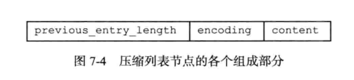

抄录redis设计与实现一书 黄建宏

# 一、数据结构和对象

> Redis数据库里每个键值对（key-value pair）都是由对象（object）组成的，其中：
>
> - 数据库的每一个健总是一个字符串对象（string object）
> - 值则可以是字符串对象、列表对象（list object）、哈希对象（hash object）、集合对象（set object）、有序集合对象（sorted set object）这五种对象中的一种。

## （一）对象

redis主要数据类型：字符串、列表、哈希、集合、有序集合都是由对象构建，对象里面包含了各自的数据结构实现，和一些共用的对象属性，实现特定功能。

### 1、对象组成结构

每个对象都有一个redisObject机构表示，该结构主要有三个属性：type、encoding、ptr如下图：


#### （1）类型

表示对象的类型，主要有字符串、列表、哈希、集合、有序集合五种

**查看变量的对象类型可以使用type命令**

```
type 变量名
```

对象类型表：

|   类型常量   |  对象的名称  |
| :----------: | :----------: |
| REDIS_STRING |  字符串对象  |
|  REDIS_LIST  |   列表对象   |
|  REDIS_HASH  |   哈希对象   |
|  REDIS_SET   |   集合对象   |
|  REDIS_ZSET  | 有序集合对象 |


#### （2）编码

> 对象ptr指针指向对象的底层数据结构，而这些数据结构由对象的encoding属性标记使用的数据结构类型。
>
> **可以使用OBJECT ENCODING 命令查看值对象的编码**

##### 1.编码和数据结构的对应关系：

|         编码常量          |   编码对应的底层数据结构   |
| :-----------------------: | :------------------------: |
|    REDIS_ENCODING_INT     |       long类型的整数       |
|   REDIS_ENCODING_EMBSTR   | embstr编码的简单动态字符串 |
|    REDIS_ENCODING_RAW     |       简单动态字符串       |
|     REDIS_ENCODING_HT     |            字典            |
| REDIS_ENCODING_LINKEDLIST |          双端链表          |
|  REDIS_ENCODING_ZIPLIST   |          压缩列表          |
|   REDIS_ENCODING_INTSET   |          整数集合          |
|  REDIS_ENCODING_SKIPLIST  |        跳跃表和字典        |


##### 2.类型、编码、数据结构三者的对应关系：

每种类型的对象至少用到两种不同的数据结构，对象有一个结构转换阈值可以设置，结构转化主要为了省内存和提交效率。

> 例如：
>
> - 因为压缩列表比双端链表更节约内存，在元素数量较少时，内存中以连续块保存的压缩列表比双端列表可以更快的载入缓存
> - 对象元素过多，压缩列表的优势逐渐消失，将数据结构转换成双端链表性能会更好

|     类型     |           编码            |                对象                |
| :----------: | :-----------------------: | :--------------------------------: |
| REDIS_STRING |    REDIS_ENCODING_INT     |     使用整数值实现的字符串对象     |
| REDIS_STRING |   REDIS_ENCODING_EMBSTR   |   使用embstr编码的简单字符串对象   |
| REDIS_STRING |    REDIS_ENCODING_RAW     | 使用简单动态字符串实现的字符串对象 |
|  REDIS_LIST  |  REDIS_ENCODING_ZIPLIST   |     使用压缩类型实现的列表对象     |
|  REDIS_LIST  | REDIS_ENCODING_LINKEDLIST |     使用双端链表实现的列表对象     |
|  REDIS_HASH  |  REDIS_ENCODING_ZIPLIST   |      使用压缩列表实现hash对象      |
|  REDIS_HASH  |     REDIS_ENCODING_HT     |        使用字典实现hash对象        |
|  REDIS_SET   |   REDIS_ENCODING_INTSET   |      使用整数集合实现集合对象      |
|  REDIS_SET   |     REDIS_ENCODING_HT     |        使用字典实现集合对象        |
|  REDIS_ZSET  |  REDIS_ENCODING_ZIPLIST   |    使用压缩列表实现有序集合对象    |
|  REDIS_ZSET  |  REDIS_ENCODING_SKIPLIST  |  使用跳跃表+字典实现有序集合对象   |

#### （3）总结

> - 字符串对象：int使用long整数、embstr编码动态字符串、raw简单动态字符串SDS
> - 列表：压缩列表、双链表
> - 哈希：压缩列表、字典
> - 集合：整数集合、字典
> - 有序集合：压缩列表、跳跃表

### 2、字符串对象

> 字符串对象的编码可以是int、raw、embstr。
>
> 使用 OBJECT ENCODING命令查看使用的数据结构。对象变化是编码方式也会发生变化。

#### （1）int编码

字符串对象保存的是整数值，使用long保存 编码int

```
set num 10086

OBJECT ENCODING num
"int"
```

int编码类型数据结构图：


#### （2）raw编码

字符串对象保存字符串长度大于32字节，那么使用SDS简单动态字符串保存，编码为raw

raw编码结构图：


#### （3）embstr编码

> 字符串长度小于等于32字节，使用embstr编码保存。
>
> embstr编码是专门用于保存短字符串的一种优化编码方式，和raw编码一样都是使用redisObject和sdshdr结构来表示字符串对象。不同的是raw两个对象内存是分开分配的，而embstr是一次分配的一块连续空间。
>
> embstr的优势在于分配内存和释放内存比raw更快少一次处理，更友好的利用缓存。


#### （4）命令实现原理


### 3、列表对象

> 列表对象的编码可以是ziplist或者linkedlist。

#### （1）ziplist编码

使用条件：

- 列表对象中所有的字符串元素长度都小于64字节；可配置list-max-ziplist-value
- 类别对象元素数量小于512个；可配置list-max-ziplist-entries

不能满足这两个条件需要使用linkedlist编码，可以配置

展示结构如下：


#### （2）linkedlist编码

展示结构：


链表里面的字符串对象按字符串对象的存储结构保存

#### （3）命令实现原理


### 4、哈希对象

> 哈希对象的编码可以是ziplist和hashtable。

#### （1）ziplist编码

> 使用压缩列表实现哈希对象。每次有新的键值对加入哈希对象时，会先将key推入队尾，再讲value推入队尾。
>
> - key和value总是挨在一起的；
>
> - 按添加的先后顺序排列

使用条件：

- 所有键值对的长度都小于64字节；可配置 hash-max-ziplist-value
- 键值对的数量小于512个；可配置hash-max-ziplist-entries

满足两个条件使用压缩列表，否则使用哈希表，这两个条件可以修改设置


结构图：


#### （2）hashtable编码

> - 字典的健都是字符串对象，对象保存键值对的健
>
> - 字典的值都是字符串对象，对象保存键值对的值

结构图：


#### （3）命令实现原理


### 5、集合对象

> 集合对象的编码可以是intset或者hashtable。

#### （1）inset


#### （2）hashtable


#### （3）编码的转换

满足以下两个条件时，使用intset编码：

> - 集合对象都是整数值。
> - 集合数量不超过512个。可配置set-max-inset-entries

不满足使用hashtable编码。

#### （4）命令实现


### 6、有序集合对象

> 编码可以是ziplist和skiplist

#### （1）ziplist编码


#### （2）skiplist

> 跳跃表按分值顺序保存集合元素，通过跳跃表可以快速排序范围查找。
>
> 跳跃表的Object属性保存元素成员，score元素保存分数
>
> 字典方便判断是否重复和读取成员分数
>
> 注意：下图为了展示方便，字典和跳跃表中的数据重复，但实际存储元素数据是共享的不会浪费内存


#### （3）编码的转换

满足一下两个条件使用ziplist编码：

> - 有序集合数量小于128；可配置：zset-max-ziplist-entries
> - 有序集合所有成员的长度小于64字节；可配置：zset-max-ziplist-value

不能满足，使用skiplist。

#### （4）命令实现


## （二）数据结构

### 1、SDS简单动态字符串

#### （1）数据结构


#### （2）SDS的优点

- 获取字符串长度可直接获得。

C字符串不记录长度需要遍历计数获得。

- 避免缓冲区溢出

C字符串不记录字符串长度，做修改操作时默认已经分配了足够多的内存。如果内存不够会溢出报错，sds记录长度可以预分配解决。

- 减少修改字符串长度时所需的内存重分配次数

增长字符串需要预分配，不然会溢出。减少字符串需要释放，不然会内存泄露。redis追求速度性能，频繁分配内存会影响性能。

sds 通过预分配和惰性释放两种策略优化

- 二进制安全，图片等其他编码都能保存 \0字符结束符避免处理
- 兼容部分C字符串函数

#### （3）SDS相关特点说明

##### 1.空间预分配

用于优化字符创增长操作，当字符串修改时减少内存分配操作。主要分配规则说明：

- sds修改之后长度小于1MB，当前使用空间len和预留空间free相等
- sds修改之后长度大于1MB，预留空间free会分配1MB留用

##### 2.空间惰性释放

优化字符串缩短操作，用free记录缩短的空间避免空间释放操作。

### 2、链表

#### （1）数据结构


#### （2）主要作用

主要用于列表、发布丁喻、慢查询、监视器等功能

### 3、字典

#### （1）哈希表的数据结构

used代表已经使用的键值对个数

size数组大小

table指向hash表数组的值这个

sizemask hash&sizemask 获取key值所出数组的位置


#### （2）字典的数据结构

##### 1.普通状态


##### 2.rehash条件

负载因子计算 used/size 当前key数量处理数组大小

扩容条件：

- 服务器目前没有执行bgsave和bdrewriteaof命令，哈希表的负载因子大于等于1
- 服务器正在执行bgsave和bdrewriteaof命令，哈希表的负载因子大于等于5

缩容条件:

- 负载因子小于0.1时进行缩容

##### 3.rehash过程

字典的数据结构由数组加单链表构成，如果元素个数过多的时候查询速度会下降。当元素变化时维持负载因子在一个合理的范围内，数组需要扩容和缩容由rehash操作来完成。

- ht[1]数组大小 

  扩容操作：大小扩大为第一个大于等于used*2的  2的n次幂。即当前key个数乘2向上取整的2的n次幂。

  缩容操作：大小为第一个大于used的 2的n次幂。即当前key个数向上取整的2的n次幂。

- 将ht[0]的所有键值rehash大ht[1]上，rehash是指重新计算健的哈希值和索引值，将键值对放到ht[1]的指定位置上

- 迁移完之后，将ht[0]和ht[1]指针互换

如下图：


##### 4.渐进式rehash

上面讲的rehash动作并不是一次性集中式完成的，而是分多次、渐进式的完成。

原因在于如何hash数量很大上百万千万级别，时间很长会导致服务阻塞停止，因此rehash分多次渐进式完成。

- 字典内有一个rehashidx>=0代表正在进行rehash操作，rehashidx代表rehash的操作的位置，结束设置为-1。
- rehash阶段有数据操作的话先找ht[0],再找ht[1]，新加的键值对保存到ht[1]里面

### 4、跳跃表

> - 跳跃表是有序集合的底层实现之一。
> - 跳跃表有zskiplist和zskiplistNode两个结构组成
> - 每个节点的层高都是1-32的随机数
> - 按分支大小排序，分支相同在按成员大小排序，分值可以相同成员不能相同

是一种有序的数据结构，通过每个节点维持多个指向其他节点的指针，从而达到快速访问节点的目的。

跳跃表支持平均O(logN)、最坏O(n)复杂度的节点查找，大部分情况下效率可以媲美平衡数，并且因为跳跃表的实现比平衡树简单，所以很多程序使用跳跃表代替平衡数。

#### （1）跳跃表数据结构


#### （2）跳跃表节点

> level属性：
>
> 前进指针：指向下一个节点
>
> 跨度：代表两个节点的距离，指向null的所有指针跨度都是0，查找过程中沿途访问所有层的跨度累计就是该节点的排位
>
> 查找遍历说明：
>
> 假设查找元素为x
>
> 1. 通过头节点访问第一个元素，比较分数大小相等，比较成员相同结束
> 2. 比第一个元素小，不存在该元素
> 3. 比第一个元素大，遍历层数组指向元素，和查找元素比较大小，找到相同的结束
> 4. 没有相同的，比较层ln的指向和下一层的指向ln+1
> 5. x>ln && x<ln+1 则以ln层的指向节点， 从步骤1按逻辑继续
> 6. x>ln&&x>ln+1  则从步骤3 继续遍历层数组逻辑往下找


### 5、整数集合

集合键的底层实现之一，集合中只包含整数且数量不多的时候使用该数据结构。

升级的好处提供灵活性，节约内存。

#### （1）数据结构

> - encoding  数组的值类型：16字节、32字节、64字节
> - length 数组的长度
> - contents 数组的内容


#### （2）升级

当新增的元素比目前数组元素的长度都长时，需要升级整数转化。

> - 分配升级整数集合所需要的空间大小，将新元素存入
> - 将底层元素转换成相同大小放置在正确的位置上

例如：16位升级成32位过程：


#### （3）降级

不支持降级操作，升级之后不会降级

### 6、压缩列表

> 列表对象、哈希对象、有序集合对象在键值对数量较少，长度较短的时候使用。

#### （1）压缩列表数据结构


#### （2）压缩列表节点

> 节点可以保存节点数组或一个整数值
>
> - previous_entry_length  记录前一个节点的字节长度，由于记录了前一个节点的长度，可以从尾部到头部遍历
> - encoding 记录content数据的类型和长度，从头到尾遍历，根据encoding 的类型和长度可以读取当前元素信息，找到下一个元素
> - content 数据内容



编码对应类型：


content内容：


#### （3）连锁更新

操作压缩列表前面的元素，新增，删除，后续元素需要重新分配内存造成连锁更新。

# 二、单机数据库的实现

## （一）数据库

> - 数据库切换
> - key增删改查的实现方法。
> - key的过期时间ttl实现原理。

### 1、数据库的数据结构

> - db 为16个数据库的指针数组，每个元素为redisDb 键值对数据结构
> - dbnum 为数据库个数

总体结构


redisDb的具体实现结构

> - dict保存了实际键值对数据
> - expires保存的健的过期时间
>
> 注意：为了展示方便，下图key对象重复出现了两次，但是实际指针指向同一内存，不会造成内存浪费


### 2、切换数据库

服务端是一个结构对象，客户端连接也是一个结构对象保存了当前使用的哪个数据库，改变其指针即可。如下图：


### 3、键值对增删改查

> 和字典的增删改查操作一样
>
> 对dict中的key值 进行增删改查操作


### 4、过期时间处理

> setex、expire命令会在expires数据里面存在key的过期时间。
>
> 过期判断：直接取出expires对应key值的时间戳判断是否过期即可

#### （1）过期策略

> - 定时删除：设置过期时间的时候，创建定时器，到时立即删除。（大量的定时器影响性能不可取）
> - 惰性删除：过期健不管，每次获取的时候判断是否过期（如果内存不足有些数据长期不获取不能得到删除，会浪费内存）
> - 定期删除：每隔一段时间对数据库进行一次检查删除里面的过期健
>
> redis主要采用惰性删除和定期删除两者结合。

#### （2）AOF、RDB和复制功能对过期健的处理

> - RDB：执行save和bgsave命令的时候过期key不会持久化 没有影响
> - AOF：过期key没有被删除没有影响，在删除之后，aof内会有一个del记录。重写的时候回忽略过期健
> - 复制：过期健的删除由主服务器控制，删除后向从服务器发送del命令

#### 5、总结


## （二）RDB持久化

> RDB持久化将redis数据在内存中的状态保存到磁盘里面，类似于快照，持久化时间相对较长数据恢复速度快。
>
> 可以配置定期执行或手动执行save、bgsave命令

### 1、RDB文件的创建和载入

创建：

> - save：阻塞服务器知道RDB文件创建完毕，期间不能执行任何命令。
> - bgsave：派生出一个子进程，由子进程创建RDB文件，服务器进程进行处理命令（当有写操作的时候子进程才生成内存快照）
> - 自动间隔性保存：设置对应条件间隔执行bgsave命令
>
> 禁止save 、bgsave同时执行防止父子进程竞争
>
> 服务器禁止bgsave、bgrewriteaof两个命令同时执行，执行bgsave的时候aof重写bgrewriteaof会等bgsave执行完之后执行，执行bgrewriteaof的时候，禁止bgsave执行。

bgsave执行过程：

> 子进程创建后，父子进程共享数据段，父进程继续提供读写服务，此时如果父进程对数据进行修改。
>
> 这个时候就会使用操作系统的 COW （Copy On Write）机制来进行数据段页面的分离。数据段是由很多操作系统的页面组合而成，当父进程对其中一个页面的数据进行修改时，会将被共享的页面复制一份分离出来，然后对这个复制的页面进行修改。这时子进程相应的页面是没有变化的，还是进程产生时那一瞬间的数据。
>
> 子进程因为数据没有变化，接下来就可以非常安心的遍历数据了进行序列化写磁盘了。

间隔性保存配置样例：


间隔性保存实现：

> 服务器对象维持了一个dirty计数器和lastsave时间
>
> - dirty：保存距离上次生成rdb文件，修改的次数
> - lastsave：上次修改的时间戳
>
> serverCron 定时器默认没个100ms就会执行一次，检查是否满足保存rdb的条件，满足条件则执行bgsave命令


载入：

> 服务器启动的时候自动载入

### 2、总结


## （三）AOF持久化

> aof（append only file）是通过持久化redis服务器执行的写命令来记录数据的。

### 1、具体实现

> 主要分为三个步骤命令追加、文件写入、文件同步

#### （1）命令追加

将命令追加到服务器对象aof_buf缓冲区的末尾


#### （2）文件写入和同步

文件写入只是将aof缓存数据写入到系统的缓冲区内，需要同步之后才会持久化。

服务器进程就是一个事件循环，循环中的文件事件负责节后客户端的命令请求，以及回复客户端。而时间事件则是想serverCron一样的定时运行的函数。判断是否需要将缓冲区的命令写入文件，写完之后清空aof缓存。


#### （3）载入和还原

还原：

> - 只开启rdb用rdb还原
> - 只开启aof用aof还原
> - 同时开启优先aof还原
>
> 疑问：为什么不先用rdb还原然后根据偏移量执行aof，rdb恢复数据速度快


#### （4）重写

rewrite和bgrewriteaof 命令可以重写，前者会阻塞后者不会阻塞，类似bgsave派生子进程

重写逻辑将数据库内的数据dic，转换成命令写入aof文件

#### （5）总结


## （四）事件

## （五）客户端

## （六）服务器

# 三、多机数据库的实现

## （一）复制

## （二）Sentinel

## （三）集群

# 四、独立功能实现

## （一）发布订阅

## （二）事务

## （三）lua脚本

# 五、应用及常见问题

## （一）常见应用场景

## （二）常见问题

### 1、缓存穿透

### 2、缓存击穿

### 3、缓存雪崩

### 4、分布式锁

单点问题，多点数据不一致引起的安全问题；

过期时间续约问题

setnx setex  中间宕机，没有过期时间一直锁住。

- 2.6之前 lua脚本，事务
- Redis从2.6之后支持**setnx、setex连用**  set a 2 ex 40 nx

### 5、mysql和缓存数据一致性