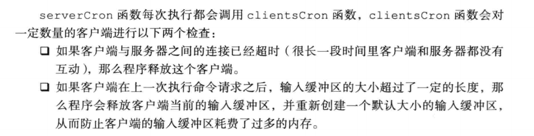
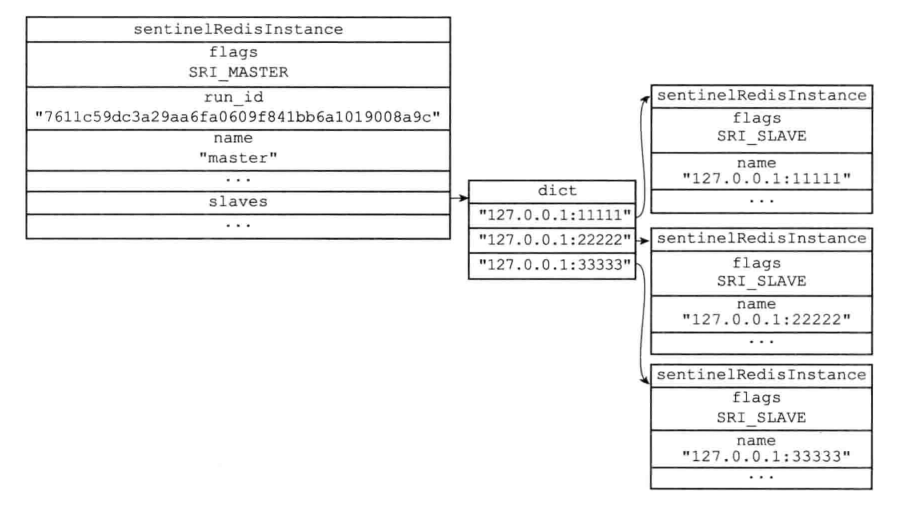
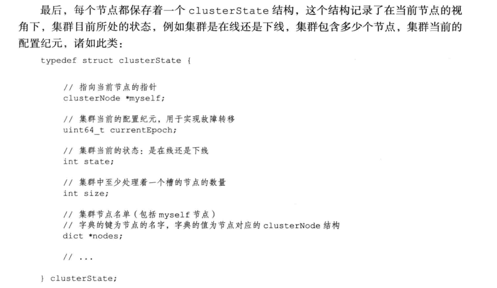
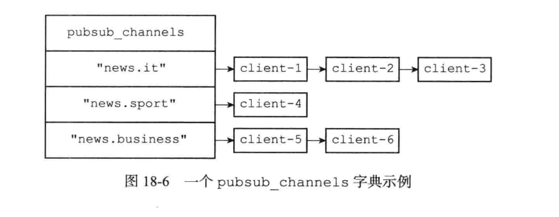
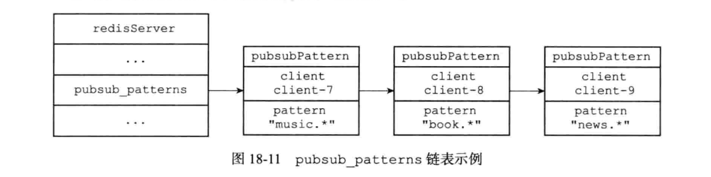

抄录redis设计与实现一书 黄建宏

# 一、数据结构和对象

> Redis数据库里每个键值对（key-value pair）都是由对象（object）组成的，其中：
>
> - 数据库的每一个健总是一个字符串对象（string object）
> - 值则可以是字符串对象、列表对象（list object）、哈希对象（hash object）、集合对象（set object）、有序集合对象（sorted set object）这五种对象中的一种。

## （一）对象

redis主要数据类型：字符串、列表、哈希、集合、有序集合都是由对象构建，对象里面包含了各自的数据结构实现，和一些共用的对象属性，实现特定功能。

### 1、对象组成结构

每个对象都有一个redisObject机构表示，该结构主要有三个属性：type、encoding、ptr如下图：


#### （1）类型

表示对象的类型，主要有字符串、列表、哈希、集合、有序集合五种

**查看变量的对象类型可以使用type命令**

```
type 变量名
```

对象类型表：

|   类型常量   |  对象的名称  |
| :----------: | :----------: |
| REDIS_STRING |  字符串对象  |
|  REDIS_LIST  |   列表对象   |
|  REDIS_HASH  |   哈希对象   |
|  REDIS_SET   |   集合对象   |
|  REDIS_ZSET  | 有序集合对象 |


#### （2）编码

> 对象ptr指针指向对象的底层数据结构，而这些数据结构由对象的encoding属性标记使用的数据结构类型。
>
> **可以使用OBJECT ENCODING 命令查看值对象的编码**

##### 1.编码和数据结构的对应关系：

|         编码常量          |   编码对应的底层数据结构   |
| :-----------------------: | :------------------------: |
|    REDIS_ENCODING_INT     |       long类型的整数       |
|   REDIS_ENCODING_EMBSTR   | embstr编码的简单动态字符串 |
|    REDIS_ENCODING_RAW     |       简单动态字符串       |
|     REDIS_ENCODING_HT     |            字典            |
| REDIS_ENCODING_LINKEDLIST |          双端链表          |
|  REDIS_ENCODING_ZIPLIST   |          压缩列表          |
|   REDIS_ENCODING_INTSET   |          整数集合          |
|  REDIS_ENCODING_SKIPLIST  |        跳跃表和字典        |


##### 2.类型、编码、数据结构三者的对应关系：

每种类型的对象至少用到两种不同的数据结构，对象有一个结构转换阈值可以设置，结构转化主要为了省内存和提交效率。

> 例如：
>
> - 因为压缩列表比双端链表更节约内存，在元素数量较少时，内存中以连续块保存的压缩列表比双端列表可以更快的载入缓存
> - 对象元素过多，压缩列表的优势逐渐消失，将数据结构转换成双端链表性能会更好

|     类型     |           编码            |                对象                |
| :----------: | :-----------------------: | :--------------------------------: |
| REDIS_STRING |    REDIS_ENCODING_INT     |     使用整数值实现的字符串对象     |
| REDIS_STRING |   REDIS_ENCODING_EMBSTR   |   使用embstr编码的简单字符串对象   |
| REDIS_STRING |    REDIS_ENCODING_RAW     | 使用简单动态字符串实现的字符串对象 |
|  REDIS_LIST  |  REDIS_ENCODING_ZIPLIST   |     使用压缩类型实现的列表对象     |
|  REDIS_LIST  | REDIS_ENCODING_LINKEDLIST |     使用双端链表实现的列表对象     |
|  REDIS_HASH  |  REDIS_ENCODING_ZIPLIST   |      使用压缩列表实现hash对象      |
|  REDIS_HASH  |     REDIS_ENCODING_HT     |        使用字典实现hash对象        |
|  REDIS_SET   |   REDIS_ENCODING_INTSET   |      使用整数集合实现集合对象      |
|  REDIS_SET   |     REDIS_ENCODING_HT     |        使用字典实现集合对象        |
|  REDIS_ZSET  |  REDIS_ENCODING_ZIPLIST   |    使用压缩列表实现有序集合对象    |
|  REDIS_ZSET  |  REDIS_ENCODING_SKIPLIST  |  使用跳跃表+字典实现有序集合对象   |

#### （3）总结

> - 字符串对象：int使用long整数、embstr编码动态字符串、raw简单动态字符串SDS
> - 列表：压缩列表、双链表
> - 哈希：压缩列表、字典
> - 集合：整数集合、字典
> - 有序集合：压缩列表、跳跃表

### 2、字符串对象

> 字符串对象的编码可以是int、raw、embstr。
>
> 使用 OBJECT ENCODING命令查看使用的数据结构。对象变化是编码方式也会发生变化。

#### （1）int编码

字符串对象保存的是整数值，使用long保存 编码int

```
set num 10086

OBJECT ENCODING num
"int"
```

int编码类型数据结构图：


#### （2）raw编码

字符串对象保存字符串长度大于32字节，那么使用SDS简单动态字符串保存，编码为raw

raw编码结构图：


#### （3）embstr编码

> 字符串长度小于等于32字节，使用embstr编码保存。
>
> embstr编码是专门用于保存短字符串的一种优化编码方式，和raw编码一样都是使用redisObject和sdshdr结构来表示字符串对象。不同的是raw两个对象内存是分开分配的，而embstr是一次分配的一块连续空间。
>
> embstr的优势在于分配内存和释放内存比raw更快少一次处理，更友好的利用缓存。


#### （4）命令实现原理


### 3、列表对象

> 列表对象的编码可以是ziplist或者linkedlist。

#### （1）ziplist编码

使用条件：

- 列表对象中所有的字符串元素长度都小于64字节；可配置list-max-ziplist-value
- 类别对象元素数量小于512个；可配置list-max-ziplist-entries

不能满足这两个条件需要使用linkedlist编码，可以配置

展示结构如下：


#### （2）linkedlist编码

展示结构：


链表里面的字符串对象按字符串对象的存储结构保存

#### （3）命令实现原理


### 4、哈希对象

> 哈希对象的编码可以是ziplist和hashtable。

#### （1）ziplist编码

> 使用压缩列表实现哈希对象。每次有新的键值对加入哈希对象时，会先将key推入队尾，再讲value推入队尾。
>
> - key和value总是挨在一起的；
>
> - 按添加的先后顺序排列

使用条件：

- 所有键值对的长度都小于64字节；可配置 hash-max-ziplist-value
- 键值对的数量小于512个；可配置hash-max-ziplist-entries

满足两个条件使用压缩列表，否则使用哈希表，这两个条件可以修改设置


结构图：


#### （2）hashtable编码

> - 字典的健都是字符串对象，对象保存键值对的健
>
> - 字典的值都是字符串对象，对象保存键值对的值

结构图：


#### （3）命令实现原理


### 5、集合对象

> 集合对象的编码可以是intset或者hashtable。

#### （1）inset


#### （2）hashtable


#### （3）编码的转换

满足以下两个条件时，使用intset编码：

> - 集合对象都是整数值。
> - 集合数量不超过512个。可配置set-max-inset-entries

不满足使用hashtable编码。

#### （4）命令实现


### 6、有序集合对象

> 编码可以是ziplist和skiplist

#### （1）ziplist编码


#### （2）skiplist

> 跳跃表按分值顺序保存集合元素，通过跳跃表可以快速排序范围查找。
>
> 跳跃表的Object属性保存元素成员，score元素保存分数
>
> 字典方便判断是否重复和读取成员分数
>
> 注意：下图为了展示方便，字典和跳跃表中的数据重复，但实际存储元素数据是共享的不会浪费内存


#### （3）编码的转换

满足一下两个条件使用ziplist编码：

> - 有序集合数量小于128；可配置：zset-max-ziplist-entries
> - 有序集合所有成员的长度小于64字节；可配置：zset-max-ziplist-value

不能满足，使用skiplist。

#### （4）命令实现


## （二）数据结构

### 1、SDS简单动态字符串

#### （1）数据结构


#### （2）SDS的优点

- 获取字符串长度可直接获得。

C字符串不记录长度需要遍历计数获得。

- 避免缓冲区溢出

C字符串不记录字符串长度，做修改操作时默认已经分配了足够多的内存。如果内存不够会溢出报错，sds记录长度可以预分配解决。

- 减少修改字符串长度时所需的内存重分配次数

增长字符串需要预分配，不然会溢出。减少字符串需要释放，不然会内存泄露。redis追求速度性能，频繁分配内存会影响性能。

sds 通过预分配和惰性释放两种策略优化

- 二进制安全，图片等其他编码都能保存 \0字符结束符避免处理
- 兼容部分C字符串函数

#### （3）SDS相关特点说明

##### 1.空间预分配

用于优化字符创增长操作，当字符串修改时减少内存分配操作。主要分配规则说明：

- sds修改之后长度小于1MB，当前使用空间len和预留空间free相等
- sds修改之后长度大于1MB，预留空间free会分配1MB留用

##### 2.空间惰性释放

优化字符串缩短操作，用free记录缩短的空间避免空间释放操作。

### 2、链表

#### （1）数据结构


#### （2）主要作用

主要用于列表、发布丁喻、慢查询、监视器等功能

### 3、字典

#### （1）哈希表的数据结构

used代表已经使用的键值对个数

size数组大小

table指向hash表数组的值这个

sizemask hash&sizemask 获取key值所出数组的位置


#### （2）字典的数据结构

##### 1.普通状态


##### 2.rehash条件

负载因子计算 used/size 当前key数量处理数组大小

扩容条件：

- 服务器目前没有执行bgsave和bdrewriteaof命令，哈希表的负载因子大于等于1
- 服务器正在执行bgsave和bdrewriteaof命令，哈希表的负载因子大于等于5

缩容条件:

- 负载因子小于0.1时进行缩容

##### 3.rehash过程

字典的数据结构由数组加单链表构成，如果元素个数过多的时候查询速度会下降。当元素变化时维持负载因子在一个合理的范围内，数组需要扩容和缩容由rehash操作来完成。

- ht[1]数组大小 

  扩容操作：大小扩大为第一个大于等于used*2的  2的n次幂。即当前key个数乘2向上取整的2的n次幂。

  缩容操作：大小为第一个大于used的 2的n次幂。即当前key个数向上取整的2的n次幂。

- 将ht[0]的所有键值rehash大ht[1]上，rehash是指重新计算健的哈希值和索引值，将键值对放到ht[1]的指定位置上

- 迁移完之后，将ht[0]和ht[1]指针互换

如下图：


##### 4.渐进式rehash

上面讲的rehash动作并不是一次性集中式完成的，而是分多次、渐进式的完成。

原因在于如何hash数量很大上百万千万级别，时间很长会导致服务阻塞停止，因此rehash分多次渐进式完成。

- 字典内有一个rehashidx>=0代表正在进行rehash操作，rehashidx代表rehash的操作的位置，结束设置为-1。
- rehash阶段有数据操作的话先找ht[0],再找ht[1]，新加的键值对保存到ht[1]里面

### 4、跳跃表

> - 跳跃表是有序集合的底层实现之一。
> - 跳跃表有zskiplist和zskiplistNode两个结构组成
> - 每个节点的层高都是1-32的随机数
> - 按分支大小排序，分支相同在按成员大小排序，分值可以相同成员不能相同

是一种有序的数据结构，通过每个节点维持多个指向其他节点的指针，从而达到快速访问节点的目的。

跳跃表支持平均O(logN)、最坏O(n)复杂度的节点查找，大部分情况下效率可以媲美平衡数，并且因为跳跃表的实现比平衡树简单，所以很多程序使用跳跃表代替平衡数。

#### （1）跳跃表数据结构


#### （2）跳跃表节点

> level属性：
>
> 前进指针：指向下一个节点
>
> 跨度：代表两个节点的距离，指向null的所有指针跨度都是0，查找过程中沿途访问所有层的跨度累计就是该节点的排位
>
> 查找遍历说明：
>
> 假设查找元素为x
>
> 1. 通过头节点访问第一个元素，比较分数大小相等，比较成员相同结束
> 2. 比第一个元素小，不存在该元素
> 3. 比第一个元素大，遍历层数组指向元素，和查找元素比较大小，找到相同的结束
> 4. 没有相同的，比较层ln的指向和下一层的指向ln+1
> 5. x>ln && x<ln+1 则以ln层的指向节点， 从步骤1按逻辑继续
> 6. x>ln&&x>ln+1  则从步骤3 继续遍历层数组逻辑往下找


### 5、整数集合

集合键的底层实现之一，集合中只包含整数且数量不多的时候使用该数据结构。

升级的好处提供灵活性，节约内存。

#### （1）数据结构

> - encoding  数组的值类型：16字节、32字节、64字节
> - length 数组的长度
> - contents 数组的内容


#### （2）升级

当新增的元素比目前数组元素的长度都长时，需要升级整数转化。

> - 分配升级整数集合所需要的空间大小，将新元素存入
> - 将底层元素转换成相同大小放置在正确的位置上

例如：16位升级成32位过程：


#### （3）降级

不支持降级操作，升级之后不会降级

### 6、压缩列表

> 列表对象、哈希对象、有序集合对象在键值对数量较少，长度较短的时候使用。

#### （1）压缩列表数据结构


#### （2）压缩列表节点

> 节点可以保存节点数组或一个整数值
>
> - previous_entry_length  记录前一个节点的字节长度，由于记录了前一个节点的长度，可以从尾部到头部遍历
> - encoding 记录content数据的类型和长度，从头到尾遍历，根据encoding 的类型和长度可以读取当前元素信息，找到下一个元素
> - content 数据内容


编码对应类型：


content内容：


#### （3）连锁更新

操作压缩列表前面的元素，新增，删除，后续元素需要重新分配内存造成连锁更新。

# 二、单机数据库的实现

## （一）数据库

> - 数据库切换
> - key增删改查的实现方法。
> - key的过期时间ttl实现原理。

### 1、数据库的数据结构

> - db 为16个数据库的指针数组，每个元素为redisDb 键值对数据结构
> - dbnum 为数据库个数

总体结构


redisDb的具体实现结构

> - dict保存了实际键值对数据
> - expires保存的健的过期时间
>
> 注意：为了展示方便，下图key对象重复出现了两次，但是实际指针指向同一内存，不会造成内存浪费


### 2、切换数据库

服务端是一个结构对象，客户端连接也是一个结构对象保存了当前使用的哪个数据库，改变其指针即可。如下图：


### 3、键值对增删改查

> 和字典的增删改查操作一样
>
> 对dict中的key值 进行增删改查操作


### 4、过期时间处理

> setex、expire命令会在expires数据里面存在key的过期时间。
>
> 过期判断：直接取出expires对应key值的时间戳判断是否过期即可

#### （1）过期策略

> - 定时删除：设置过期时间的时候，创建定时器，到时立即删除。（大量的定时器影响性能不可取）
> - 惰性删除：过期健不管，每次获取的时候判断是否过期（如果内存不足有些数据长期不获取不能得到删除，会浪费内存）
> - 定期删除：每隔一段时间对数据库进行一次检查删除里面的过期健
>
> redis主要采用惰性删除和定期删除两者结合。

#### （2）AOF、RDB和复制功能对过期健的处理

> - RDB：执行save和bgsave命令的时候过期key不会持久化 没有影响
> - AOF：过期key没有被删除没有影响，在删除之后，aof内会有一个del记录。重写的时候回忽略过期健
> - 复制：过期健的删除由主服务器控制，删除后向从服务器发送del命令

#### 5、总结


## （二）RDB持久化

> RDB持久化将redis数据在内存中的状态保存到磁盘里面，类似于快照，持久化时间相对较长数据恢复速度快。
>
> 可以配置定期执行或手动执行save、bgsave命令

### 1、RDB文件的创建和载入

创建：

> - save：阻塞服务器知道RDB文件创建完毕，期间不能执行任何命令。
> - bgsave：派生出一个子进程，由子进程创建RDB文件，服务器进程进行处理命令（当有写操作的时候子进程才生成内存快照）
> - 自动间隔性保存：设置对应条件间隔执行bgsave命令
>
> 禁止save 、bgsave同时执行防止父子进程竞争
>
> 服务器禁止bgsave、bgrewriteaof两个命令同时执行，执行bgsave的时候aof重写bgrewriteaof会等bgsave执行完之后执行，执行bgrewriteaof的时候，禁止bgsave执行。

bgsave执行过程：

> 子进程创建后，父子进程共享数据段，父进程继续提供读写服务，此时如果父进程对数据进行修改。
>
> 这个时候就会使用操作系统的 COW （Copy On Write）机制来进行数据段页面的分离。数据段是由很多操作系统的页面组合而成，当父进程对其中一个页面的数据进行修改时，会将被共享的页面复制一份分离出来，然后对这个复制的页面进行修改。这时子进程相应的页面是没有变化的，还是进程产生时那一瞬间的数据。
>
> 子进程因为数据没有变化，接下来就可以非常安心的遍历数据了进行序列化写磁盘了。

间隔性保存配置样例：


间隔性保存实现：

> 服务器对象维持了一个dirty计数器和lastsave时间
>
> - dirty：保存距离上次生成rdb文件，修改的次数
> - lastsave：上次修改的时间戳
>
> serverCron 定时器默认没个100ms就会执行一次，检查是否满足保存rdb的条件，满足条件则执行bgsave命令


载入：

> 服务器启动的时候自动载入

### 2、总结


## （三）AOF持久化

> aof（append only file）是通过持久化redis服务器执行的写命令来记录数据的。

### 1、具体实现

> 主要分为三个步骤命令追加、文件写入、文件同步

#### （1）命令追加

将命令追加到服务器对象aof_buf缓冲区的末尾


#### （2）文件写入和同步

文件写入只是将aof缓存数据写入到系统的缓冲区内，需要同步之后才会持久化。

服务器进程就是一个事件循环，循环中的文件事件负责节后客户端的命令请求，以及回复客户端。而时间事件则是想serverCron一样的定时运行的函数。判断是否需要将缓冲区的命令写入文件，写完之后清空aof缓存。


#### （3）载入和还原

还原：

> - 只开启rdb用rdb还原
> - 只开启aof用aof还原
> - 同时开启优先aof还原
>
> 疑问：为什么不先用rdb还原然后根据偏移量执行aof，rdb恢复数据速度快


#### （4）重写

rewrite和bgrewriteaof 命令可以重写，前者会阻塞后者不会阻塞，类似bgsave派生子进程

重写逻辑将数据库内的数据dic，转换成命令写入aof文件

#### （5）总结


## （四）事件

> redis服务器是一个事件驱动程序，主要处理两类事件：
>
> - 文件事件：redis服务器通过套接字和客户端进行连接交互，而文件事件就是服务器对套接字操作的抽象。两者通信会产生相应的文件事件，服务器通过监听并处理这些事件来完成一系列网络通信操作
> - 时间事件：redis服务器有一些操作需要在给定时间执行，而时间事件就是定时操作的抽象。

### 1、文件事件

> redis基于reactor模式开发了自己的网络事件处理器：文件事件处理器
>
> - 文件事件处理器使用I/O多路复用程序来同事监听多个套接字，并根据套接字目前执行的任务来为套接字关联不通的事件处理器。
> - 当被监听的套接字准备好执行连接、读取、写入、关闭等操作时，与操作相应的文件事件就会产生，这时文件事件处理器就会调用套接字之前关联好事件处理器来处理这些事件。
>
> redis虽然是单线程方式运行，但通过使用I/O多路复用来监听多个套接字，文件事件处理器既实现了高性能的网络通信模型，又可以很好的和其他以单线程运行的模块进行对接，保持了redis内部单线程设计的简单性。

#### （1）文件事件处理器构成

> 套接字：利用操作对套接字的支持使用select、epoll、evport、kqueue等实现方式进行套接字的接收，并保存在对里面
>
> io多路复用：监听多个套接字，接收到对应事件（系统io处理会有对应api）通过事件分发器分发给事件处理器处理
>
> 事件分发器和事件处理器使用通知中心模式，事件处理器将处理函数注册到分发器，分发器判断有对应事件进来进行函数调用


套接字api 获取套接字状态


### 2、时间事件

> 时间操作类型：
>
> - 定时事件：让一段程序在指定的时间之后执行一次。
> - 周期性时间：每隔指定时间执行一次对应的程序。
>
> 时间事件主要属性：
>
> - id：时间事件的唯一id。
> - when：毫秒精度，时间事件到达的时间。
> - timeProc：时间事件处理器，一个函数。当时间事件到达时，服务器调用相应代码
> - 定时时间到达执行之后删除事件，不再执行
> - 周期性事件执行后会更新时间，下次执行

#### （1）事件结构


#### （2）时间事件实例（serverCron）

> - 更新服务器各类统计信息，比如时间、内存占用、数据库占用情况等
> - 清理数据库中的过期键值对
> - 关闭和清理链接失效的客户端
> - 尝试进行aof和rdb持久化操作
> - 服务器是主服务器，对从服务器进行定期同步
> - 集群模式，对集群进行定期同步和链接测试
>
> serverCron以周期性时间事件的方式运行
>
> redis2.6 没100ms运行一次，redis2.8开始，用户可以通过hz选项来调整每秒执行的次数

服务器执行主流程：

> 注意：文件事件和时间事件是在一个线程内执行，文件事件执行完后如果时间事件到达则执行，所以时间事件可能会延迟一点执行时间不会很准


#### （3）总结


## （五）客户端

> redis服务器是一对多的服务器程序：一个服务器可以与多个客户端建立网络连接，每个客户端都可以向服务端发送命令请求，服务器接收请求并返回结果。服务器通过I/O多路复用技术实现文件事件处理器，以单线程的方式运行处理多个客户端的网络连接和请求。

### 1、数据结构

> redisClient客户端主要属性：
>
> - 套接字描述符：用于接收命令
> - 名字：默认为空，可以命令设置client setname
> - 标志值：客户端的角色、状态（主从服务、阻塞、事务等状态）
> - 正在使用数据库的指针，以及数据库号码
> - 当前要执行的命令、命令参数、参数个数，以及命令实现函数的指针
> - 输入缓冲区和输出缓冲区
> - 复制状态，进行复制所需的数据结构
> - brpop、blpop等列表阻塞命令时使用的数据结构
> - watch命令用到的数据结构
> - 发布订阅用到的数据结构
> - 身份验证标志：用户是否通过身份验证
> - 创建时间，最后一次通信的时间，输出缓冲区大小超出软性限制的时间


### 2、客户端属性

> - 通用属性，与特定功能无关，执行所有操作要用到
> - 特定功能使用：例watch命令使用watched_keys，事务用到mstate

#### （1）套接字描述符

> 属性名 fd
>
> - 伪客户端：值为-1，主要处理AOF、Lua脚本的命令而不是网络
> - 网络客户端：值大于1，通过套接字与服务器进行通信

#### （2）标志位

记录目前客户端角色以及客户端所处的状态


#### （3）输入缓冲区

> 保存客户端发送的命令请求，是一个sds结构的属性，不能超过1GB


#### （4）命令、命令参数、实现函数

服务器将输入缓冲区的请求内容进行解析，存放命令及参数信息，通过命令在命令字典内可以解析出对应的实现函数


#### （5）输出缓冲区

> 执行完命令得到的回复会被保存在客户端的输出缓冲区里面
>
> - 固定大小缓冲区，保存长度较小的回复
> - 可变大小缓冲区，保存长度较大的回复


#### （6）服务器关闭

> - 客户端进程退出、杀死
> - 客户端发送不符合协议的请求
> - 客户端执行client kill
> - 服务器设置timeout网络超时会断开，阻塞状态不会断开
> - 命令请求超出了输入缓冲区和输出缓冲区的大小

#### （7）总结


## （六）服务器

### 1、命令执行过程

> 客户端发送命令-》服务端接受命令-》解析命令-》执行-》回复
>
> - 接受命令存入输入缓冲
> - 解析命令存入命令，参数，执行函数对应的数据结构
> - 执行命令
> - 执行结果存入输出缓冲区
> - 返回结果给客户端


### 2、serverCron函数

> redis服务器中serverCron函数默认每隔100ms执行一次，负责管理服务器的资源，保持服务器自身的良好运转。

#### （1）更新服务器时间缓存

> 获取服务器系统当前时间每次都做系统调用耗时，减少系统调用执行次数。
>
> - 服务器状态Unixtime 秒级精度Unix时间戳
> - mstime 毫秒级精度的当前时间戳
>
> 每100ms执行一次，时间属性的进度并不高
>
> 用于时间精度要求不高的场景
>
> - 打印日志、更新服务器lru时间、持久化任务判断时间景点要求不高的场景使用上面时间缓存
> - 键值对过期时间、慢查询日志高精度时间要求功能还是会调用系统时间

#### （2）更新LRU时钟

服务器状态lruclock保存服务器的lru时钟，每10s更新一次时钟

每个redis对象都有一个lru属性，保存对象最后一次使用的时间，当服务器计算一个键值对空转时间时，利用服务器lruclock减去对象的lru属性记录时间即可。lruclock每10s更新一次，根据这个属性估算的lru时间只是一个模糊的估算值。

#### （3）更新服务器每秒执行次数


#### （4）更新服务器内存峰值记录


#### （5）管理客户端资源



#### （6）管理数据库资源


#### （7）执行被延迟的bgwriteaof

服务器执行bgsave命令期间，客户端发送bgwriteaof命令时，会被延迟到bgsave执行完之后，通过定时检查执行状态判断是否执行

#### （8）检查持久化的运行状态


#### （9）将aof缓冲区的内容写入aof文件

如果开启了aof持久化功能并且aof缓冲区内还要待写入的数据，会执行相应的aof操作

#### （10）关闭异步客户端

不满足条件的客户端关系

#### （11）增加cronloops计数器的值

记录serverCron执行次数，用于判断执行N次serverCron执行一次的代码块

### 3、总结


# 三、多机数据库的实现

## （一）复制（主从数据同步）

> 在redis中，可以执行一个slaveof命令或者设置slaveof选项，让一个服务器去复制另一个服务器，被复制的服务器叫主服务器，进行复制的服务器叫从服务器。

在redis2.8版本之前使用旧版复制功能，2.8开始使用新版复制功能

### 1、旧版复制功能实现

> 复制功能分为同步和命令传播两个操作
>
> - 同步操作用于将服务器状态更新至主服务器的数据库状态
> - 命令传播，将执行命令同步到从服务器，实现增量同步

#### （1）执行过程

1、执行slaveof第一次需要向主服务器放松sync命令

2、主服务器执行bgsave生成rdb给从服务器同步

3、同步阶段主服务器记录写命令在缓冲区内，待rdb同步完后使用命令传播同步主从数据


#### （2）缺陷

> 对于初次复制的从服务器并没有什么问题，但是对于已经同步过的从服务器断线后重连，每次都需要生成rdb全量同步时间和性能消耗很严重。新版功能会记录从服务器命令传播的偏移量，用于增量同步

### 2、新版复制功能实现

> redis2.8开始使用psync代理sync。psync具有完整同步和部分重同步两种模式：
>
> - 完成同步用户初次复制和上述相似
> - 部分重同步用于处理断线重复制情况：条件允许，主服务器可以将断开期间的写命令发送给从服务器


#### （1）部分重同步实现

> - 主服务器的复制偏移量和从服务器的复制偏移量
> - 主服务器的复制积压缓冲区：默认1m大小，如果断线时间太长写命令超过这个大小，和旧版同步过程一样，可以配置
>
> repl-backlog-size=second*write_size_per_second 断线时间 * 每秒写命令大小  参考
>
> - 服务器的运行id：每个redis服务器都有一个自己的id


监测命令丢失、监测服务器网络连接

从服务器每秒向主服务器发送replconf ack命令检查两者之间的链接状态，主服务器超过1s没有收到就知道从服务器网络连接出现问题。

从服务器向主服务器发送replconf ack命令时，会将当前偏移量发送过来，主服务器会对比偏移量和当前自己的偏移量，将缺失的数据重新发送给从服务器


## （二）Sentinel（主从高可用）

> sentinel是redis的高可用方案：由一个或多个sentinel实例组成的sentinel系统可以监听任意多个主服务器以及这些主服务器的所有从服务器，并在监视的主服务器下线时，从下属的从服务中选择一个从服务器升级为主服务器，其他从服务器修改所属主服务器为新的服务器。
>
> 思考问题点：
>
> - 如何判断主服务器下线：主观下线，一台sentinel判断下线时，询问其他sentinel节点信息，投票数量达到配置值时判断为下线
> - 如何选择从服务器成为新的主服务器：选择复制偏移量最大的
> - 


启动过程


### 1、数据结构

> sentinelRedisInstance属性：
>
> - flags 标识值，记录了实例的类型，以及当前状态
> - name 实例名字 主服务器配置文件设置 ；从服务器自动设置 格式 ip:port
> - runid 运行id
> - config_epoch 配置纪元用于实现故障转移
> - addr 实例地址
> - mstime_t down_after_period 实例无响应多少毫秒之后判断为主观下线
> - quorum：判断客观下线所支持的票数
> - parallel_syncs：在执行故障转移时，可以同时对新的主服务器进行同步的从服务器数量
> - failover_timeout 刷新故障迁移状态的最大时限


### 2、创建连向服务器的网络连接

> - 命令连接：发送命令
> - 订阅连接：接受服务器信息


### 3、获取主服务器信息

sentinel默认会以每10s一次的频率，通过命令连接向主服务器发送info命令，分析结果获取主服务器当前信息。

例如：




### 4、获取从服务器信息

和主服务器一样，每10s发送info命令到从服务器，根据回复信息解析从服务器状态。


### 5、向服务器发送信息，订阅信息解析

sentinel每2s一次向服务器发送订阅信息，订阅通道会接收消息解析。

发送信息详情：


接收信息解析，用于更新其他sentinel的信息


### 6、sentinel集群

#### （1）sentinel之间的网络连接

sentinel之间会建立命令连接，通过其它sentinel服务器发送命令进行信息交换，主观下线、客观下线实现


#### （2）监测下线

sentinel服务器每秒向所有建立命令连接的实例（包括主从服务，sentinel服务）发送ping命令，通过ping命令回复判断是否在线。


##### 主观下线：

如果一个服务器在down-after-milliseconds毫秒内，连续回复无效请求，就会将sentinel内这个实例的信息状态改成主观下线。

注意：多个sentinel设置的主要下线时长可能不同，如果不同需要等待长时间的sentinel实例到达下线时间判断才生效

##### 客观下线：

当一个sentinel判断某个主服务器主观下线之后，会想其他sentinel服务器询问这一主服务器状态是否下线，当sentinel从其他sentinel服务接受到足够数量的已下线判断之后，可以将服务器判定为客观下线，进行故障转移操作

##### 故障转移：

当服务器被判断为客观下线时，sentinel集群会选举出一个领头sentinel进行故障转移操作

选举大概流程：

前面说的配置纪元实际就是一个计数器，每次选举自增一次

> - 每个发现客观下线的sentinel都会将自己设置为领头sentinel，给其他sentinel发送命令
> - 设置局部leader规则是先到先得，第一个到达的会被设置成局部leader后面到达的都会被拒绝
> - 每次接受选举命令会回复 leader_runid和配置纪元
> - 接受到回复之后，会比较runid和配置纪元，如果runid和纪元相同表示命令设置局部leader成功
> - 半数以上的sentinel设置成leader的节点，将称为leader
> - 在给定时间内没有选举成leader会再次进行选举，知道成功为止

故障转移流程：

> - 在从服务器里面选一个转移为主服务器
> - 让其他从服务器和已下线的主服务器改为复制新的主服务器

新的主服务器挑选过程：

> 在状态健康数据较新的从服务器中根据优先级别选择从服务器，优先级别相同的服务器根据复制偏移量排序，选择最大复制偏移量的服务器


### 7、总结


## （三）集群（分布式）

> redis集群是redis提供的分布式数据库解决方案，集群通过分片进行数据共享，并提供复制和故障转移功能。
>
> - 集群中节点状态信息，通过gossip协议同步信息
>
> - 高可用通过复制功能完成：clusterNode存入了slaveof从节点信息，cluster replicate nodeid 设置主从复制
>
> - 分布式通过槽指派完成（请求槽错误moved错误，重新分配过程请求槽错误ask，重新分片槽点和key用跳跃表记录可以快速找到槽点的key）
>
> - 故障转移：疑似下线gossip同步状态，下线和上线广播消息，类似sentinel切换主从
>
>   sentinel故障转移是由sentinel选主之后执行，
>
>   集群模式是由处理槽的各个主节点协调执行，第一个向其他主节点投票自己成为主节点的会获得选票，步骤和sentinel类似。只是投票者变成了下线主节点的节点，投票的变成了其他主节点

### 1、集群组建

> - 运行redis服务器的时候开启cluster-enable
> - 通过命令 cluster meet ip port  将制定节点加入集群
> - 通过cluster addslots <slot> 指派槽  一共16384个槽，每个槽都必须有节点在处理，不然就处理下线状态


### 2、集群数据结构

clusterNode内会保存slaveof信息，从节点信息是一个clusterNode列表




### 3、meet命令的实现

> 在A节点执行cluster meet ipA port 时，将B节点加入
>
> - 节点A上，创建节点B的clusterNode信息，添加的集群信息内
> - 向B节点发送meet信息
> - B节点接受到A节点的信息，会为A节点创建clusterNode信息加入集群信息中
> - B给A节点回复pong消息
> - A给B回复ping消息
> - B接受ping消息确认握手成功
>
> 节点A、B信息通过gossip协议传播给集群中的其他节点


### 3、消息

> 集群中的节点通过发送和接受消息来进行通信，主要有五种消息：
>
> gossip协议主要有meet、ping、pong三种消息实现
>
> meet：发送cluster meet 命令时接送命令的节点，会向被加入的节点发送meet消息，将节点加入集群当中
>
> ping：每秒会从节点列表中随机选五个节点，对其中最长时间没有发送的节点发送ping消息，此外为了防止节点长时间没有被选中导致信息更新滞后，节点最近一次发送ping消息的时间超过cluster-node-timeout 选项设置时长的一半，也会发送ping消息
>
>  pong: 当接收者收到meet和ping消息时，回复的消息；另外广播pong消息刷新当前节点的状态（新节点）
>
> fail：当主节点发现某个节点处于fail状态时，会广播该节点的fail消息，收到消息的节点将该节点状态改成已下线
>
> publish：当节点接收到一个publish命令时，节点会执行这个命令，并向集群广播publish命令，接收到的节点会执行

#### （1）消息的结构

> 消息头：类型、发送者信息、发送者主节点信息、发送者状态、发送者槽指派信息等
>
> 消息正文：meet、ping、pong正文相同使用gossip消息结构（节点名字、最后一次发送时间、ip、端口、标识值）

#### （2）meet、ping、pong

> redis集群各个节点通过gossip协议交换不同节点的状态信息。gossip协议主要由ping、pong、meet三种消息实现，这三种消息的消息正文相同都包含两个gossip消息结构（节点信息），即每个消息会包含两个节点信息
>
> - 如果正文中的节点信息不再接收者的节点列表内，说明是新增的节点，新增节点信息保存列表内
> - 如果正文中的节点已经存在，则更新节点状态
>
> 总结：通过gossip协议同步集群节点状态，每秒随机五个节点中选择最久未发送ping消息的节点，或超过超时时间的一半的节点发送ping消息，ping消息会包含当前节点的信息和节点列表中随机两个节点的信息，接收者同步节点状态，回复pong消息当前节点的信息和列表中随机两个节点的信息，发送者同步节点状态。如果未收到pong消息者标记为疑似下线状态，当某个节点接收到疑似下线节点数超过一半时会广播下线消息，然后进行故障转移相关操作。

#### （3）fail消息的实现

当节点将某个节点标记为下线状态时，会广播一个该节点的fail消息，让其他节点都将该节点标记为下线。

#### （4）publish消息

接受到publish命令的节点，执行完操作会广播对应的publish消息，让其他节点都执行该命令

### 4、槽指派

> redis集群通过分片的方式实现水平拓展：集群数据库被分为16384个槽，每一个健都属于其中一个槽。没有一个槽都需要有节点负责处理否则集群属于下线状态。
>
> - 槽和节点信息保存：集群信息内会保存内个槽指向的节点，每个节点会保存自己能处理的槽通过16384位 为1则能负责
> - moved：请求的key值不属于节点负责的槽，会返回moved错误重新指向
> - 重新分片：节点信息内会通过跳跃表保存slot和key的关系，分片的时候能过快速定位到需要迁移的key
> - ask：请求的key值正处于迁移阶段会返回ask错误

#### （1）槽记录数据结构

##### 集群槽位信息结构：


##### 节点保存负责槽位结构：


#### （2）moved

请求过程，请求的key节点不负责会返回moved错误，计算key所属槽 crc16（key）&16383


#### （3）重新分片

重新分片可以通过redis-trib负责完成，命令：cluster setslot <slot> importing <source_id>等实现

slot和key值的关系通过跳跃表保存，迁移slot的时候可以快速定位需要迁移的key


迁移过程中访问key值流程


### 5、复制和故障转移

#### （1）复制

复制功能设置从节点即可：cluster replicate nodeid。从节点复制主节点数据，从节点信息保存在主节点信息的slaveod内，原理和之前单机的复制功能相似

#### （2）故障转移

> 故障检测：每秒发送ping消息，没有收到pong消息回复的节点被设置为疑似下线，通过gossip协议传播状态，当超过半数的主节点标记为疑似下线时，会广播下线消息。
>
> 故障转移：
>
> - 选中一个从节点，执行slave on one设置为主节点
> - 取消下线主节点槽指派信息，指派给自己
> - 广播pong消息通知自己成为主节点
> - 接受自己负责槽位的命令请求，完成转移
>
> 选举新的主节点：raft协议   数据会有丢失
>
> - 在线的主节点负责投票，从节点向主节点要求投票
> - 每个主节点在一个投票周期内只能投一次票
> - 从节点发现主节点下线，向集群广播下线消息要求选自己为主（复制偏移量越大的节点越早发起消息，保证选主节点的数据最全）
> - 主节点会投票给收到的第一个从节点
> - 从节点接受自己获得支持的数量，超过一半选为主
> - 一个周期内没有选主成功，会再次发起投票


# 四、独立功能实现

## （一）发布订阅

> 发布订阅功能由 publish、subscribe、psubscribe等命令组成
>
> subscribe 频道
>
> publish 频道 消息
>
> 频道可以模糊匹配，发布的消息，订阅端能接收到数据


### 1、数据结构

#### （1）频道的订阅

服务器对象结构内有一个频道和订阅关系的结构如下：

订阅频道的时候会加入相关信息，退订的时候删除



#### （2）模式的订阅

模式的订阅和退订在当前结构内增加和删除客户端节点数据即可



### 2、发送消息

执行publish 命令时，在订阅列表内找到对应频道的客户端发送数据，在模式订阅的数据结构内遍历模式匹配，将消息发送给匹配成功的客户端

## （二）事务

> nutil：开启事务，发送的命令都会放入一个命令队列内
>
> exec：执行事务，执行命令队列内的命令，执行期间其他客户端的命令不会被执行
>
> watch：在执行exec前，监听某个值发生变化事务取消不会提交执行
>
> 入队成功后执行错误，其他命令会执行，不能保证都成功

### 1、mutil 命令入队过程


### 2、watch

乐观锁，在exec执行前，监听某些key变化，如果变化则事务拒绝执行。

keys的监听结构：

当发生写操作时都会调用watchkey相关逻辑，判断修改的key是否在监听中，如果在监听中会修改监听的key对应的客户端状态，在事务执行的时候可以直接判断是否有发生变化，选择是否执行事务


# 五、应用及常见问题

## （一）常见应用场景

> 1. 登录鉴权，token、用户信息保存
> 2. 字典项配置值
> 3. 分布式锁
> 4. 移动端用户的云缓存，用户的使用习惯、配置信息
> 5. 计数类：微博数、粉丝数、点赞数
> 6. 排名类使用，有序集合。学习观看时间排名，用户学习时间记录，页面的点击数量
> 7. 热点数据缓存，经常访问的第一个数据，榜单，热点话题等
> 8. 集合 使用：交集、并集、防止重复逻辑（标签、品类、共同好友）
> 9. 页面用户访问数量：HyperLogLog 概率算法，可以评估某个页面的用户访问量；只需要`12K`内存就能统计`2^64`个数据
> 10. 发布订阅：简单的消息队列
> 11. 地理位置围栏信息
> 12. 分布式id 派发器
> 13. 逻辑判断类：多少分钟发送一次消息，不能重复发送。同步数据的时间段

## （二）常见问题

### 1、缓存穿透

正常业务逻辑，读取缓存数据，不存在会读取数据库数据，载入缓存

如果key不存在数据库也没有，每次都会请求到数据库对数据库造成一定压力。可以将所有的key存入布隆过滤器，请求的时候先判断如果过滤器不存在，则直接返回空值，存在在执行后续逻辑。

可以使用布隆过滤器，过滤掉不存在的key直接返回空值，减少数据库压力（布隆过滤器只能减少百分之90多访问）不能做到决定过滤

布隆过滤器原理：利用一个很大的位数组和几个不一样的哈希函数。假设是三个将key值hash三个不同的值，散列在数组的不同位上，设置为1即设置成功。读取的时候，hash散列之后读取不同的位每一位都为1并不能说明一定存在。但是如果不为1可以说明一定不存在。

### 2、缓存击穿

缓存击穿：某个热点key值，并发访问量很高，在某个时间点过期，大量的并发请求落在数据库上导致数据库崩溃

解决办法：不设置过期时间、或者使用互斥锁，请求数据库阶段只允许一个请求过去，其他请求等待数据载入缓存后读取

### 3、缓存雪崩

大量的key在同一时间失效，大量的请求落在数据库上造成数据库崩溃

解决办法：数据库读取加互斥锁、过期时间实用随机值

### 4、分布式锁

单点问题，多点数据不一致引起的安全问题；使用zk或etcd强一致性中间件，或者使用单台redis专门处理分布式锁

过期时间续约问题，开启定时延期任务，宕机就不会延期，正常业务堵塞会延长锁时间

setnx setex  中间宕机，没有过期时间一直锁住。

- 2.6之前 lua脚本，事务
- Redis从2.6之后支持**setnx、setex连用**  set a 2 ex 40 nx

### 5、mysql和缓存数据一致性

懒加载方式：删除缓存后重新读取的时候更新数据

- 先修改数据库后删缓存 +ttl  （缓存删除失败事务会回滚，存在问题事务提交之前有其他事务读取key值更新了老的缓存，加ttl可以保证最终过期之后到达一致性），管理界面增加缓存刷新按钮，可以手动刷新缓存
- 使用cannel 监听binlog，key变化删除缓存

主动加载：修改之后，更新缓存数据 +ttl

问题点：更新缓存后事务提交失败，数据脏数据，尽量在事务的最后面进行缓存更新。ttl保证最后更新缓存。长时间未读取浪费redis内存

### 6、redis qps测试

硬件设备：16G内存，cup双核3.6Ghz ，大概4.6w左右，通过redis-benchmark工具测试

redis-benchmark -c 100 -r 100000 -n 100000 -q 

-c 100 模拟多少个客户端

-r 随机多少个key

-n 发起多少次操作

-d 数据量大小 字节

### 7、高性能原因

1、单线程避免线程上下文切换，系统调度

2、io多路复用非阻塞io

3、内存读取速度快

4、c语言编写很多实用系统函数速度快

