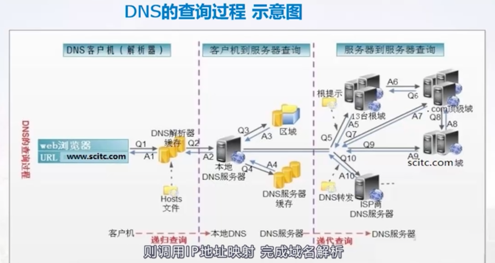

#### 1、nmcli

networkmanager  守护进程管理网络

nmcli 是命令行操作networkmanager的工具

配置文件 /etc/sysconfig/network-scripts 目录

网络配置是基于会话 connection（一个网卡可以有多个会话  但是只能有一个处于激活状态）

##### （1）配置静态网络

nmcli connection add/delete/modify 对会话操作

nmcli connection add con-name 【会话名】 iframe 【网卡】type【网络类型】ip4 【IP地址】gw4 【网关】 ipv4.method manual ipv4.dns 【dns】

nmcli connection show

#### 2、ip/ping 测试网络网络联通性 

ip addr  查看网络地址信息

ip link set 网卡名 up/down 激活和停止网卡

ip addr add ip地址 dev 网卡名  临时设置ip地址

（1）ping自己

（2）ping网关

#### 3、网络链路聚合

多张网卡 高可用负载均衡配置

1、创建链路聚合会话

nmcli con add con-name team0 iframe team0 type team config '{"runner":{"name":"activebackup"}}'

2、往会话内添加网卡成员

nmcli connection add con-name team0-p1 iframe eno1 type team-slave master team0

nmcli connection add con-name team0-p2 iframe eno2 type team-slave master team0

3、配置物理网卡的ip信息

nmcli connection modify con-name team0 ipv4.address 【IP地址】ipv4.gateway 【网关】 ipv4.method manual ipv4.dns 【dns】

4、启用team0会话

nmcli connection up team0

#### 4、ipv6

nmcli connection mod con-name team0 iframe ens33 type ethernet ipv6.address 1:123::ABCD:0:10/96 ipv6.gateway 1:123::ABCD:0:1/96 ipv6.method manual

重新网络生效

systemctl restart network 或者 nmcli connection down/up team0  

#### 5、ssh

远程链接服务协议，服务器返回公钥给客户端，客户端加密密码给服务端，服务器私钥解密登录

##### （1）密码登录

ssh 用户名@ip    第一次返回指纹 确认

##### （2）免密登录

1、生成秘钥（cd ~/.ssh 目录下）

ssh-keygen

2、将公钥上传服务器

cd ~/.ssh

ssh-copy-id user@ip

3、免密登录

ssh user@ip

##### （3）修改默认端口

1、修改配置文件

使用root用户

cd /etc/ssh

vim sshd_config

修改  Port 40022

2、设置端口类型

semanage port -l |grep ssh

semanage port -a -t ssh_port -p tcp 40022

3、设置防火墙

firewall -cmd --permanent --add-port=40022

firewall -cmd --reload

systemctl restart sshd

#### 6、挂载本地yum源

##### （1）挂载光盘

挂载点：目录存在、没有进程使用、挂载之后目录内文件会被隐藏

mnt 挂载目录，挂载目录的名称和设备同名

mkdir  /mnt/cdrom

服务器重启后需要重新挂载

mount /dev/cdrom /mnt/cdrom

永久挂载

vim /etc/fstab

mount -a

设备					挂载点		文件系统	挂载方式 不做备份 不自检

/dev/cdrom /mnt/cdtom  iso9660		default	0	0

##### （2）挂载yum源

配置文件  /etc/yum.repos.d/*.repo

创建本地yum文件命令：

yum-config-manager --add-repo=file:///mnt/cdrom

修改本地文件  cd /etc/yum.repos.d/  ls 查看

[mnt_cdrom]

name=added from:file:///mnt/cdrom #

baseurl=file:///mnt/cdrom  #仓库文件来源

enadble=1 #仓库可用

gpdcheck=0  #不校验

清理无用yum源

cd /etc/yum.repos.d

mkdir backup

mv CenterOS-* backup/

yum clean all

yum list  查看软件包信息

#### 7、dns服务

domain name system  域名和ip映射服务

dns查询过程

本地hosts 文件-》dns缓存-》dns服务器查询

