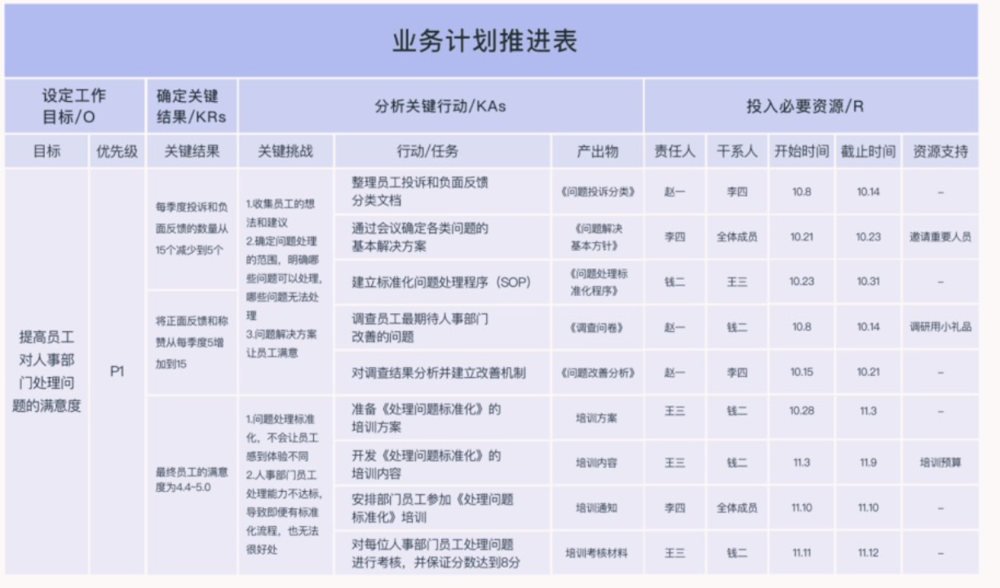
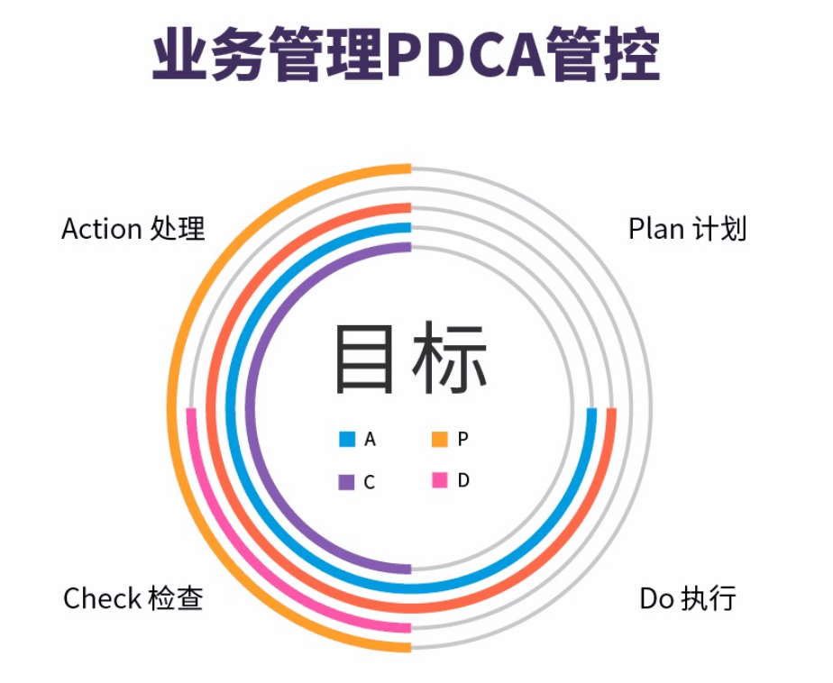
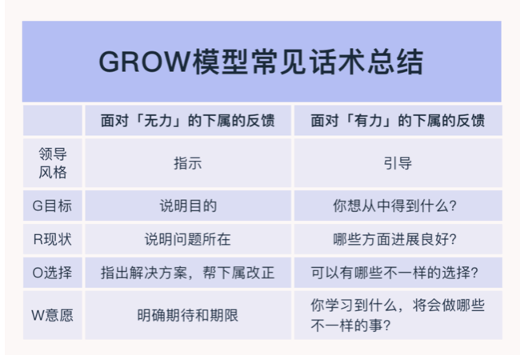
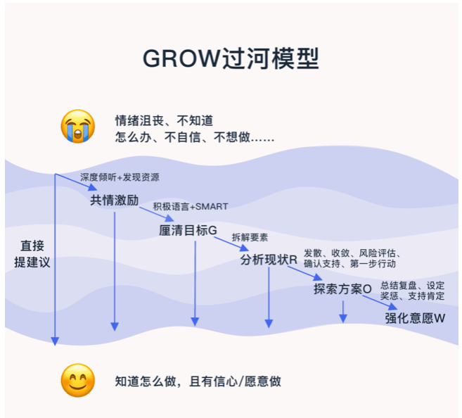

#### 一、项目时间

##### 1、PERT时间计算公式：

预计时间=(乐观时间+4*最可能的时间+悲观时间)/6

计划表：

|      |        |          |          |           |        |        |        |          |          |          |
| ---- | ------ | -------- | -------- | :-------: | ------ | ------ | ------ | -------- | -------- | -------- |
|      | 目标   |          |          |   行动    |        |        |        | 投入资源 |          |          |
| 目标 | 优先级 | 关键结果 | 关键挑战 | 行动/任务 | 产出物 | 责任人 | 干系人 | 开始时间 | 截止时间 | 资源支持 |
|      |        |          |          |           |        |        |        |          |          |          |

##### 2、进度跟踪 PDCA

计划-》执行-》检查-》处理

