渲染引擎、物理引擎、碰撞监测、音效、脚本引擎、动画系统、网络引擎、人工智能、场景管理

### 工具使用：

Assets：对应unity面板的project，资源文件，模型，材质等。可以导入导出；项目里面的资源

hierarchy：游戏对象，项目运行可以操作展示的对象，项目创建默认有一个主相机和光源

scene面板：场景面板，

- 操作：右键移动视野角度，滚轮拉近拉远，长按滚轮拖动场景，选中物体F居中，手拖动场景，+拖动物体
- atl+左键旋转、atl+右键放大缩小、右键+wasd 可以移动场景位置
- 将两个物体挨一起，按住V选中物体贴合的点拖动物体

inspector面板：显示选中组件的属性 

F选中物体在scene面板居中显示

command+shift+F  将物体的位置移动到当前scene面板视角

### 基础特性：unity 基础知识，组件

- 组件属性

- 位置transform  位置：xyz （单位m）； 旋转：xyz；  放大缩小：xyz；调整设置值或者左上角234界面调整

- 场景游戏关卡 一个关卡一个场景，场景是游戏物体的组合

- 游戏对象：一个游戏对象就是一个容器，用来装组件  代码修改颜色：找到物体对象-》mesh render-》材质-》颜色

  ​	transform：组件保存对象的位置

  ​	mesh filter 网格过滤器，从资源中获取网格信息，对象展示形状

  ​	mesh render 网格渲染器：根据网格过滤器获取的形状，根据定义的位置渲染

  ​	materials  颜色、纹理、贴图 展示效果   底层通过shader 着色器渲染（设置颜色，贴图，着色器等）

- 物理着色器   根据不同的光照展示不同的效果

- 相机：移动相机的位置，游戏玩家的视角，音频监听器、

  ​			clear flags 空白部分展示，天空盒（材质）整个空间的包装器

  ​			天空盒设置：相机内设置，window-》光源内设置

  ​			culling mask：选择能够显示的层，可以给物体加上layer属性，可以设置是否展示，不显示的不渲染，在相机内增加自定义										layer给物体设置层

  ​			projection：2d视角，3d视角

  ​			field of view   镜头拉近拉远

  ​			clipping planes   视角显示距离范围，优化性能，远处的不渲染 设置 显示距离

  ​			viewpoint rect   窗口的位置和大小

  ​			depth 窗口层级，悬浮窗口

  ​			audio listen：声音，多个相机保存一个声音就行			

- 渲染管线：cpu判断是否需要渲染，gpu渲染图形

  定点处理：接受模型的定点数据、坐标系转换 

  图形装配：连接相邻顶点，三角面， 物体的形状

  光栅化：计算三角面的像素，物体的颜色

  像素处理

  缓存：缓存像素形状等数据，渲染速度更快 

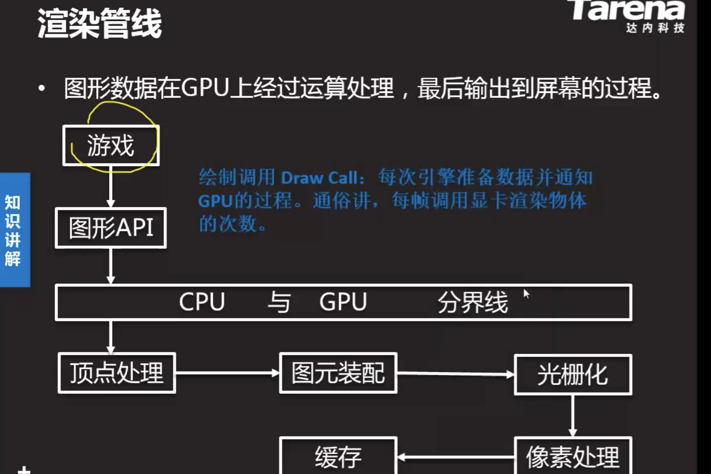

- 即时遮挡剔除 instant occlusion culling   

  ​	unity不支持动态遮挡剔除，使用插件（instantoc_dynamic_oculling_lod），将插件加入project ，给相机加入对应组件

  ​	挡住的物体不渲染，提高渲染性能

  ​	设置参与遮挡剔除的layer、tag，射线数量采样数量，射线范围距离（和摄像头视野范围一致），延迟多少帧隐藏：一帧不一定是真的遮挡，需要给物体增加碰撞检查的物体（box collider）

  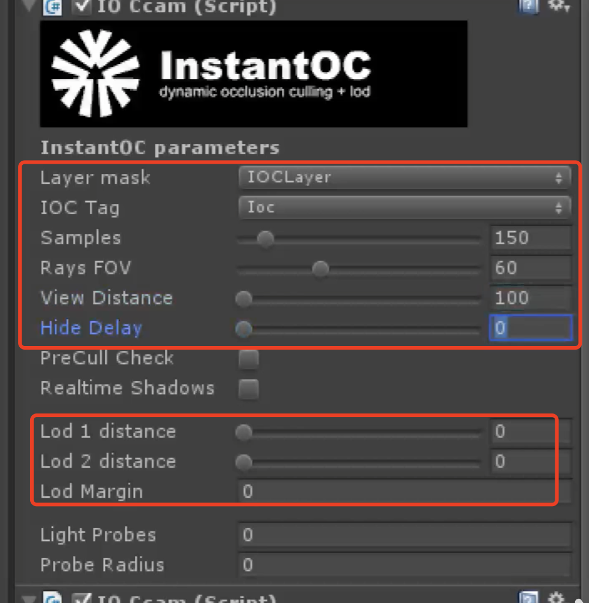

  ​	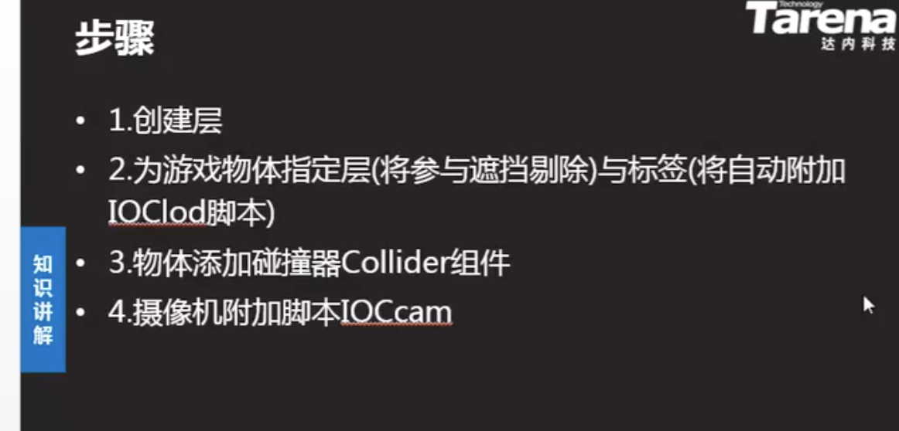

- lod多细节层次  levels of detail

  ​    占内存，一个模型变成多个模型，距离监测

  ​	不同精度的模型，按照不同的距离展示，近的的时候用高精度，远的时候使用低精度，优化渲染性能

  ​    给物体加层或者tag，然后在相机内ioc配置对应需要处理的层和tag

  ​	设置 lod  1 2 的显示距离

- 光照系统

  GI 全局光照（global illumination），直接光、间接光、环境光、反射光

  直接光：light 组件发出直接光 方向光、点光、聚光灯、范围光

  阴影：物体可以设置双面阴影、edit 、 project setitng、quality 设置阴影的等级全局阴影

  环境光：windows 里面light 设置，全局的

  反射光：来自天空盒反射出来的光

  间接光：物体接受光照后反射出来的光，物体标记成静态，调节光源设置间接光，编译是烘焙好，light面板

  实时gi：实时计算光源渲染，消耗性能

  烘焙gi：lightmap，可以将光照效果预渲染成贴图，可以不需要光源，手游提高性能

  光源侦测：烘焙没有光源，通过光源侦测可以给物体动态渲染颜色 light probe

  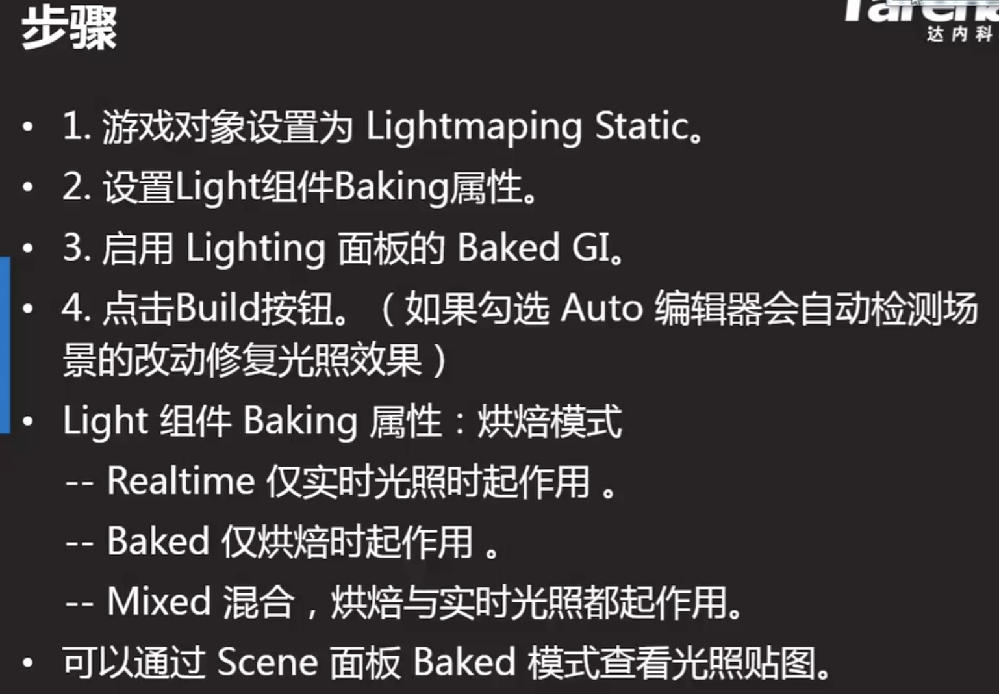

- 声音 mp3，ogg、wav

  ​	2d声音：背景音乐	3d：远近声音大小一样

  ​	audio 组件控制：3d设置根据距离修改声音大小

### 语言：C#

### unity api 

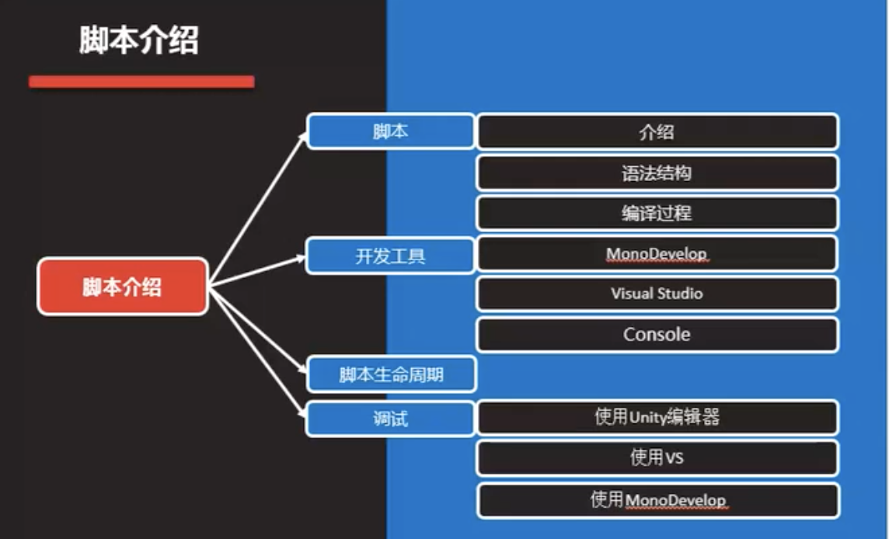

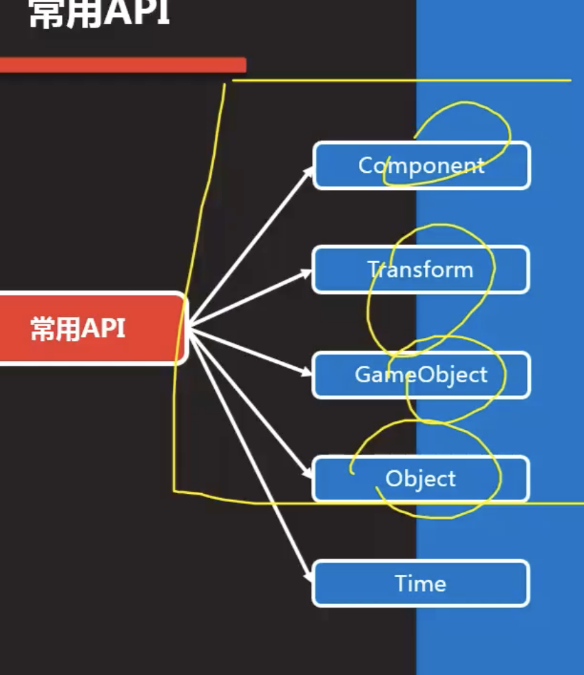

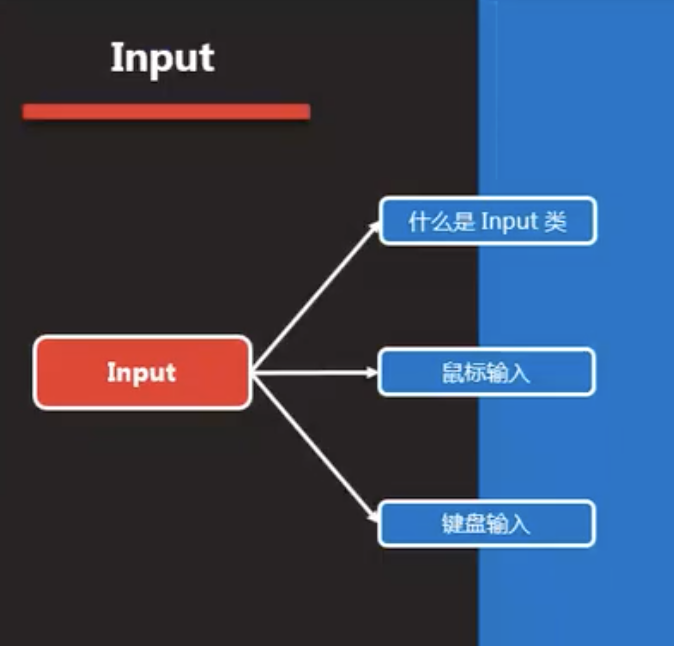

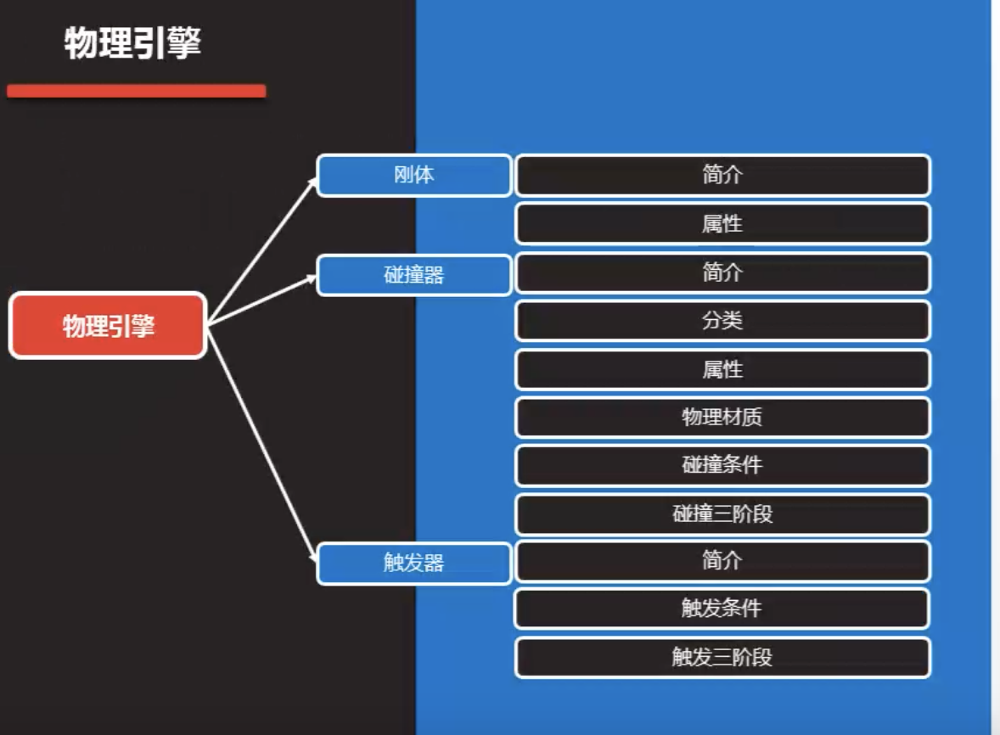

unity文档查找MonoBehaviour

- 脚本：附加在游戏物体上的代码，定义对象行为的指令代码C#、js 主流使用C#

  ​	物体上的脚本必须继承 MonoBehaviour 类，有对应的生命周期方法

- 编译过程 源代码-》cls-》中间语音-》mono runtime -》机器码     dll文件

- 生命周期 

  ​	Awake  所有的awake 先执行 初始化   游戏对象创建-》立即执行

  ​    OnEnable 每当脚本启用时调用

  ​	Start 初始化 	游戏对象创建-》脚本启用-》才执行

  ​	FixedUpdate  每个固定时间执行一个，时间可以修改 项目设置-》time -》fix time

  ​	Update 每帧渲染执行一次时间不固定

  ​	LateUpdate 延迟更新，update执行完后执行

- 事件监测

  ​	 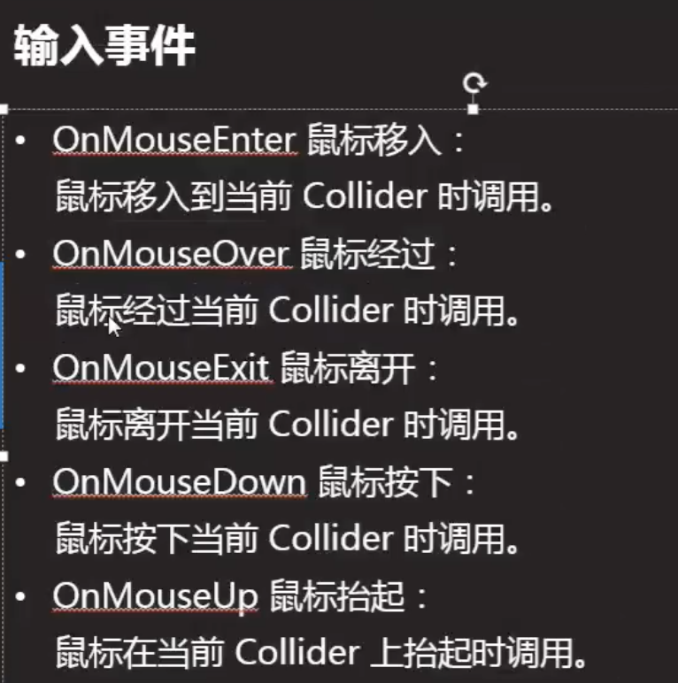

- 场景渲染

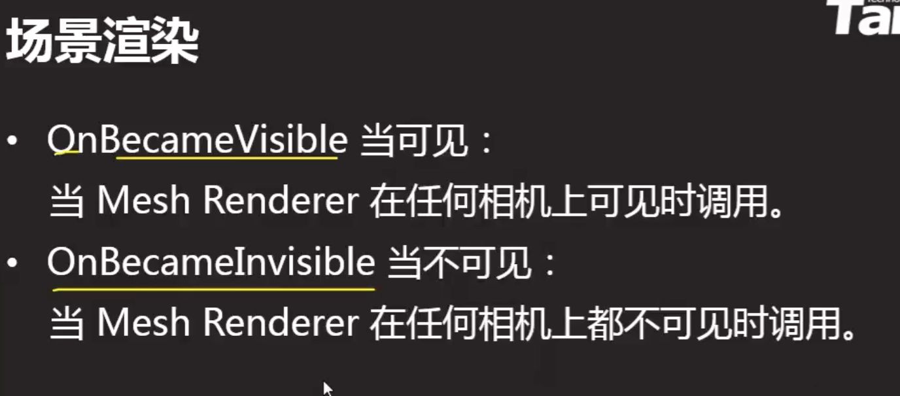

- 结束阶段

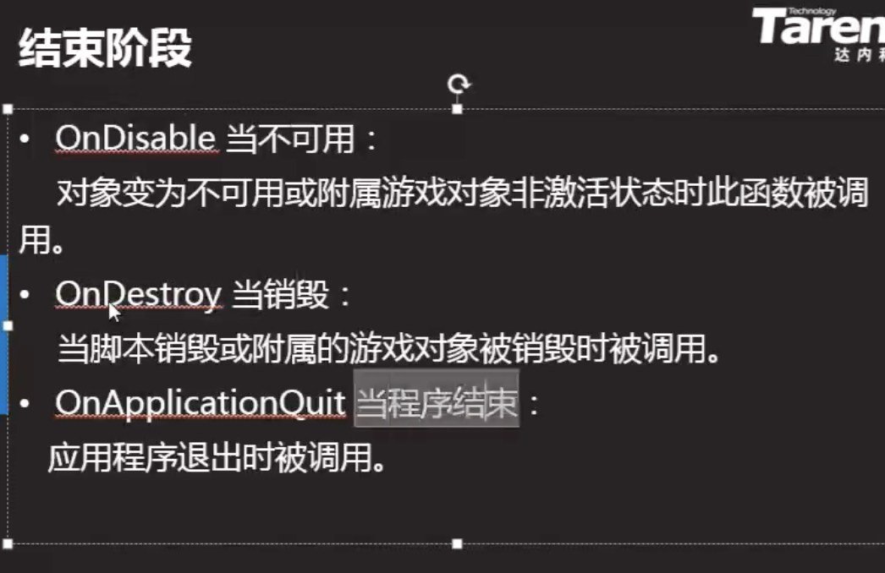