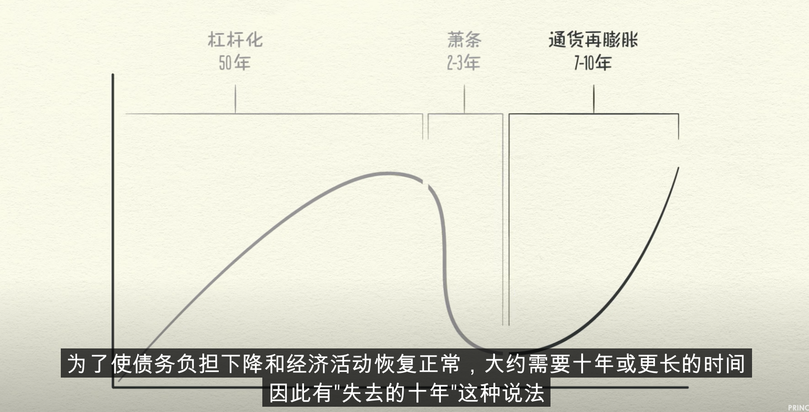
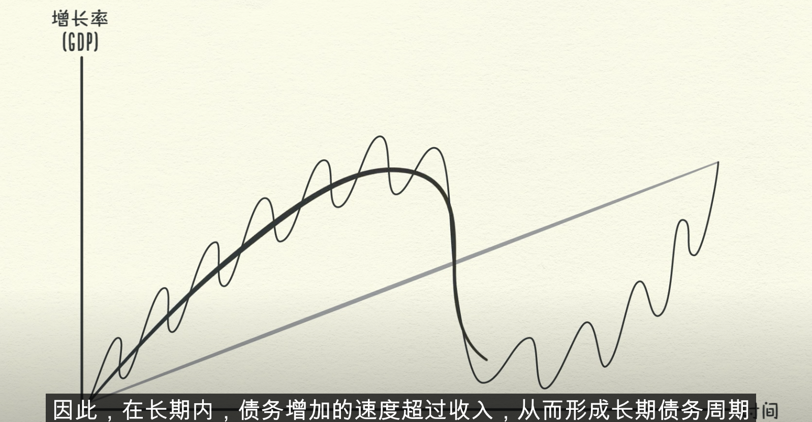

#### 技术分析：

​	分析情绪

​	1、大的机构大量买

​	2、k线 10日线，带量突破时买入

​	3、停损点设置成k先低位

​	4、k先停损点移动，k线带量突破，停损点平移到新的突破点红柱涨幅大的时候一半或低位

​	做t：

​		选股：股价有一定波动、中长线价值选股、较好的流动性

​		底仓，当日买入卖出相同股。做多 低买高卖。做空高卖低卖

作者：星辰财经
链接：https://zhuanlan.zhihu.com/p/372112747
来源：知乎
著作权归作者所有。商业转载请联系作者获得授权，非商业转载请注明出处。

一：牛市不买年线以下的股票，特别是远离年线以下的股票。

 二：不买十日线在上，五日线在下，且K线位于五日线下方的股票。 

三：短线买股时，当你吃不准要不要在这个时候买入则绝对不买。获利出局时当你犹豫要不要卖则必须卖一半。长线做T不能保证80%的胜率前，股票趋势向上时只做正T，股票趋势向下时只做反T。(正T先买后卖，反T先卖后买) 

四：在你不会正确解读什么叫长短中期利好利空新闻。什么叫宏观行业个股新闻时。永远不看着利好新闻买入股票。 

五：高开五个点以上，第一波上攻未封板，直接卖。高开八个点以上开盘就卖。 

六：永远不要一发入魂，一次all- in满仓，短线如果你持有两只股，则把钱分为三份。两大一小比如10万买两只股则分为4-4-2。 4-4为两个股票的仓位，2留在外面T。记住当日T进去的必须当日T出。永远把一部分钱留在外面，你会发觉这半份做T的钱，抵得上千军万马，如果你厉害。。可以做5次T，悟了吗? 

七：大阴线永不[补仓](https://www.zhihu.com/search?q=补仓&search_source=Entity&hybrid_search_source=Entity&hybrid_search_extra={"sourceType"%3A"article"%2C"sourceId"%3A"372112747"})，跌停啊，放量大跌啊，下面没有影线的，收在全天最低点的，永不补仓。 

八：新手别看研报买股票，新手别看基本面做短线。买入成本代表着你在这只股票的战斗博弈中，所能承受的损失的心理起始点。而基本面兑现到股价比你预计的要晚上好几个星期甚至几个月。市净率选股就市净率选股，[pb](https://www.zhihu.com/search?q=pb&search_source=Entity&hybrid_search_source=Entity&hybrid_search_extra={"sourceType"%3A"article"%2C"sourceId"%3A"372112747"})选股就pb选股，趋势选股就趋势选股，打板就打板，规则很重要，知行要合一 ，别我买这个股是因为估值低，买那个股虽然他估值很高但是他roe也高。。然后买第三只股虽然亏损基本面一塌糊涂，但是他是缠论三买。。请你先专精于一门兵器，赚钱了，有武功了，再去争武林第一，没人可以又学刀又学枪又学剑，然后门门武功精通。。小说里都不会出现。。长线一个规则，短线一个规则，两个规则简简单单就完事了。用一门手艺赚钱了再去学其他的，贪多嚼不烂。 

九：拿的住，割的狠。明确上涨趋势则[收盘价格](https://www.zhihu.com/search?q=收盘价格&search_source=Entity&hybrid_search_source=Entity&hybrid_search_extra={"sourceType"%3A"article"%2C"sourceId"%3A"372112747"})不破10日线不抛出。是为拿的住，超短另论。 其实纵观所有的心得感悟。所有的规则到最后总结，也无非就是六个字：拿的住，割的狠。 大道至简，仅此而已。

#### 价值分析：

​	1、债务的增长速度不要超过收入

​	2、不要让收入的速度超过生产率

​	3、尽一切努力提高生产率

​	宏观：经济形式，大家都有钱，股票就有钱      中国央行政策  DDP、CPI

​			在不发币的情况下，现金流是固定的。总支出是不变的，能量守恒

​			增加支出的办法是增加生产率，信贷也可以增加支出

​			支出越多，收入越多。信贷 提前消费刺激市场。利率越低信贷越多，支出越高，市场活跃

​			信贷：利率高 经济紧缩。利率低经济膨胀

​			信贷可以周期刺激市场，通过信贷增加支出就有人收入增加，整个市场金钱流动增加

​					支出大于生产率，物价上涨通货膨胀；提高利率信贷减少，支出收入减少，市场紧缩

​			短周期衰退：5-7年周期，可以控制利率调整   中国九年一周期  主要有政府控制，看信贷利率调整

​			长周期经济萧条2-3年：去杠杆，几十年，利率控制不了。人们债务普遍过重资产贬值，无法偿还债务

​								削减支出、减少债务、财富在分配、央行发币

​			

​	行业：行业龙头（券商公众号：看一下行业报告）

​			所属周期：朝阳、夕阳

​			行业门槛/格局：门槛高、利润高点

​			政府政策：政府扶持

​			板块轮动：大众喜欢的

​	公司：模式、增长点（新业务）、护城河（品牌、用户量、技术）、利润率（研发、品牌、生产代工）

​			好公司不一定是好股票、看行业宏观财报

​			PE 多久能回本，看平均PE  如果平均PE过高 过高

​			利润率 ：传统行业 20-30%    零售现金流

​			财务：负债、收益、现金流量

行业选择：行业市场大小、护城河、前景趋势、利润率、周期

衣食住行：龙头企业

通信行业三大运营商

家电电器

生化品

能源

材料

#### -- 集团公司 中国建材

##### 中国巨石 600176

玻璃纤维  产能 200亿 

##### 北新建材  000786

建筑材料行业

北新科技发展有限公司是2002年11月1日，经中国建筑材料集团公司批准，将原国家建筑材料工业部1981年设立在深圳经济特区的窗口企业---中国珠江建材企业公司，由中国巨石股份有限公司(沪市600176)和北新建材集团股份有限公司 (深市000786)共同出资改制为有限责任公司; 经国家工商总局核准更名，并在深圳市工商行政管理局登记为独立法人企业，注册资本人民币9000万元，集实业投资、新型建材集成、国内外贸易、仓储物流于一体的多元化企业; 是深圳建材行业协会名誉会长单位。

34年间，公司在深圳市先后独资、参资兴办建材企业27家。工业投资: 率先引进中空玻璃、特种水泥、空心砌块、装饰贴 面、云母板材、铝铂、超声波测桩、4.1米大口径输送管道等项目，填补了行业空白; 进出口贸易: 率先开发中国浮石替代进口浮石内、外销，为中国经济发展创造出一条产业链，产生了极大的社会经济效益; 新型材料集成: 是深圳盐田港、香港机 场、澳门威尼斯人酒店等著名工程建设的材料供应商。

北新科技作为中国建材的区域公司，依托中国建材资源、服务港澳市场，面向国际标准化，是中国建材在港澳市场参与国际竞争的先锋队，公司拥有完善的集成服务体系，并以背景、实力、诚信在区域市场树立了卓越的声誉，使公司确立了“科技建材产品集成商”的市场定位，并与欧美、东南亚建材市场，具有广泛的合作关系，是深圳建材行业最大的商家之一。